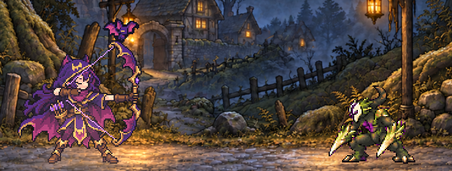
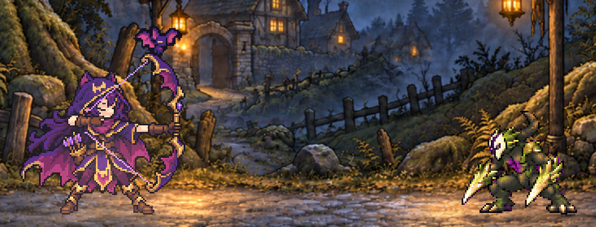
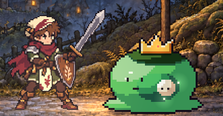
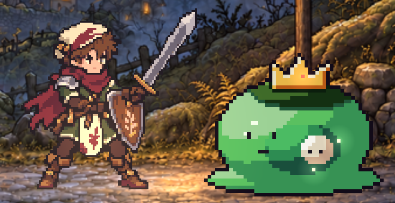
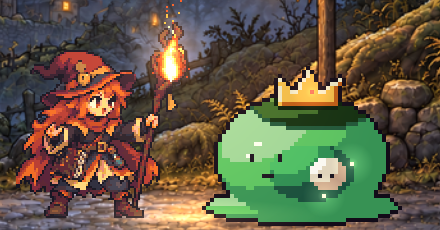
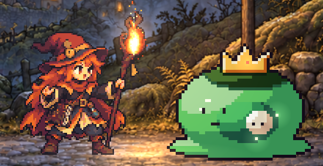

# Art direction v2: should heroes and foes be drawn at a finer pixel scale for desktop?

Status: **pick pending the Codex sample.** Card `art-direction-v2` (browser-first plan, section 3 step 5). Docs only: nothing
here changes the game. The Opus art judge rules **wire**, **re-brief** or **shelve** once Codex's sample lands, and the
ruling goes in `docs/DECISIONS.md` (Art) with a veto phrase for Cal.

The question: today's heroes are about 96 art px tall. Should Codex redraw every hero and foe at about 1.5x to 2x that, so
they look finer on a desktop screen?

## 1. Today's art on a desktop screen

Heroes are drawn at 1 art px = 1 logical stage px (`64h-hero-sprites.js`), and the landscape stage zooms in whole steps
(`62-stage.js` `LAND_ZOOMS`): x2 at 1280x720, x3 at 1920x1080, x1 on a 740x360 phone. So one art px is 2 CSS px at the design
size and 3 CSS px at 1920x1080. Wren and Tobin stand 192 CSS px tall at 1280x720 and 288 at 1920x1080 (Pip about 172 and 258).

Shots from the current integration build (07aaae10), the "early" fixture moved to zone 1, Mossy Hollow. Wren faces the
Thorn Imp (a Codex pack); Tobin and Pip face the Elder Moss Slime (the old code-drawn B1 kit).

| 1280x720 (design size, 2 CSS px per art px) | 1920x1080 (must look good, 3 CSS px per art px) |
|---|---|
|  |  |
|  |  |
|  |  |

Whole screens: [1280x720](art-direction-v2/screen-1280x720.jpg), [1920x1080](art-direction-v2/screen-1920x1080.jpg)
(JPEG for context only; judge the pixels on the PNG crops).

What the shots show:
- **At 1280x720 the heroes read well.** Faces, hands, the bow, the shield crest and Pip's staff are all clear, and the
  outline holds against the painted road.
- **At 1920x1080 the pixel steps show.** Each art px is a 3x3 block. It still reads as clean pixel art, but it is chunkier
  than the painted Mossy Hollow background behind it, which is smooth.
- **The roughest thing on screen is a foe, not a hero.** The Elder Moss Slime, the zone 1 boss (`21g-data-bosses.js`), is
  still the code-drawn B1 kit at 2 logical px per art px, so 6 CSS px blocks at 1920x1080. It waits on boss and Champion
  packs; the C22 zone packs only replace zone monsters (`59l-zone-foes.js`). The Thorn Imp matches the heroes' grid. The
  judge failed the 2026-10-07 Claude art trial partly because its monsters "did not reach the heroes' level of detail"
  (`docs/DECISIONS.md`, Art): the heroes are already the detail bar.

## 2. What a finer scale costs

### Codex time

Codex does not log its working time, so these come from commit times on the art branches. They are lower bounds and
estimates.

| Past pack | What it held | Time seen in commits |
|---|---|---|
| Gloomjaw (zone 2 foe) | concept, 67 body frames over 7 actions, 22 effect frames | Thorn Imp packaged 2 Oct 10:39, Gloomjaw draft 11:42, approved 11:50: about 1 to 1.5 h with Cal driving, if Codex started right after the Thorn Imp |
| Thorn Imp (zone 1 foe) | 14 key poses, then 55 body frames with effects | key poses packaged 1 Oct 22:48, animation pack approved 2 Oct 10:39 after 2 to 4 revision rounds (overnight) |
| Hero tool rigs (C27) | held-tool gathering and hunting draft poses for the heroes (later shelved) | first checkpoint 1 Oct 12:27, last commit 14:10: at least 1 h 45 min |
| Four ability icons | 4 icons x 4 sizes | carded 6 Oct, due 9 Oct 18:00, not delivered yet |

The last row is the real cost. Codex work starts when a brief is handed over, and the hand-over waits on Cal, so a pack
costs days of waiting even when the drawing takes an hour or two.

How Codex makes a pack matters here. It does not place pixels by hand: it generates full-size art with an image
generator, then shrinks it to the pixel grid and cleans it (`art/enemies/thorn-imp/v1/generation-notes.txt`,
`art/heroes/wren/v4-source/README.txt`, the Gloomjaw `sources/`). So a 2x frame may cost about the same as a 1x frame, or
the generator's detail may be the limit. **The real cost per frame at 2x is unknown until the sample reports its time**
(the brief asks for it). The estimates below assume 2x costs somewhat more per frame for clean-up:

| Item | At today's 96 px | At 2x (192 px) |
|---|---|---|
| One hero (Wren 11 frames: 8 fight, 3 hunting, plus her bat, arrow and sound-wave sprites; Tobin 18: 8 fight, 7 gathering, 3 hunting; Pip 17: 7 fight, 7 gathering, 3 hunting) | done | about 2 to 4 h of Codex time, plus one Claude card to re-measure the code layers (bow string, arrow and bat placement, tool grips, the hunting spear, effect offsets) |
| Three heroes (46 frames and Wren's effect sprites) | done | about 6 to 12 h, plus three wiring cards and the Classic art switch |
| One normal foe pack (about 60 body frames and effects) | about 1 to 1.5 h | about 1.5 to 3 h |
| Thorn Imp and Gloomjaw redrawn | done | about 3 to 6 h |
| The other 41 Chapter 1 foes (35 zone monsters, 7 Champions, the Fenmother, less the 2 done) | drawn anyway | about 20 to 60 h more than at today's scale (0.5 to 1.5 h extra each), plus Captain poses |

Why so many foes: the Hollow is all of Chapter 1 (`docs/design/milestones.md`), and its roster has 35 zone monsters, 7
Champions and the Fenmother (`docs/design/enemies-c22-roster.md`). Two are drawn. The art freeze says foes match the
heroes' scale, so if the heroes go finer, every foe still to come goes finer too.

### Page size

The web page is one file with a 16 MB limit; today it is about 8.7 MB. The two foe packs already take about 1.6 MB of it
(`21za-data-foeart.js`: Thorn Imp about 0.5 MB, Gloomjaw about 1.1 MB, as RGBA PNG atlases in base64). Chapter 1's 43 foes
at today's per-pack cost would not fit, so the web page cannot hold the whole roster even now. At 2x each pack has about
4x the pixels, so roughly 3 to 4x the bytes. Heroes are cheap by comparison (all three are 180 KB today, so about 0.6 MB at 2x).

The page-bytes ruling (Opus judge, 2026-10-09, `autopilot/rulings/2026-10-09-page-bytes.md`; Cal's veto: "lift the Codex
byte rule") answers this with an export rule for new sprite packs: lossless WebP, at most 64 colours across a pack, alpha 0
or 255 only, no soft edges or glows, held key poses instead of near-identical in-betweens, and ceilings in file bytes (a
monster with its Captain 85 KB, an area's five monsters 425 KB, a Champion 120 KB, the Fenmother 200 KB, a hunting beast
60 KB). **A finer scale must fit the same ceilings.** At today's scale the ceilings are already tight (a 64-colour Gloomjaw
comes to about 91 KB, over 85 KB), so a 2x foe with 4x the pixels would have to cut frames hard to fit. Raster hero packs
are not in that budget and need their own room.

### The pixel grid

Today's art lands on whole pixels at every desktop zoom. A finer scale does not:

| Art scale | 1280x720 (x2 zoom) | 1920x1080 (x3 zoom) | 740x360 phone (x1 zoom, device px ratio 2) |
|---|---|---|---|
| 1x (96 px, today) | 2 CSS px per art px: crisp | 3 CSS px: crisp | 1 CSS px (2 device px): crisp |
| 1.5x (144 px) | 1.33 CSS px: uneven columns | 2 CSS px: crisp | 0.67 CSS px (1.33 device px): uneven |
| 2x (192 px) | 1 CSS px: crisp | 1.5 CSS px: uneven on a 1x monitor, crisp on a 2x one | 0.5 CSS px (1 device px): crisp |

Uneven means some art px draw one screen pixel wide and their neighbours two, so outlines wobble. 1.5x is uneven at the
design size, which rules it out unless the stage zoom changes. If we go finer at all, it should be 2x, and the 1920x1080
stage would need its own zoom rule to stay crisp on 1x monitors: x2 with a wider view, or x4, which leaves the stage about
237 logical px tall, under today's 280 px minimum (`LAND_MIN_H`), so x4 also needs a smaller minimum view. That is a
layout change for a later card, not this one.

## 3. The pick (pending the sample)

**Provisional pick: shelve. Keep heroes and foes at today's scale (heroes about 96 art px).**

Reasons:
1. At the design size the heroes already read well, and the judge's own bar says the gap is the foes catching up to the
   heroes, not the heroes being too coarse.
2. Codex time is the scarcest thing we have. A redraw takes about 9 to 18 h of drawing for the heroes and the two done
   foes, then about 20 to 60 h more across Chapter 1's roster, all behind Cal's hand-over. The same hours draw new zone
   monsters that replace the code-drawn slimes and bats, which is the bigger visible gain.
3. Foe packs must fit the page-bytes ceilings, which are already tight at today's scale; at 2x they would only fit by
   cutting frames.
4. 1.5x does not land on whole pixels at 1280x720.

**What flips it to wire:** the Codex sample (section 4), shown in the game at 1280x720 and 1920x1080 beside today's Wren,
reads clearly better to the judge (face, hands and bow read better, not only smaller pixels), keeps the style (strict
pixel grid, 1 px dark outline, flat shading clusters), and the 2x pixel grid is crisp at the design size. If it flips:
- draw at **2x (192 px)**, never 1.5x;
- heroes first, as whole packs behind the Classic art switch; foes from the C22 queue are drawn at 2x from then on; the
  Thorn Imp and Gloomjaw are redrawn last;
- 2x foe packs must still meet the page-bytes ceilings (85 KB for a monster with its Captain), and hero packs need a
  byte budget of their own first.

**What makes it a re-brief:** the sample is better in some ways but breaks the style (soft edges, more than one outline
weight, painterly shading), or only the 1.5x frame looks good.

**Weigh with:** the `3d-to-pixel-spike` idea in the Autopilot backlog (Codex renders Gloomjaw from a 3D model at our pixel
scale). It changes how foes are made and may change what a finer scale costs, so the judge should weigh the two together.

**When to ask Codex:** the sample is a P3 card. It waits until Codex has delivered the overdue four ability icons, so it
does not take Codex time from the first hour.

## 4. The Codex sample brief

Give Codex the quoted block as written; it is self-contained.

> **Lanternfall: one hero pose at a finer pixel scale (a sample, not a pack).**
>
> We are deciding whether to redraw our heroes at a finer pixel scale for desktop screens. Draw one sample so we can
> compare it with today's sprite in the game. This is a test frame; it does not go into the game.
>
> **Branch:** work on `codex/art-direction-v2-sample`, made from the integration branch `claude/elegant-johnson-m6k00u`.
> Approved Codex art on that branch lives in `art/resources/approved-v1/`, `art/enemies/thorn-imp/approved-v2/` and
> `art/enemies/gloomjaw/approved-v1/`.
>
> **The pose:** Wren Hollowmere, the full-draw fight idle. Match `art/heroes/wren/poses/full-draw.png` exactly in pose,
> design and colours: the same violet, magenta and gold, bat-eared hood, bat-wing cloak, bow at full draw. Draw it twice:
> 1. **2x:** standing body about 192 px tall (about 204 px with the raised bow), on a 448x384 transparent canvas, feet on
>    the anchor (192, 264), facing right.
> 2. **1.5x:** standing body about 144 px tall, on a 336x288 transparent canvas, feet on the anchor (144, 198), facing right.
>
> Make both frames from the same source image, so the comparison is fair. Never upscale today's sprite.
>
> **Style (the same as today, only finer):** strict pixel art on a true grid; a clean 1-pixel dark outline at the new
> scale (one art px, so it is thinner on screen than today's; never 2 px); flat shading clusters with 4 to 6 shades per
> material, cooler shadows and warmer highlights; no noise, dithering, soft edges or anti-aliasing; binary alpha. Up to
> 48 colours (the game's cap for sprite packs is 64), built from `art/heroes/wren/palette.png` (new shades only between
> the existing ones). No glows or soft edges anywhere: every pixel is fully opaque or fully transparent. Use the extra pixels
> for what reads better on a big screen: the face and eyes, the hands on the bow and string hand, the hood ears, the
> cloak's wing edge, the gold trim. Do not add new costume pieces or change her proportions.
>
> **Leave out** (the game adds these as separate layers): the bow string, the nocked arrow, the bat, any glow or effect.
>
> **References:** `art/heroes/wren/poses/` (all eight poses) and `art/heroes/wren/v4-source/`; her concept on branch
> `codex/hero-animation-icons`, `art/concepts/hero-corrections-v1/wren.png` (face and costume only, not its painterly
> rendering); the Thorn Imp and Gloomjaw packs for how a finished Codex sprite looks in this game.
>
> **Deliver** in `art/heroes/wren/scale-sample-v1/`: `full-draw-2x.webp` and `full-draw-1_5x.webp` as lossless WebP
> (the game's export format), a PNG copy of each for review, the palette as `palette.png`, and a `README.md` that says
> how long it took, how you made it (tool, source image size, how you shrank and cleaned it) and each WebP's file size.
> Open a PR into `claude/elegant-johnson-m6k00u`. Do not change any other file, and do not change the game.
>
> **The byte rule for every Codex pack** (page-bytes ruling, 2026-10-09). This sample is a hero frame, so the ceilings
> below do not bind it, but report its sizes against them; any pack drawn at the new scale must meet them:
> 1. Export every pack and background as lossless WebP.
> 2. Sprite packs (monsters with their Captains, Champions, the Fenmother, beasts): at most 64 colours across the whole
>    pack, alpha 0 or 255 only, no soft edges or glows. Backgrounds get no colour cap.
> 3. Ceilings in file bytes, all atlases together: monster with its Captain 85 KB, an area's five monsters 425 KB,
>    Champion 120 KB, Fenmother 200 KB, beast 60 KB, still 25 KB. A Captain's look and poses fit inside its monster's
>    ceiling.
> 4. Backgrounds: one 960x540 picture an area, at most 190 KB, no colour cap, with the upright crop's safe area marked.
> 5. Hold key poses with manifest timing rather than drawing in-betweens that barely move.

When it lands, a Claude thread puts the two frames into game shots beside today's Wren, scaled the way the game would draw
them (nearest neighbour, nothing redrawn): the 2x frame at 1 CSS px per art px at 1280x720 and 1.5 at 1920x1080; the 1.5x
frame at 4/3 at 1280x720 (uneven on purpose, as the game would show it) and 2 at 1920x1080. The 1920x1080 shots are taken
at device pixel ratio 1 and 2, since 2x art is uneven on the first and crisp on the second. A red team argues against it, then the Opus
art judge rules and records the verdict.

## 5. Out of scope

- Icons (`codex-brief-sizes`), the screen layout (`desktop-layout-v1`), backgrounds.
- Any change to the game, the stage zoom or the art files.
