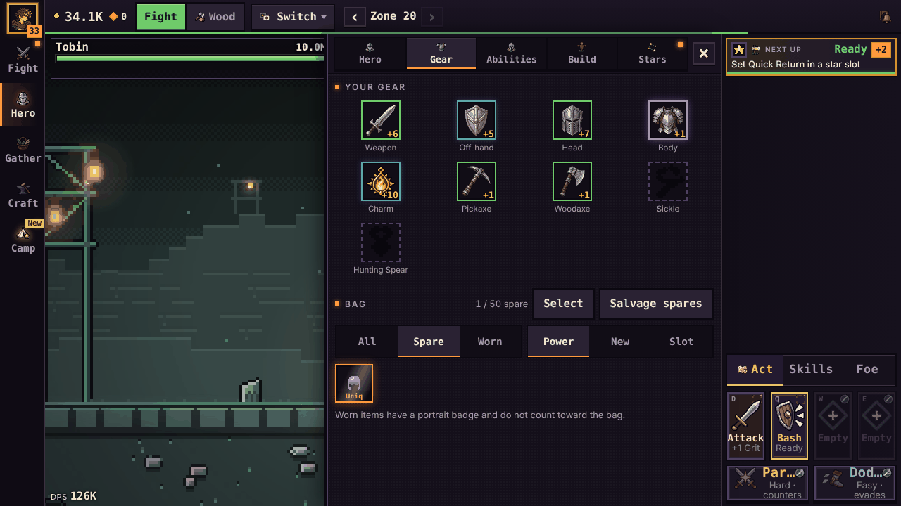
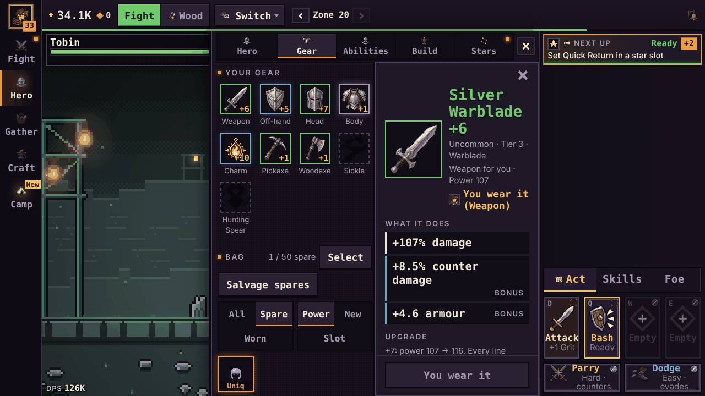
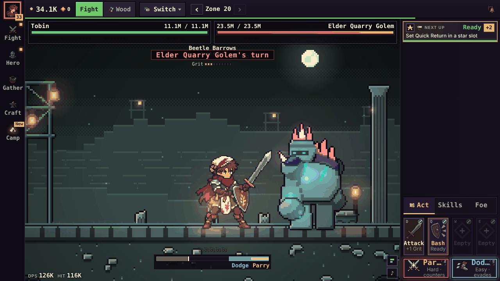
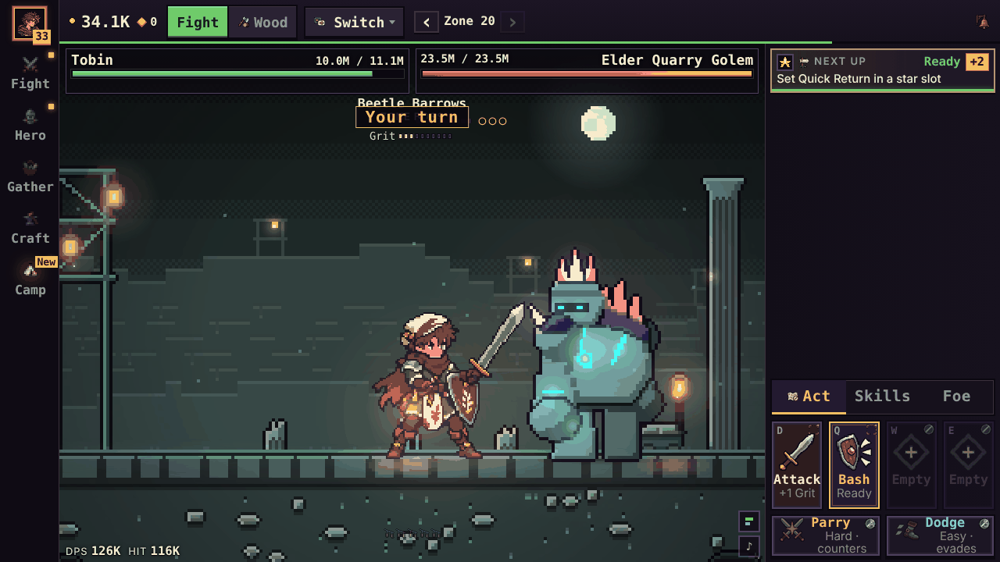
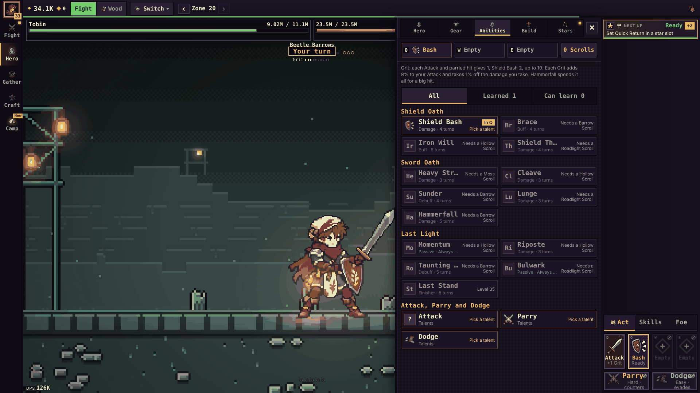
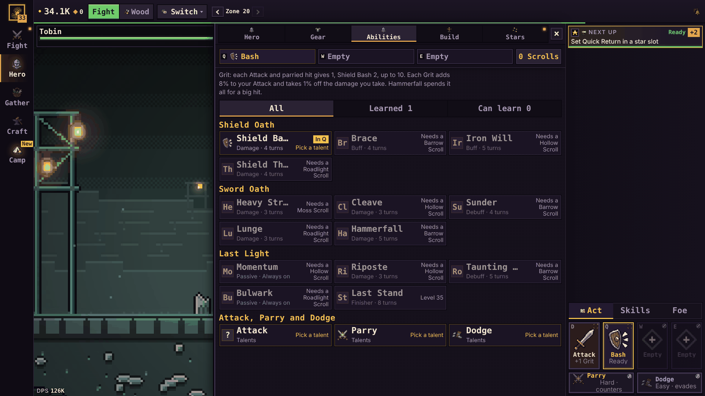

# Desktop layout (browser-first, v1 and after)

Spec for the build card `desktop-layout-v1`. Written by the planner (Opus high, 2026-10-08; file:line refs at integration
5571a40d) from card `desktop-layout-spec`, the browser-first plan (section 3 step 2, approved by Cal with "Go",
2026-10-08 11:59) and the CLAUDE.md rule in PR #234. Ruled on by an Opus high judge and read by a separate reviewer; the
ruling is in `docs/DECISIONS.md` (Screen and menus, "Desktop layout").

## In one screen

On a desktop browser today the stage grows but everything around it stays phone-sized: 15 px body text with most labels
at 9 to 13 px, a 560 px menu panel, a 256 to 272 px side column, and list and detail shown one at a time. v1 makes the
chrome and text grow on screens 1200 px and wider, widens the menu panel to two thirds of the stage, shows list and
detail side by side, adds number keys for the tabs and clears the "Tap again" wording. Phones on their side (740x360),
upright (360x740) and 1024x768 tablets do not change by a pixel.

| | Today at 1280x720 | v1 at 1280x720 | v1 at 1920x1080 |
|---|---|---|---|
| Body text | 15 px | 17.25 px | 19.5 px |
| Smallest text in a menu | 9.5 to 12 px | 14 px | 15 px |
| Menu panel | 560 px | 596 px (66% of the stage) | 956 px |
| Item detail | a bottom sheet over the menu | docked beside the list (298 px) | docked (478 px) |
| Stage zoom | x2 | x2 (903x664) | x3 (1448x1016) |
| Bag tile / gear row | 52 px with a 32 px icon / 56 px with 48 | as today | 72 px with a 48 px icon / 104 px with 96 |

**Prediction:** at 1280x720 on `tests/fixtures/save-current.json`, the smallest visible text in an open menu is 14 px
or more (today 9.5 to 12), Hero > Gear shows the list and an item's detail at once, and 740x360, 360x740 and 1024x768
compute the same sizes as the base commit for every element.

Before and after (more in `docs/design/desktop-layout/before/` and `mock/`):

| Today | v1 (mock) |
|---|---|
|  |  |
|  |  |
|  |  |

The mock is CSS injected into the built page at 4e2ff08a (`/mnt/project-files/early-game/desktop-layout-data/mock-desktop.cjs`
and `mock-desktop.css`, numbers in `mock-desktop.out`). It proves the sizes. It is not the build, and it differs from
this spec in three ways the judge and reviewer settled: the mock's text floor at Desktop 1 is 13 px (v1: 14), its slot and
tab icons grow to 52/64 and 26/32 px (v1: they stay at their native 48 and 22, see 2), and it still shows a few clipped
names (v1 fixes them, see 4).

## Breakpoints

All widths and heights are CSS px of the browser's inner window.

| Tier | Media query | Who gets it | Status |
|---|---|---|---|
| Portrait | not landscape (today's rule) | phones upright, upright tablets, narrow windows | unchanged in v1 |
| Landscape | `(min-aspect-ratio: 1/1) and (min-width: 600px)` (`80-landscape.css:19`) | phones on their side, tablets | unchanged |
| Short landscape | `... and (max-height: 500px)` | 740x360 | unchanged |
| Tall landscape | `... and (min-height: 600px)` (`80-landscape.css:158`) | 1024x768 tablets, small windows | unchanged |
| **Desktop 1** | `(min-aspect-ratio: 1/1) and (min-width: 1200px) and (min-height: 600px)` | 1280x720, 1366x640, 1440x900, 1536x864 | new |
| **Desktop 2** | `(min-aspect-ratio: 1/1) and (min-width: 1600px) and (min-height: 900px)` | 1920x1080 and up | new |

The card asked for the bag at 48 px and the gear row at 96 px from 1440 px. The judge put them in Desktop 2: four
104 px gear tiles need about 440 px, and at 1440x900 the docked list half is about 338 px. Laptops below 1600x900 get
all of v1 except the bigger tiles.

One JS twin of the Desktop 1 query, next to `WIDE_Q` in `70-ui.js:404`: `DESK_Q` and `isDesk()`. Nothing else in JS
reads a width.

## v1: what goes in (one PR)

### 1. Text grows with the screen

- **How:** `tools/build.mjs` rewrites every CSS `font-size` (and the size token inside a `font:` shorthand) from `S` to
  `max(var(--tmin, 0px), calc(S * var(--tk, 1)))`. `:root` sets `--tk: 1; --tmin: 0px`, so every size outside the
  desktop tiers computes to exactly what it is today. Desktop 1 sets `--tk: 1.15; --tmin: 14px`; Desktop 2 sets
  `--tk: 1.3; --tmin: 15px`. There are no px line-heights in the CSS today, so line-heights are left alone.
  The mock did this in the browser and rewrote 652 rules.
- **Why a build step:** about 386 rules set raw px sizes and 303 more use `calc(N * var(--display-k))`; there is no rem,
  em, % or clamp. Hand-editing 700 rules is the alternative. CSS `zoom` is out: it scales images by 1.15 and breaks the
  whole-pixel rule (`docs/design/art-direction.md`).
- **Interface:** one pure exported function in `tools/build.mjs`, `scaleText(css) -> css`, run on the joined styles
  before they go into the page. Its rules:
  - `!important` stays outside the `max()` (`60-classes.css:11`, `font-size: 12.5px !important`).
  - Skips `font: inherit` (12 rules), keyword sizes, `font-size: 0` (`60-nav.css:103`) and anything inside a comment
    (`10-base.css:23` has "font:" in one).
  - Skips any declaration on a line carrying `/* tk:off */`.
  - Leaves a declaration it cannot parse unchanged.
- **Opt-outs (`/* tk:off */`):**
  - The fight bar's slot label: `80-landscape.css:167` (`.sb-lb`) and `:169` (`.sb-def .sb-lb`). The Desktop blocks set
    `.sb-lb` to `calc(14px * var(--display-k))` (16.8 px, the size the mock proved fits "Attack" in a 68 px slot) and
    leave `.sb-def .sb-lb` at its 19.2 px.
  - The slot key letters (`.sb-key`), which may stay at 13 px.
- **Text the transform cannot reach** (not in `src/styles`): `76-audio.js:104-107` (the ♪ button), `shell.html:105`
  and `:182` (inline sizes) and `75-camp-ui.js:250` and `:318` (`cssText`). v1 leaves them as they are; the smallest-text
  check skips them by selector.

### 2. Chrome grows with the screen

| | Tall landscape (today) | Desktop 1 | Desktop 2 |
|---|---|---|---|
| Rail `--rail` | 64 | 76 | 92 |
| Top row `--toprow` | 48 | 56 | 64 |
| Side column `--side` | clamp(208px, 20vw, 272px) | clamp(300px, 23.5vw, 340px) | clamp(300px, 20vw, 380px) |
| Tab min-height | 62 | 64 | 76 |
| Tab icon | 22 | 22 | 22 |
| Action bar `--sb-tile` | 100 | 116 | 132 |
| Action bar icon `--sb-ic` | 48 | 48 | 48 |
| Mode and switch buttons | 38 | 40 | 40 |

- **Icons stay at native size.** Slot icons are canvases drawn at a native size only (`60n-nicons.js:37-41`); the action
  icons exist at 16/24/36/48 and the tab icons up to 22. A bigger box would stretch them by a non-whole factor, and the
  C26 icon check at 1280x800 and 1920x1080 (`check.mjs:8530`, `:8544`) asserts native size equals box size. Bigger
  icons there wait for Codex's 64/32 packs (plan step 4).
- **Stage zoom** keeps its whole steps (`pickZoom`, `62-stage.js:156-160`): x2 at 1280x720 and 1366x640, x3 at
  1920x1080. Full-window 1440x900 and 1600x900 drop from x3 to x2 (the wider side column and taller top row; the
  judge measured it). Browser windows on those screens are under 900 tall and draw x2 today. The new check pins the
  zoom at both sizes so a later change shows up.
- **The UX-L1 layout check** (`check.mjs:11930-11935`) asserts a rail of at most 80 px, a top row of 40 to 52 px and
  `ZM === (w >= 1200 ? 2 : 1)`. v1 moves those bounds for the desktop tiers (rail up to 96, top row up to 68) and adds
  a 1920x1080 case (x3) with a `WEIGHT` entry (`check.mjs:73`) so CI shards stay balanced. Its 740x360 bounds stay.

### 3. The menu panel and the detail dock

- **Panel:** Desktop 1 and 2: `.menu { width: clamp(560px, 66%, 1040px) }`, still a panel over the stage
  (`80-landscape.css:103`). The card said "about 60%"; at 60% the 1280 panel falls under 560 px. The hero's HP bar and
  the live fight bar stay in view. At 1920x1080 the panel covers the hero sprite (today's 560 px panel does not); at
  1280x720 it is mostly covered today too.
- **Detail dock:** in the desktop tiers, a sheet opened from inside an open menu docks into the panel's right half,
  below the menu head (the view switcher and ×), instead of rising over the whole screen. The list keeps the left half
  and stays usable: clicking another item swaps the docked sheet.
- **Which sheets dock in v1:** the craft sheet (`75-craft-ui.js:821`), which serves both an item (`openItem`) and the
  empty-slot picker (`pick`); the hero sheet (`75-party-sheet.js:216`); the gather node sheet (`72-ui-gather.js:68`).
  Every other `openSheet` caller stays a centred sheet as today. An item opened from the picker keeps today's back
  chain: × or Escape on the item returns to the picker, × or Escape on the picker closes the dock, the next Escape
  closes the menu.
- **Interface:** `openSheet(build, opts)` (`75-party-sheet.js:55`) takes `opts.dock` (true for the three callers).
  When `opts.dock && isDesk() && S.tab`:
  - The overlay keeps its `bsheet-ov` class and gains `docked`, and is placed inside `#menu` below the menu head.
    `.app` gets `detail-docked` while it is open (`#panels` then pads its right half). The walk bot (`walk.mjs:355`,
    `:452`) and `goFight` (`70-ui.js:604`) still find it by `.bsheet-ov`.
  - It is not modal: `aria-modal` off and no capturing focus-trap key listener (`75-party-sheet.js:89`); its × gets
    focus on open; Escape still closes it.
  - The grab drag (`75-party-sheet.js:~93-110`, which also works with a mouse) is off when docked.
  - It closes on a tab switch, a view change inside the tab, closing the menu, and a resize out of the desktop tiers.
- **Blockers ignore a docked sheet.** These selectors become `.bsheet-ov:not(.docked)`: the Escape handler's
  (`70-ui.js:617`), the new number keys', the guide's `BLOCK` (`75-onboard-ui.js:327`, which also drives `guideLineOk`)
  and the story cards' `BLOCK` (`75-story-ui.js:21`). Without this the keys, Hesketh's lines and story cards would
  wait for as long as a docked sheet stays open. The two onboard and story edits are one selector each.

### 4. List and detail side by side

- **Hero > Gear and the bag:** the list on the left, the docked item sheet on the right (3).
- **Hero (the hero card):** unchanged layout, wider; the hero sheet docks (3).
- **Gather:** the node list on the left and the "Now" card (`.gx-now`, `72-ui-gather.js:170`) on the right, sticky at
  the top: `grid-template-columns: minmax(340px, 3fr) minmax(280px, 2fr)`. Node names never end in "…" at these tiers;
  they wrap (the mock cut "Birch Thi…" at 1280).
- **Craft > Make:** the recipe list on the left and the result box (`.cf-resbox`, `75-craft-ui.js:459`) on the right,
  sticky, the same columns.
- **Abilities:** already splits at 520 px (`@container ab`, `60-abilities.css:162`). At the desktop tiers the card grid
  shows no more columns than keeps every ability name whole (the mock cut "Shield Ba…", "Shield Throw" and "Heavy Str…").
- **Cut line:** if the PR runs long, the Gather, Craft > Make and Abilities grids move to `desktop-views-2` and v1 ships
  with the dock alone for list and detail. The builder says so in the PR.

### 5. Bigger gear and bag icons at Desktop 2

Bag tiles `72` px with the `48` px export; the Hero > Gear row (`.cf-gs`) `104` px with `96` px (the 48 px export at x2,
as the item card already does). `nicons` picks the native size times a whole number for images, so this is CSS. Exports
are in the page since #227. Nothing is drawn or redrawn. The gear-icons-48 check (`check.mjs:8573-8582`) asserts the
Gear view's `.cf-gs img` is 48 px at 1920x1080; it changes to expect 96 at Desktop 2 and 48 below.

### 6. Keys

| Key | Does | Where |
|---|---|---|
| 1 2 3 4 5 | Fight, Hero, Gather, Craft, Camp through `tabClick` (`70-ui.js:607-609`): 1 goes to the live fight (and stops gathering, as the Fight tab does); the open tab's number closes it; a tab not unlocked yet does nothing | new, `70-ui.js` beside the Escape handler (`:615`) |
| Escape | closes the docked sheet, then the menu (today: the menu) | `70-ui.js:615`, `75-party-sheet.js` |
| Q W E, A, S or Space, D, F | the fight bar, unchanged (`75-solo-ui.js:222-230`) | |

- Letters are not used for tabs: Q W E A S D F are the fight keys. No handler binds a digit today.
- The number keys do nothing:
  - inside `INPUT`, `TEXTAREA`, `SELECT` or contentEditable, or with Ctrl, Alt or Meta held, or on a key repeat;
  - while `gameHeld()` (`00-util.js:74`);
  - while a modal is open: the Escape handler's list (`70-ui.js:617`, with `.bsheet-ov:not(.docked)`) plus `#abPicker`,
    `#moveSheet`, `.gl-ov`, `.mm-ov`, `.dw-ov`, `.dd-fc-ov`, `.tabs-ov`, story cards and the intro.
- The fight keys gain the `SELECT` skip they lack today (`75-solo-ui.js:225`). The text fields this covers: the save
  code (`75-savecode-ui.js:257`), feedback (`75-feedback-ui.js:124`), the name (`shell.html:156`), trade
  (`74b-ui-trade.js:67`), the selects in `75-craft-ui.js:497` and `75-deepwell-ui.js:418`.
- **On screen:** each rail tab shows its number in its top-left corner at the desktop tiers on a fine pointer, styled
  like the slots' key letters (`.sb-key`, hidden on coarse pointers, `60-solo.css:37`). The CSS goes in
  `80-landscape.css`. The slot key letters show as today.

### 7. Neutral wording for second presses

Every "Tap again ..." second-press label becomes "Confirm: ..." (for example "Confirm: spend a Roadlight Scroll",
"Confirm: refund half of the cost", "Confirm: send them off"). Where the label is only "Tap again" (the camp card's
quick button, `75-camp-ui.js:125`, which #228 made say "Tap again" instead of "Sure?"), it becomes "Confirm".
Aria-labels follow ("Confirm: build Lv 1"). The 14 sites at 5571a40d: `75-class-ui.js:283`, `75-party-sheet.js:187`,
`75-abilities-ui.js:228`, `74-ui-hands.js:209, 221, 314, 330, 340`, `75-attributes-ui.js:117`,
`75-camp-ui.js:121, 125, 126`, `75-solo-ui.js:433`, `75-craft-ui.js:983`. The builder greps again and lists each change
in the PR. Everything that matches the old words changes in the same PR: the walk bot (`tools/walk.mjs:481`,
`Sure|Tap again` becomes `Sure|Confirm`), the checks (`tools/check.mjs:3893, 7358, 8721, 10414, 13133, 13140`; the
"no Sure?" assert at `:13097` stays) and the proof route `docs/proof/camp-build-tap-again/route.txt` (lines 27, 31, 32).
Other "Tap" and "Hold" lines (about 66, 14 of them in `75-onboard-ui.js`) wait for the copy card (below).

## Later (own cards, in this order)

1. **desktop-tooltips (P1, next after v1):** a hover tooltip component for items, abilities and costs on a fine pointer,
   with the same text the bar slots' and bag tiles' aria-labels already carry (`75-solo-ui.js:353`, `75-craft-ui.js`).
   Deferred because the dock already shows an item's full detail on one click, and a tooltip needs its own copy per thing.
   **Built (desktop-tooltips, 2026-10-09):** `70b-tips-ui.js` (`setTip(el, text | () => text)`, `tipItem`, `tipCost`) and
   `60-tips.css`. With a mouse (`pointerType` mouse only; touch and pen never), resting 120 ms on a target opens a tip; any press,
   key, wheel or scroll closes it, so does its target going or being covered; its text follows the game while open; it stays
   inside the screen. Targets: items (bag, worn gear, last crafts) show the item sheet's head and stat
   lines (the hero card's and hero sheet's slots keep just the name, their old title, since a click there opens no item sheet); the fight bar's Attack, Parry, Dodge and ability slots and
   Hero > Abilities' slots and rows show the ability card's head and text; cost chips (Craft, item upgrades, Camp) show the full
   name with what you have and what it needs. Every line is also on the view a click opens. Those targets' old `title`
   attributes moved into their tips, so the browser's own tooltip does not double them.
2. **neutral-wording (P2):** the remaining "Tap" and "Hold" lines, after the onboard cards running now merge (they own
   `75-onboard-ui.js`).
3. **upright-tablet (P2):** 768x1024 gets something better than the 560 px strip (`10-base.css:48-51`). That card picks
   the design. Until then 768x1024 stays as today (the strip, a 536x638 stage at x1), which plays.
4. **desktop-views-2 (P2):** Stars, Store, Uniques, Camp, Build and the Codex as desktop panels; keys for views
   (for example `[` and `]`); any grid v1 cut (4).
   **Built (desktop-views-2, 2026-10-09):** `[` and `]` step through the open menu's views (70-ui.js `VIEW_KEYS`); each view's
   CSS file has a Desktop 1 block that puts list and detail side by side (`docs/design/layout.md`, "Views"). v1's cut grids landed
   here too: Gather (nodes beside the Now card) and Craft > Make (recipes beside the result card); Abilities had shipped in v1.
   Build, Camp and Make widen at Desktop 1 to the stage less a 120 px strip (up to 980 px; Stars already widened), since at 1280x720 the two-thirds panel (596 px)
   squeezed two columns into three-line rows. The Stars map's constellation names no longer grow with the text (`tk:off`): they
   are SVG units, and at 1920x1080 they ran into each other.

Deferring tooltips and the upright tablet departs from the approved plan; Cal can undo it with "Tooltips and tablet in v1".

## What stays the same

- **740x360, 360x740 and 1024x768:** every computed size, every layout, every string except the "Confirm" labels. The
  transform computes to the same sizes there (`--tk: 1`, `--tmin: 0px`). The judge re-ran the base against the mock at
  all three sizes in Fight, Gear, Abilities, Gather and Make: the rail, tabs, side column, slots and labels, menu, bag and
  gear tiles, stage and body text match exactly, and Abilities, Gather and Make match element for element.
- The stage art, its whole-step zoom and the fight bar's slots and order (DECISIONS.md, Screen and menus).
- Fonts (Handjet and Barlow Semi Condensed), colours, icons, art.
- Game rules, numbers and save state. `lanternfall.ui.v1` prefs are untouched; no new save field.

## Files and interfaces

| Change | Files | Interface |
|---|---|---|
| 1 Text | `tools/build.mjs`; `src/styles/10-base.css` (`:root` defaults); `src/styles/80-landscape.css` (tier values; `tk:off` at `:167`, `:169`); `src/styles/60-solo.css` (`.sb-key` `tk:off`) | `scaleText(css)` (exported); `--tk`, `--tmin`; `/* tk:off */` |
| 2 Chrome | `src/styles/80-landscape.css` (two new blocks after `:176`) | `--rail`, `--toprow`, `--side`, `--sb-tile` |
| 3 Panel and dock | `src/styles/80-landscape.css`; `src/styles/60-party.css` (`.bsheet-ov.docked`); `src/js/75-party-sheet.js` (`openSheet`); `src/js/70-ui.js` (`DESK_Q`, `isDesk`, closing the dock, the Escape selector); `src/js/75-craft-ui.js:821`, `75-party-sheet.js:216`, `72-ui-gather.js:68` (`dock: true`); `src/js/75-onboard-ui.js:327` and `src/js/75-story-ui.js:21` (one selector each) | `opts.dock`; `.bsheet-ov.docked`; `.app.detail-docked` |
| 4 List and detail | `src/styles/60-gathering.css`, `src/styles/60-craft.css`, `src/styles/60-abilities.css` (desktop blocks only); `src/js/72-ui-gather.js` and `src/js/75-craft-ui.js` only if a wrapper class is needed for the grid | none new |
| 5 Icons | `src/styles/60-craft.css` (bag tile, `.cf-gs`) | none |
| 6 Keys | `src/js/70-ui.js` (number keys), `src/js/75-solo-ui.js:225` (the `SELECT` skip), `src/styles/80-landscape.css` (rail number hint), `src/shell.html` only if the hint needs markup | `TAB_KEYS` |
| 7 Wording | the 14 sites listed in 7; `tools/walk.mjs:481`; `docs/proof/camp-build-tap-again/route.txt` | none |
| Check | `tools/check.mjs`: one new section `desktop-layout`; the UX-L1 bounds at `:11930-11935` and its 1920x1080 case plus `WEIGHT`; gear-icons-48 at `:8581`; the six "Tap again" asserts | |
| Docs | `docs/design/layout.md` (the desktop tiers; also fix its stale "the bag is in Craft"), `docs/GAME.md` (keys), `docs/lessons.md` | |

Areas for plan.json: fight-layout, early-ui, craft-ui, party-ui, abilities-ui, tools-walk, docs (as the v1 card says),
plus build (`tools/build.mjs`), onboard and story (one selector each, so v1 goes after `reload-keeps-tips` and
`forge-tip-goes-stale`), and `74-ui-hands.js`, `75-class-ui.js`, `75-attributes-ui.js`, `75-camp-ui.js` for the wording
lines only.

## Steps the player sees (acceptance in Cal's words)

1. "I opened the game on my laptop at 1280x720. The text was easy to read and nothing was squeezed into the corner."
2. "I clicked my sword in Gear. Its details opened next to the list, and I clicked the next item without closing anything."
3. "Gather showed the groves on the left and what I'm gathering on the right."
4. "On my big screen the gear row was big and crisp."
5. "I pressed 3 and Gather opened. I pressed 3 again and it closed. Typing my name didn't switch tabs."
6. "The camp build button said Confirm, not Tap again."
7. "On my phone nothing changed."

## Never

- Never change game rules, numbers, save state or the save key.
- Never draw, redraw or rescale art by a non-whole factor; bigger icons use the exports already in the page.
- Never change a computed size or layout at 740x360, 360x740 or 1024x768.
- Never cover the fight bar, the rail or the menu head with the dock.
- Never let a number key fire inside a text field or select, or with a modifier held.
- Never let a docked sheet block keys, Hesketh's lines or story cards.
- Never change the online layer (raid, tavern, leaderboard, `db`/`room`/`user`).

## Out of scope

Tooltips, the remaining Tap/Hold copy, the upright tablet, other menus' desktop layouts (all "Later" above);
art-direction v2 and the Codex briefs (`codex-brief-sizes`); the walk, Eyes and playtest defaults (`desktop-view-in-checks`);
the online layer.

## How v1 proves itself

1. `node tools/build.mjs && node tools/check.mjs` exit 0. The new `desktop-layout` section, in a mouse context (no
   touch), on `tests/fixtures/save-current.json`:
   - **1280x720**, Hero > Gear open: the smallest visible text in `#panels` is 14 px or more (`tk:off` elements and the
     unreachable ones in 1 left out), body text 17 px or more, `#menu` 590 px wide or more, no horizontal scroll.
     Clicking a gear tile docks the sheet: its top is at or below the view switcher's bottom, its left at or right of
     the list's right edge, and the list's first tile is still clickable. With the dock open, `3` opens Gather (and
     closes the dock) and a guide line can show.
   - **1366x640:** the same, and the stage zoom is 2.
   - **1920x1080:** smallest text 15 px or more (same exclusions), zoom 3, a bag tile's image 48 px and a gear row
     image 96 px.
   - **1440x900 and 1600x900:** zoom 2 (pinned).
   - **No clipped names:** no visible text with `text-overflow: ellipsis` has `scrollWidth > clientWidth` at 1280x720
     and 1920x1080 in five views: fight, Hero > Gear, Hero > Abilities, Gather > Wood and Craft > Make.
   - **Keys:** `3` opens Gather and `3` again closes it; `1` while gathering goes to the fight; `2` with focus in
     `#nameInput` or a `select`, or with Ctrl held, does nothing.
   - **Phones unchanged:** `matchMedia(DESK_Q).matches` is false at 740x360, 360x740 and 1024x768. At those sizes, in
     the fight and in Hero > Gear with an item sheet open, every element's computed `font-size` and bounding box equal
     those of the same page built with untransformed CSS (the check swaps the page's `<style>` for the joined
     `src/styles` without `scaleText`).
   - **`scaleText` unit cases:** a plain size; a `calc(N * var(--display-k))` size; a `font:` shorthand with a var;
     `!important`; `font: inherit`; `font-size: 0`; a comment containing "font:"; a `/* tk:off */` line; an
     unparseable value (unchanged).
2. Shots in the PR (a mouse context, `tests/fixtures/save-current.json`): fight, Hero > Gear with an item docked,
   Abilities, Gather and Craft > Make at 1280x720, 1366x640 and 1920x1080, one fight shot at 1200x600, and fight and
   Hero > Gear at 740x360 and 360x740 beside the base commit's shots.
3. Eyes at 1280x720 and 1920x1080 (once `desktop-view-in-checks` adds them): no clipped or cut-off text in the five
   views. Eyes at 740x360 and 360x740: no worse than on the base.
4. `node tools/walk.mjs --seed 1 --minutes 15` at the desktop view (or 740x360 until `desktop-view-in-checks` lands):
   camp builds still get confirmed (the "Confirm" matcher).

## Risks

- A check that greps the built CSS for a literal font size breaks after the transform. The builder changes it to read
  the computed size and names it in the PR.
- At 1920x1080 an open menu covers the hero sprite. If desktop playtest notes say a boss telegraph was missed with a
  menu open, cap Desktop 2's panel lower or revisit a split stage ("Split the stage for menus").
- Tile badges ("Uniq", "+6", "T2") may crowd at 14 px; the 1280 shots and Eyes show it.
- Narrow desktop windows (1200 to 1279 px) get Desktop 1 with a 300 px side column. At 1200x600 the stage is about
  824x544, which draws at x1 (544 / 2 is under the 280 px minimum), as today's 1200x600 does. The builder says if the
  1200x600 shot looks worse than the base.
