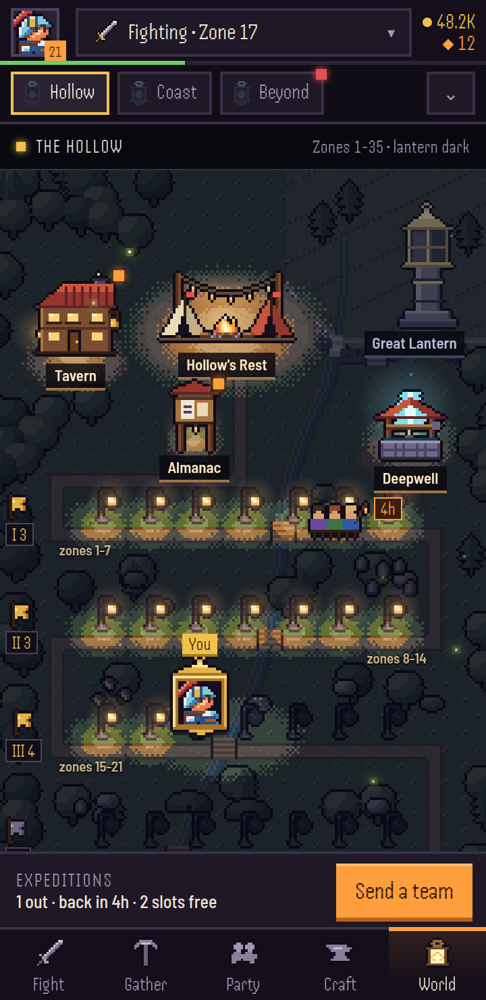
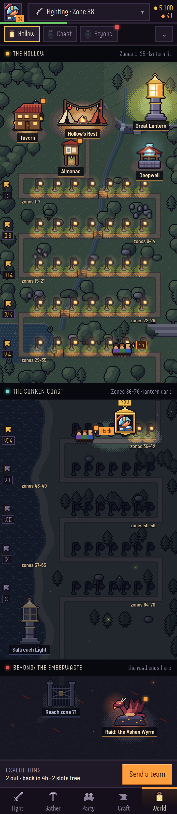
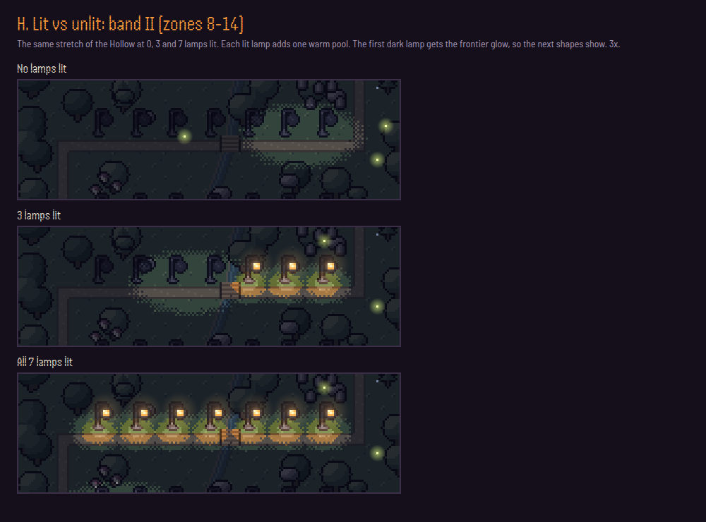

# World map: art study (MAP0)

> **MAP1 update (2026-09-28): the owner picked a hybrid.** It uses A's map, C's night and landmarks,
> and the mood "light in the dark". See [Hybrid H](#hybrid-h-light-in-the-dark-map1) at the end.
> UX-W1 builds H.

Status: options for the owner (2026-09-28). This is a study only: nothing in `src/` changed.
It comes before UX-W1 to W3 (plan-4.md 6.4: "The map must be designed well").

The owner said the draft (`img/ux/w-map.png`) looked "really sub-par", and the weak part was the map
icons and landmarks. The draft had flat grey rocks, a road of tiny yellow squares, and sprites
that did not match the B1 characters. This study offers three finished directions. Each one keeps
the layout from ux-overhaul.md section 7 (head row, region chips, one vertical scroll of region
plates, the expedition bar, the bottom tabs), and each redraws the map and every landmark in B1.

| File | What it shows |
|---|---|
| `img/map/map-overview.png` | The three phone screens side by side |
| `img/map/map-a-screen.png`, `map-b-screen.png`, `map-c-screen.png` | 360 x 740 (rendered at DPR 2), the Hollow, mid save (zone 17) |
| `img/map/map-a-full.png`, `map-b-full.png`, `map-c-full.png` | The whole scroll on the late save (zone 38): the Hollow lit, the Coast reached, Beyond locked with the raid |
| `img/map/map-a-closeups.png`, `map-b-closeups.png`, `map-c-closeups.png` | Every landmark at 3x, plus one slice of each of the 5 regions, lit and locked |

Prototype (scratch code, not loaded by the game): `prototypes/map-study/`. Open
`index.html?style=A|B|C&view=screen|full|sheet` in a browser, or `?view=overview`. It loads the
real B1 kit (12a-12f, 60b) only to take the hero's 16 x 16 portrait for the You marker.
`node prototypes/map-study/shots.mjs [out] --fonts <dir>` re-renders every PNG (Playwright and
`/opt/pw-browsers/chromium`, like `tools/perf.mjs`).

Saves used: **mid** is zone 17, level 21. Bands I and II are lit, band III is half lit, IV and V
are dark, the Great Lantern is dark, one team is out on band I, and the Tavern and Almanac have
dots. **Late** is zone 38. The Hollow and its Great Lantern are lit, the Coast has lamps 36-37 lit,
one team is out and one is back, and the Ashen Wyrm raid is live on the Beyond plate.

## What all three share

- **B1 rules on every sprite** (art-direction.md): 3 tones per material lit from the top left,
  hand-placed section lines where one piece sits on another, and a 1 art px ink outline `#120B18`.
  Everything shows at whole-number scales: 2x on the map, 3x on the sheets. Nothing is drawn
  at a fractional scale.
- **Lit vs unlit is the whole picture, not just the lamp.** Each plate is painted once in full
  colour, then relit. Pixels inside a lit lamp's reach keep their colour and get a warm banded
  pool near the flame. Pixels outside it take the style's "dark" palette. The edge between them
  is one dithered band (SNES style), not a gradient. Hollow's Rest is always lit (the Hearth). A lit
  Great Lantern lights its whole region. So a player sees how far they have come in one glance,
  and each new lamp pushes the light a little further down the road.
- **One lamp per zone, 7 per band, 5 bands per region.** The road runs one row per band, as in
  ux-overhaul 7.2, and the band flags and zone ranges are DOM. Lamps are lit when `zone < maxZone`.
- **Pins are DOM over a baked plate** (spec 7.2-7.3). Each pin is its sprite at 2x, with a label
  chip and the ember dot. Labels are clamped inside the plate. Each style has its own label skin:
  a JRPG window (A), ink on a parchment slip (B), or a dark chip with a lamplight underline (C).
- **You** is the hero's real portrait (from `ART.portraitCanvas`, 16 x 16) framed in that style's
  frame, always at 2x (32 CSS px). The spec's 24 CSS px would be a 1.5x scale, which B1 forbids.
- The Almanac post stands at the camp gate on the road. The Deepwell is beside the camp. The Great
  Lantern is on Lantern Hill above the camp (lore.md 8.1). The raid pin sits on the Beyond plate,
  lit and tappable, with the Beyond chip's red dot (spec 7.5).

## A. Dusk overworld

 

**Pitch:** a 16-bit JRPG world map seen from above at a 3/4 tilt. It has 12 x 12 grass tiles,
round-canopy forests outlined as one mass, Lantern Hill as a cliffed plateau with stairs and a
waterfall, a stream with plank bridges at every road crossing, a marsh pond, graves, barrows,
mushrooms and a quarry. The land past your last lamp waits in the night palette.

- **Palette.** Grass `#6E9E52 #4C7E40 #35613A #22442E`. Road `#A48558`, edge `#6A5034`. Water
  `#24587A #2E6A84 #4A8AA0`. Stone `#B8B0C2 #88809C #5C5474 #3A3450`. Roof `#DA6A4E #AC443A #76292E`.
  Canvas `#F4E8C6 #D4BE90 #A08660`. Gold `#FFE08A #E4B44A #A8762A`. Lamp glass `#FFD27A`, core
  `#FFF3C4`, dark glass `#5A6072`. **Night:** every colour is desaturated 55% and mixed 62% toward
  `#0C1224`.
- **Sprites (art px, plus a 1 px outline):** Hollow's Rest 40 x 27 (command tent with a pennant, two
  tents, the fire, a lantern pole, a woodpile). Tavern 26 x 24 (gable roof, gable window, planks,
  two lit windows, mug sign, chimney). Deepwell 24 x 24 (roofed winch, stone ring, blue glow).
  Great Lantern 16 x 32 (plinth, column, gold cage; lit or cold glass). Ashen Wyrm 26 x 24 (on an
  ember crag). War horn 12 x 12. Almanac post 16 x 20. Road lamp 5 x 10. You 22 x 26 (gold ring with
  a tail). Team 20 x 13 (three walkers and a banner). Band flag 8 x 10. Locked gate 24 x 18.
  Stamps: tree 14 x 16, pine 11 x 16, rock 8 x 6, grave 4 x 5, barrow 16 x 8.
- **Reads at phone size:** very well. It is the most "map-like" of the three: you see geography,
  and every place stands on its own clearing. The road is the lightest thing on the plate. Lamps
  are the smallest of the three (10 x 20 CSS px) but read through their light pools.
- **Five regions:** each region gets a tile palette and 2-3 stamps. The Coast has a sea, shingle
  and pines, with Saltreach Light on a rock. The Emberwaste has ash ground, lava cracks and dead
  trees. The Pale Reach has snow and frosted pines. The Gloamvale has cave floor and glowing
  crystals. See the strip at the bottom of `map-a-closeups.png`.
- **Locked region (next or Beyond):** the dim palette from spec 7.11 (desaturated 80%, mixed toward
  `#1E1A20`), dark lamps, and a barred gate with a gold padlock across the road.
- **Weak points:** it looks like many other RPG maps. The lanterns are only one theme among trees,
  rocks and water. It needs the most terrain stamps per region.

## B. Lampwright's chart

 

**Pitch:** an old parchment map in sepia ink, as the Lantern Order's lampwrights would have drawn
it. It has tree marks, hatched hills, ripple lines, a ruled road and a compass rose. Crisp B1
landmarks sit on it like stickers: an ink outline plus a 1 px pale "cut" edge. **The chart is only
coloured where your lamps are lit.** Past the last lamp it is bare ink on smoke-stained paper. Lit
lamps are gold leaf, and dark lamps are bare ink outlines.

- **Palette.** Paper `#EADAB0 #DCC897 #C9B07C` with a burnt edge `#A88C5C`. Ink `#2E2018`, light
  ink `#6A5238`. Cut edge `#F6EBCB`. Washes, multiplied onto the paper: meadow `#DCE8B4`, forest
  `#B8D08C`, water `#A8C8D0` / sea `#9CC0CC`, road `#F0C890`, camp yard `#F2D8A8`. Gold leaf `#FFE890
  #E8B84A #A8762A #6A4418`. Red wax `#E0524F #9A3A30 #6A2428`. **Unlit (soot):** the bare
  (unwashed) chart is desaturated 45% and mixed 46% toward `#3A2E26`.
- **Sprites (art px, plus ink and cut edge = 2 px):** Hollow's Rest 42 x 28 (low palisade, lantern
  pole, a big and a small tent, the fire). Tavern 24 x 28 (a timber-framed two-storey house, a stone
  ground floor, lit windows, mug sign). Deepwell 22 x 26 (stone arch, pulley, blue light rising).
  Great Lantern 22 x 36 (a lamp tower with gold-leaf rays when lit). Ashen Wyrm 32 x 24 (a serpent
  diving through the ground, "here be dragons"). War horn 12 x 11. Almanac post 20 x 22 (a signpost
  with a nailed page). Road lamp 7 x 9 gold / 5 x 9 ink. You 22 x 28 (a red wax map pin with a
  gold-leaf rim). Team 14 x 18 (a pennant token on a wax disc). Band flag 7 x 9. Locked seal 18 x 18
  (red wax with a padlock). Ink marks: tree 5 x 5, pine 5 x 6.
- **Reads at phone size:** landmarks and gold lamps read best of the three against the light
  paper. The "colour comes back" idea is lovely, but it is the subtlest lit vs unlit read (warm
  green-gold vs grey-brown). The parchment is the one light surface in a dark UI.
- **Five regions:** one sheet per region, with torn top and bottom edges, so a region appends as a
  new leaf. Each region changes only its land wash and its ink mark: trees, pines and sea,
  dead trees and ember dots, peaks with hatching, or cut stair steps.
- **Locked region:** a blank, soot-darkened sheet with a fold, faint pencil marks where the road
  will go, and the red wax seal with a padlock. It is the most story-like locked state ("not yet
  charted").
- **Weak points:** a bright plate on a dark game. It moves furthest from the stage's look, and the
  ink marks can get busy in dense forest.

## C. Lamplit terraces

 

**Pitch:** the region at night, seen from the side like the fight stage. The Lantern Road zigzags
down the hillside in **5 stone terraces, one per band**, joined by stairs at alternate ends. Each
zone has a tall lamp post (the same lantern shape as `63-scenery.js`) and **a small picture of
that zone beside it**: moss and fireflies, a cave mouth, graves, a barrow door, giant caps, cut
stone, and reeds. Because the 7 zone types repeat in every band, each terrace reads as "the 7
places, again, deeper". Lit lamps light their stretch of terrace in warm bands. The rest of the
hill is a cold blue silhouette. Hollow's Rest, the Tavern, the Deepwell and the Almanac line the
camp plateau under the moon, and the Great Lantern stands on Lantern Hill.

- **Palette.** Sky bands `#0A1022 #0E1628 #132034 #1A2C40`, dithered. Terrace lip `#5E9A4A`, road
  `#8A6A44 / #6A5034`, retaining wall `#7A7490 #5A5470 #3A3450`, backdrop ridge `#1C3438`, pines
  `#1E4238 / #2A5444`. Lamp glass as the stage: `FLAME #FFBA60`, glass `#FFD27A`, core `#FFF3C4`,
  dead glass `#4A5064`. **Night:** every colour is desaturated 50% and mixed 62% toward `#080C1A`.
  A soft glow layer (art size, smooth, `screen` blend) sits on top.
- **Sprites (art px, plus a 1 px outline):** Hollow's Rest 50 x 30 (two tents, a rope of five
  little lanterns over the fire, logs). Tavern 32 x 32 (two storeys of lit windows, a lantern by
  the door, mug sign, smoking chimney). Deepwell 26 x 32 (a well house with a beam of blue light
  through the roof). Great Lantern 22 x 46 (a lantern on a tall banded column). Ashen Wyrm 32 x 28
  (wings up on a burning crag, with a red glow). Almanac post 18 x 26 (a notice board with its own
  lamp). Road lamp 9 x 21 (the tallest thing on a terrace). You 22 x 30 (your portrait as the glass
  of a lantern). Team 22 x 16 (walkers, the first carrying a lantern on a pole). Band flag 7 x 9.
  Locked gate 28 x 26 (chains and a dark lantern). Zone vignettes 16 x 16 each (7).
- **Reads at phone size:** the clearest progress read of the three. Lit terraces glow and dark ones
  are silhouettes. Each terrace is an 84 CSS px row, which is exactly the band's tap target (spec
  7.3). Lamps are big (18 x 42 CSS px). It matches the stage (same lanterns, same banded light, same
  night) and the B1 characters best. The zone vignettes give the band sheet a preview for free.
- **Five regions:** each region swaps its backdrop and terrace palette: sea behind the Coast's
  terraces with Saltreach Light at the end, a red sky and ash for the Emberwaste, snow peaks and an
  aurora for the Pale Reach, a cave ceiling with crystals for the Gloamvale. The road itself goes
  down the whole way, which fits the Gloamvale ending (lore.md 8.4). Each region needs its 7
  vignettes (16 x 16), which can share the stage's zone art.
- **Locked region:** pitch night (desaturated 70%, mixed 70% toward `#06060C`), the road running
  off into the dark, and a chained gate with a dark lantern. Beyond shows the raid foe lit against a
  red horizon.
- **Weak points:** it is a road more than a map; there is no left-right geography. Plates are a bit
  taller (Hollow 316 art px vs 300; Coast 276 vs 236). The camp plateau is tight at 360 px: four
  places share one row, and the Great Lantern's label goes to its left. Unlit regions are very dark,
  so the Next state leans on the header note and the gate.

## Side by side

| | A. Dusk overworld | B. Lampwright's chart | C. Lamplit terraces |
|---|---|---|---|
| View | top-down 3/4 | top-down chart with pictorial stickers | side view, terraces |
| Lit vs unlit | full colour vs night palette | colour washes vs bare ink and soot | warm light vs blue silhouette (strongest) |
| Lanterns as the main visual | medium | medium (gold leaf) | **high** |
| Match with the B1 stage | good | lowest (light paper) | **best** (same lamps, light and night) |
| Geography, "a map" | **best** | good | weakest |
| Landmark readability | good | **best** on light paper | good (lit windows, glows) |
| Art per new region | palette + 3 stamps | wash + 1 mark | backdrop + 7 vignettes |
| Plate size (Hollow / Coast / Beyond, art px) | 180 x 300 / 236 / 84 | 180 x 300 / 236 / 84 | 180 x 316 / 276 / 90 |

## Performance (perf.md, ux-overhaul 7.12)

All three styles meet the spec's budget. Every plate is baked once to a canvas at art size (180 px
wide) and shown at 2x with `image-rendering: pixelated`. There is no `requestAnimationFrame`. Only
the ember dots, and optionally the camp fire and raid pin, animate, in CSS with `steps(2)`, and not
under reduced motion.

- **The study's own bake times** (desktop, unoptimised): 110-210 ms for the Hollow, 20-50 ms for
  the Coast, and 6-40 ms for Beyond. The study code keeps colours as hex strings in JS arrays and
  tests every pixel against every light. That is fine for a mockup but not how to ship.
- **How to ship it under 4 ms desktop / 16 ms phone per plate:** paint into a `Uint8Array` of
  **palette indices** (each style uses about 40-60 colours). Keep two small palettes per region:
  lit and dark (plus the warm tints). Then relighting is a palette swap per pixel, done only inside
  each light's bounding box (a lamp is about 50 x 50 px). The first paint is about 54,000 index
  writes plus 35 light boxes, and a new max zone repaints one box. It writes to the canvas with one
  `putImageData`. Stamps (trees, vignettes) are pre-indexed arrays copied in. The plate costs 216
  KB of RGBA per region, as the spec estimates.
- **Glows.** A and B need none: the banded pools in the plate are the light. C wants a soft glow
  layer. Bake it once at art size (180 x 316 canvas, radial gradients), let CSS scale it with
  smoothing, and composite it with `mix-blend-mode: screen`. That adds one extra layer per plate
  on the compositor and no main-thread work while scrolling. If the blend layer costs too much on
  a low-end GPU, bake the glow into the plate at 1x CSS instead (360 x 632 x 4 B = 0.9 MB for the
  Hollow).
- **DOM:** per region, 5-6 pins, 5 flags, 5 zone labels, You and the teams (about 20 nodes, under
  the spec's 40).
- **Sprites:** landmarks are fixed small maps (the largest is C's Hollow's Rest, 52 x 32) baked with
  the plates in `idleTask`. Nothing is animated inside a canvas.

## Recommendation

**C, Lamplit terraces**, with two borrowings.

Why C: the brief is "keep the lantern/lamp theme and show lit vs unlit progress clearly", and C
does both hardest. The lamps are the biggest, brightest thing on the map, and a lit band against a
dark one reads from across the room. It is the same world as the fight stage (the same lantern
drawing, banded light and night), so opening World feels like stepping back from the stage rather
than into a different game. The owner's complaint was the landmarks and icons. In C they are big,
lit, side-on buildings in the characters' B1 style, and the zone vignettes add seven small
landmarks per band that the other styles do not have. Each terrace is also exactly one band's tap
row, so the layout in ux-overhaul 7 needs no change.

Borrow from B: **colour returns where the light does.** C already relights. Keep the unlit
palette cold but a touch lighter than in these PNGs, so a Next region's shapes still read. Borrow
from A: **give the top a real place.** Make the camp plateau two tiers: Lantern Hill and the Great
Lantern above, and the Tavern, Hollow's Rest, Deepwell and Almanac on the plateau. That gives
labels room at 360 px (they are tight now), and pins stay 48 px apart.

If the owner wants a map with geography first, A is the runner-up. It is the lowest risk and scales
cleanly with palettes and stamps. B is the most charming but pulls furthest from the game's dark
B1 look, so I would keep its "coloured only where lit" idea rather than the parchment itself.

**Next steps for UX-W1 (if C is chosen):** port `style-c.js` to an indexed-palette painter in
`13d-art-world.js` (`WORLD_MAP` rows become terrace ground lines). Share the lamp and lantern
pieces with `63-scenery.js`. Draw the Coast's 7 zone vignettes. Add the checks from ux-overhaul
7.10: one `WORLD_MAP` block per region, 5 rows, pins 48 px apart, and a plate 180 art px wide.

## Hybrid H: light in the dark (MAP1)

 

| File | What it shows |
|---|---|
| `img/map/map-h-screen.png` | 360 x 740 (DPR 2), the Hollow on the mid save (zone 17) |
| `img/map/map-h-full.png` | The whole scroll on the late save (zone 38): the Hollow lit, the Coast reached, Beyond locked with the raid pin |
| `img/map/map-h-closeups.png` | Every landmark at 3x in its own pool of light, the palette-swap ramps, and one band slice of each of the 5 regions (lit, then locked) |
| `img/map/map-h-strip.png` | Band II (zones 8-14) with no lamps, 3 lamps and all 7 lamps lit |

Prototype: `prototypes/map-study/style-h.js`. Open `index.html?style=H&view=screen|full|sheet|strip`.
It borrows A's terrain stamps and C's landmarks through `STYLE_A.parts` and `STYLE_C.parts`.
`node prototypes/map-study/shots.mjs --only h-screen,h-full,h-closeups,h-strip --fonts <dir>`
re-renders the PNGs.

**Pitch:** A's top-down 16-bit overworld, at night. It keeps the forests, Lantern Hill's cliff with its
stairs and waterfall, the stream and its plank bridges, the marsh pond, the graves and barrows, and the
winding road with one lamp per zone. C's landmarks stand on it: the Tavern, Hollow's Rest, the Deepwell,
the Great Lantern, the Almanac post, the raid pin, You and the team. Every lit lamp and lit landmark
throws a small warm pool of light that falls off fast. Outside the pools the land is deep shadow, only
silhouettes, and fireflies drift there. As you progress, more pools light up along the road.

### Layout

- **Hollow plate 180 x 324 art px** (A was 300). The top 120 px is the camp tier. Lantern Hill and
  the Great Lantern are top right, above the cliff. The Tavern, Hollow's Rest and the Almanac post
  stand on the clearing, and the Deepwell sits under the cliff. C's bigger landmarks need this
  room. Every label fits at 360 px, and no two labels touch. The road then runs 5 rows, 40 art px
  apart (`rows 134 174 214 254 294`), with the lamps on the upper edge of each row.
- **Coast plate 180 x 262** (A was 236). The extra 26 px puts Saltreach Light (the Coast's Great
  Lantern) on its rock under row X, clear of the band flags and zone labels. **Beyond** stays 84.
- **Road lamp:** C's hook lamp, cut down to 8 x 12 art px (plus outline) so it stands in a top-down
  row. The glass hangs from the tip of the arm.
- **Pins** are C's sprites with C's label style (a dark chip with a lamplight underline). Dark places
  (the cold Great Lantern, Saltreach Light, the locked gate) are drawn in the dusk palette with a cold
  grey underline, so each one reads as a goal in the dark. Teams out stand on their band's road at the
  sixth lamp. You stands on your zone's lamp.

### Palette

- **Ground** (painted, then relit): A's palette. Grass `#6E9E52 #4C7E40 #35613A #22442E`, hill
  `#5A8C48` with a `#86B864` lip, road `#A48558` with edge `#6A5034`, earth `#A08458 / #8A7048`, water
  `#24587A #2E6A84 #4A8AA0`, stone `#B8B0C2 #88809C #5C5474 #3A3450`. The Coast: grass `#5E8A5A`, sea
  `#1E4E6A`, shingle `#B0A488`, road `#A89878`. Beyond: ash `#4A4048`, cracks `#B8442E`.
- **Landmarks:** C's palette, unchanged (roof `#C8563E`, canvas `#E8DCB8`, lamp glass `#FFF3C4 #FFD27A
  #FF9E3D`, dead glass `#4A5064`).
- **The four lights:** each painted colour `c` is swapped for one of four palette entries.

| Level | Name | Formula |
|---|---|---|
| 0 | shadow | desaturate 66%, mix 74% toward `#050816` |
| 1 | dusk | desaturate 45%, mix 48% toward `#0A1024` |
| 2 | lamplit | desaturate 25%, multiply by the tint mixed 45% to white, then mix 10% toward the tint |
| 3 | flame | mix 10% toward white, then 24% toward the tint |

- **Tints:** levels 2 and 3 take the tint of the light that wins the pixel. Road lamp `#FFBA60`, camp
  fire `#FF9A48`, Deepwell `#6FD0E8`, raid `#FF6B3D`, lit Great Lantern `#FFD27A`. The painted colour
  itself never shows, because the whole map is night.
- **Fixed pixels** ignore the light: lit lamp glass, a few moonlit crests on the sea (`#1C2C44`), faint
  lava cracks in Beyond (`#5A1A14`), and the Gloamvale's crystals.

### The light model

- **One pool per light.** A pool is an ellipse on the ground, squashed to about 0.72 of its width.
  Its strength is `I = a * (1 - q)^2`, where `q` is the distance divided by the radius. The square
  makes the light fall off fast, so most of the radius is a dim tail. Each pixel keeps its strongest
  light (the max, not the sum) and that light's tint.
- **Four levels, dithered seams.** `I` plus a 4 x 4 Bayer offset (amplitude 0.14) is cut at 0.12
  (dusk), 0.34 (lamplit) and 0.62 (flame). The seams are 1-2 px of SNES-style dither, not gradients.
- **Radii** (art px, x by y; double them for CSS px):

| Light | Radius | Strength | Reads as |
|---|---|---|---|
| Road lamp (lit) | 19 x 14, at the lamp's foot | 1 | Flame 4 px, lamplit about 8 x 6, dusk out to 12 x 9. Lamps are 20 px apart, so their dusk edges join and a lit row reads as a string of warm pools |
| Frontier (the first dark lamp) | 40 x 22, shifted 10 px ahead along the road | capped at 0.27 (dusk only) | The next stretch shows as shapes. This keeps MAP0's tweak: the land just past the last lamp reads a little |
| Hollow's Rest fire (the Hearth, always lit) | 50 x 32 | 1.25 | the camp clearing |
| Tavern windows | 26 x 17 | 0.95 | its yard |
| Deepwell | 24 x 17, blue | 1 | a cold blue pool |
| Almanac lamp | 15 x 11 | 0.9 | a small pool at the camp gate |
| Great Lantern, lit | 62 x 46, gold | 1.15 | The hill. **An ambient of 0.2 also lifts the whole region to dusk** |
| Raid pin | 38 x 26, red | 1.15 | a red pool on the black Beyond plate |
| Locked gate | 26 x 20 | capped at 0.27 | shows where the road ends |

- **Glow:** a small, smooth layer with `screen` blending, baked once at art size, as in C but toned
  down. Lamp glass glows 9 art px. C's landmark glows are cut to 62-80% of their MAP0 size, so the
  light stays a pool and never becomes a haze.
- **Fireflies and motes:** DOM sprites (2 x 2 CSS px, one art px). They are placed at bake time and
  only where `I < 0.1`, at least 8 px from any light and 16 px from each other. The Hollow has 14 (mostly
  fireflies), the Coast 9 (fireflies and sea motes) and Beyond 7 (embers). They drift on CSS
  `transform` keyframes (7-12 s) and blink with `steps(2)`. Under `prefers-reduced-motion` they stay
  still (no animation, fixed opacity). Each region has its own kind: fireflies, motes, embers, snow or
  crystal sparks.

### Performance plan

Nothing runs per frame except the firefly sprites, and those animate on the compositor only.

- **Bake per plate:** paint the ground into a `Uint8Array` of **palette indices**, as in MAP0's plan
  (about 60 colours per region). Then bake the **light plate**: a `Uint8Array` of levels 0-3 with the
  Bayer dither baked in, and a `Uint8Array` of tint ids. Each light walks only its bounding box (a
  road lamp is 38 x 28, about 1,100 px). A pixel's colour is one lookup,
  `PAL[region][level][tint][index]`. The tables are small: shadow and dusk, plus lamplit and flame
  for each tint, about 60 x (2 + 2 x 5) = 720 RGBA entries. One `putImageData` writes the plate.
- **Memory:** the index plate is 180 x 324 = 58 KB, the level and tint plates are 58 KB each, and the
  RGBA canvas is 233 KB. The Hollow is about 0.4 MB with its glow layer; 3 plates are about 1 MB.
- **A new max zone** lights one lamp. Recompute the light plate only inside that lamp's box and the
  old and new frontier boxes (3 boxes, about 3,500 px), then `putImageData` the dirty rectangle. There
  is no full repaint. Lighting a Great Lantern or reaching a region repaints that plate in an
  `idleTask`.
- **Study bake times** (desktop, hex strings, unoptimised): Hollow 40-60 ms, Coast 19-29 ms, Beyond
  6-9 ms. That is already 2-3x faster than MAP0's A and C, because each light touches only its box.
  The indexed version fits the ux-overhaul 7.12 budget of 4 ms desktop / 16 ms phone.
- **Fireflies:** at most 14 per plate, animating only `transform` and `opacity` (no layout, no paint).
  Pause them with `animation-play-state: paused` while the World menu is closed, and on plates scrolled
  out of view (one `IntersectionObserver`). DOM: 14 motes plus about 20 pins, flags and labels is 34
  nodes, under the budget of 40 per region. If a low-end phone drops frames, fall back to 6 per plate.
- **Sprites:** the landmarks are C's fixed pixel maps, baked once with the plates. The road lamp is 2
  small sprites (lit and dark), stamped after the relight and shaded per pixel from the light plate.

### How it carries to 5 regions

A new region adds only numbers and a palette, as in ux-overhaul 7.10. The light model stays the same.

- **Ground:** A's tile palette and 2-3 stamps per region. The Coast has sea, shingle and pines; the
  Emberwaste ash, cracks and dead trees; the Pale Reach snow and frosted pines; the Gloamvale cave
  floor and crystals.
- **Lamp tint:** warm `#FFBA60` in the Hollow, `#FFC890` on the Coast, a hotter `#FF8A50` in the
  Emberwaste, pale `#FFE0B0` on the Pale Reach and crystal violet `#C8A0FF` on the Gloamvale.
- **One set of fixed pixels** per region, so its dark is never plain black: sea crests, lava cracks,
  frost glints or crystals.
- **One mote kind:** fireflies, sea motes, embers, snow or crystal sparks.
- **Locked (Next or Beyond):** all shadow. Only the frontier's dusk glow shows, around the chained
  gate, plus the raid's red pool if its foe lives there.

The bottom row of `map-h-closeups.png` shows all five regions, lit and locked.

### Weak points and notes for UX-W1

- Dark lamps show as strong black silhouettes on the Coast, where whole rows are unlit. If that
  looks heavy, draw dark lamps one step lighter (a dusk outline) or drop their arm.
- The shadow palette keeps a trace of green and blue so tree canopies still read. A darker shadow
  would be spookier, but it would hide the geography that A was picked for.
- The camp tier makes the Hollow 24 art px (48 CSS px) taller. The late-save scroll is about 1,440 px (MAP0 A: about 1,390).
- While you fight at your max zone, the frontier glow sits under the You marker. That is on purpose:
  the hero's lantern lights the road ahead.
