# UX overhaul: menus, navigation and one set of patterns (UX2)

Spec only. It covers every tab, view and sheet as built on `claude/elegant-johnson-m6k00u` at 8660749
(after the Storehouse, the Party screen, Achievements, Bonds, story and Lore merged).

Owner, 2026-09-28: "Navigating the gathering menus could still do with work... switching between each
thing needs to be more fluid. Also switching between fighting and gathering requires going to the main
screen, bit long." Then: "Perhaps a general look at overhauling the menus might be wise."

Naming (owner decision, same day). In player-facing text the player's own character is the
**Lanternbearer**, companions are **heroes**, and the party is the Lanternbearer plus two heroes.
Code ids and save fields keep their names (`companion`, `comp`, `rec`, `roster`, `hero` as a party key).

Owner items folded in: the **Armoury**, a new camp building for gear (bigger bag by level, loadouts,
lock and favourite, an auto-salvage filter, sort and filter, a display rack at camp), separate from the
Storehouse (materials only). **Benched heroes earn no XP** (shipped after F5; the copy in this spec
follows it).

**Revision UX2b (2026-09-28): a World tab and map.** Owner: "We might do well to have a WORLD tab where
we select from Tavern, camp, etc. for anything that isn't basic gameplay (fighting and gathering). From
the world map we can enter zone dungeons and find the zone raid. We'd start expeditions from the world
map too." He does not want much more visual design work, so the map is cheap: one baked plate per
region, the B1 icons, three landmark sprites. This revision replaces the Camp tab with a **World** tab
that opens on a map of the Lantern Road (3, 7), moves the Deepwell and the raid out of Fight and into the
World, puts expeditions on the map, folds plan-2's RD (the Lantern Road map) into it, and rewrites the
build plan (8). Unchanged from UX2: the audit, the activity pill and quick switcher, the Gather rebuild,
the pattern kit, the Journal via the portrait. Also folded in: the **Bunkhouse** (beds for Hands, a
camp building; hire at the Tavern) and K13's **production chains** (refining at camp stations).

Contents: 1 audit, 2 top problems, 3 information architecture, 4 global navigation, 5 patterns,
6 per-screen wireframes, 7 the World map, 8 build plan, 9 what must not change, 10 open questions.

---

## 1. Audit

How it was measured: `node tools/build.mjs`, then Chromium (Playwright, `/opt/pw-browsers/chromium`)
with dist served through `page.route` (`text/html; charset=utf-8`), Handjet and Barlow Semi Condensed
from npm `@fontsource` through `page.route`, saves seeded by `page.addInitScript` behind a
`sessionStorage` flag. Saves: `tests/fixtures/save-v3-four.json` (the "late" save: zone 38, class
chosen, camp, 12 heroes, one expedition out, gathering Starsteel Crater), and a new game (cold Hearth).
Sizes: 360 x 740 portrait (all images below) and 1280 x 800. Toasts hidden for the captures.

The menu's scroll area at 360 x 740 is **528 px**. Above it: header 48 px, menu title row and view
switcher 108 px; below it: the tab bar 54 px. So 210 of 740 px (28%) is chrome before any content.
"Screens" below = content height / 528.

Taps are counted from the game view. Each tab remembers its last view, so a view costs 1 tap if it was
the last one used, else 2. Every screen passed the no-horizontal-scroll check; there were no console errors.

Images: `img/ux/a-*.png` (late save, 360 wide; `-full` = the whole scroll length), `img/ux/new-*.png`
(new game), `img/ux/wide-*.png` (1280 x 800, halved), `img/ux/m-*.png` (the UX2 mockups in section 6),
`img/ux/w-*.png` (the UX2b World mockups in section 7).
Also captured, not shown inline: above-the-fold shots of the long views (`a-13-adv-deep`,
`a-14-party-team`, `a-15-party-roster`, `a-20-gat-pack`, `a-21-forge-make`, `a-23-forge-powers`,
`a-25-world-camp`), `a-18-gat-wood`, `a-19-gat-forage`, `a-31-deeds-ach-feats`, `a-32-deeds-ach-looks`,
`new-11-gat-mine`, `wide-01-game`, `wide-14-party-team`.

### 1.1 Game view

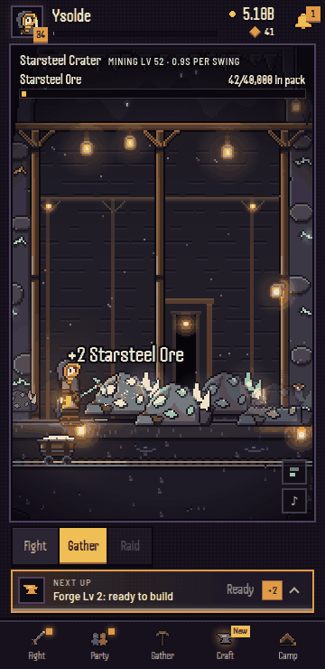 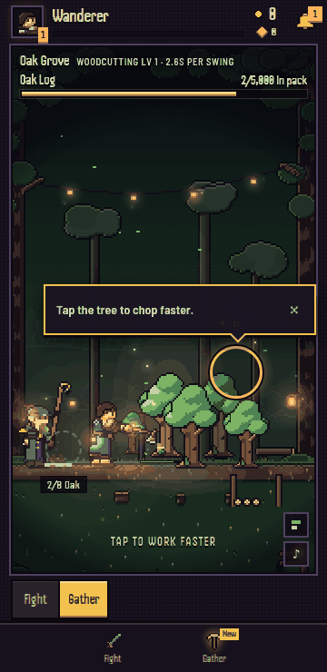

- The header shows the name, not what you are doing. What you are doing shows only on the stage
  strip ("Starsteel Crater, Mining Lv 52") and on the Fight / Gather / Raid buttons, and both are
  covered as soon as any menu opens.
- Raid is a greyed button on the control row for everyone who plays offline or from a file.
- Next Up is good: one line, Ready, +2.

### 1.2 Fight (Upgrades, Bounties, Bestiary, Deepwell)

| View | Taps | Above the fold | Length | Notes |
|---|---|---|---|---|
| Upgrades 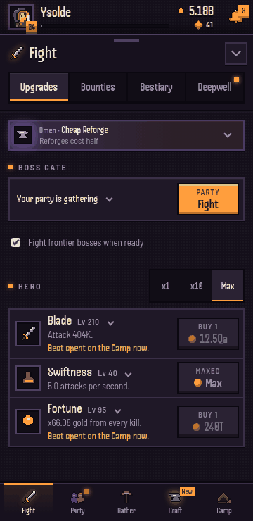 | 1-2 | Omen banner, boss gate, hero upgrades | 477 px (0.9) | Omen banner repeats the Almanac card. Boss gate reads "Your party is gathering" while you gather, with a "PARTY Fight" button: the only way back to fighting inside any menu. The zone stepper is on the game view only. "Best spent on the Camp now." is good advice with no link to the Camp. |
| Bounties 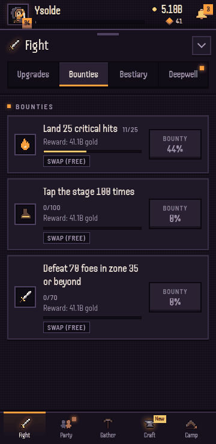 | 2 | all 3 bounties | 408 px | "SWAP (FREE)" is the only caps button with brackets. The claim button is a grey box that says "BOUNTY 44%". |
| Bestiary 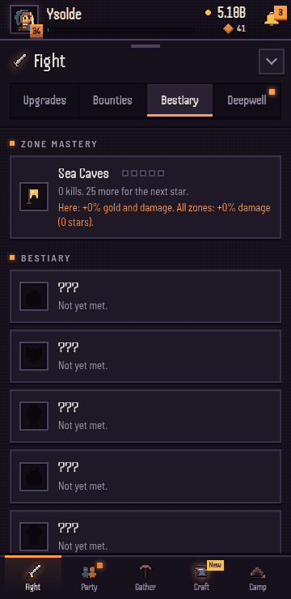 | 2 | zone mastery, 2 of 7 rows | 687 px (1.3) | 7 rows of "??? Not yet met." Zone mastery shows "+0% gold and damage" in warning orange. The same data is a Codex page (Bestiary, Zones). |
| Deepwell 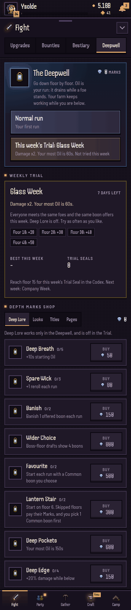 | 2 | intro card, run choice | 1444 px (2.7) | The weekly Trial shows twice (run choice card and its own section). The Depth Marks shop has its own inner tab bar (Deep Lore, Looks, Titles, Pages): a third level of tabs. |

### 1.3 Party (Team, Roster, Stars)

| View | Taps | Above the fold | Length | Notes |
|---|---|---|---|---|
| Team 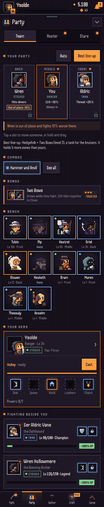 | 1-2 | the three slots, combos, one Bond | 1520 px (2.9) | Each party member appears three times: slot card, "Your hero" card, "Fighting beside you" card. The Lanternbearer's gear strip repeats Craft, Gear. "Best line-up" is a button and also a sentence under it. The bench repeats the Roster grid. |
| Roster 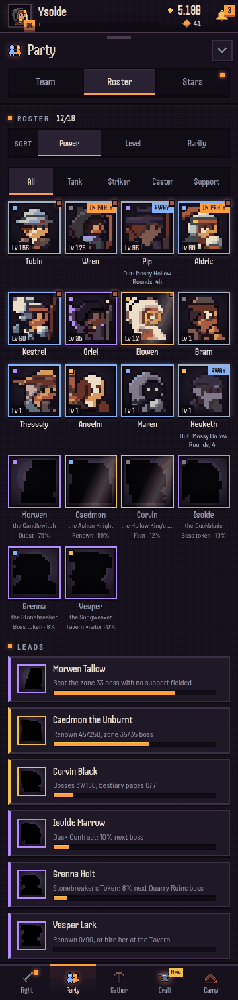 | 2 | sort bar, filter bar, 8 heroes | 1290 px (2.4) | Two stacked segmented bars (Sort, then role). Six locked heroes show as silhouettes in the grid AND again as "Leads" rows below. The Camp's roster board repeats who is at camp. |
| Stars 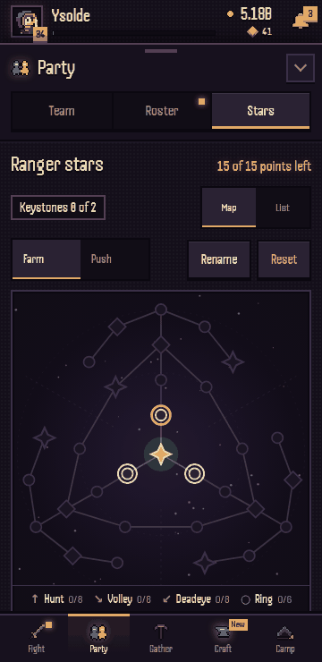 | 2 | header, the map | 736 px (1.4) | Two inner switches (Map / List, Farm / Push) plus Rename and Reset. Good use of space otherwise. |

### 1.4 Gather (Mining, Wood, Foraging, Pack)

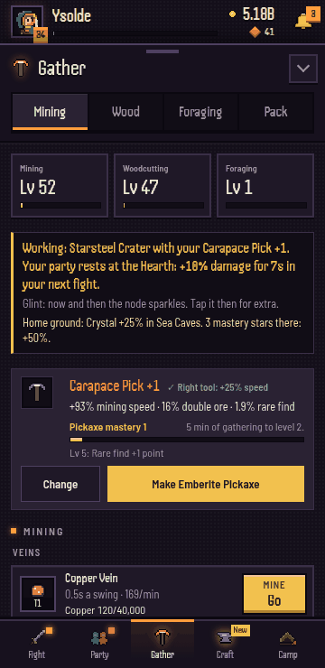 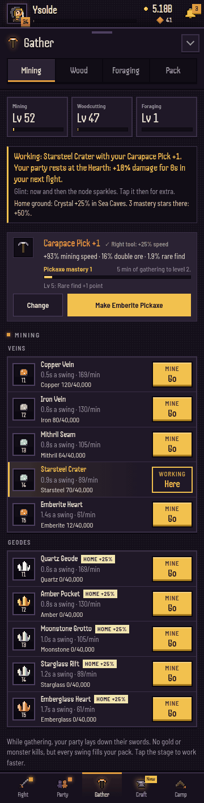 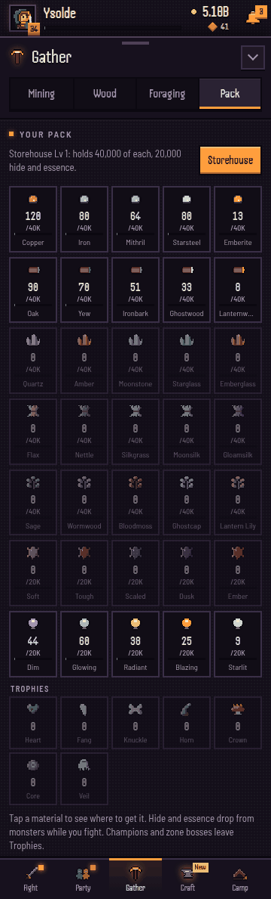

| View | Taps | Above the fold | Length | Notes |
|---|---|---|---|---|
| Mining | 1-2 | three skill cards, status box, tool card, 1 node row | 1191 px (2.3) | **The first node row starts at 423 px of 528 (80% down).** 10 identical two-line gold "MINE Go" buttons. The current node is a gold edge in the middle of the list. Nothing says which node is best. Locked and empty tiers look the same as open ones. |
| Wood / Foraging | 2 | same header block | 845 / 808 px | Same header repeated. |
| Pack | 2 | Storehouse line, 3 rows of cells | 969 px (1.8) | 35 material cells plus 7 trophies; 4 whole families are all zero. Called "Pack" in the menu, "Storehouse" on the button, "in pack" on the stage. |

Stale or confusing copy on these views:
- "While gathering, your party lays down their swords. No gold or monster kills, but every swing fills
  your pack." Since G1 the party goes home and the Lanternbearer gathers alone; the status box above it says
  "Your party rests at the Hearth".
- "Home ground: Crystal +25% in Sea Caves. 3 mastery stars there: +50%." This is about the fight zone,
  shown while you gather.
- "Glint: now and then the node sparkles. Tap it then for extra." shows all the time.
- "Lv 5: Rare find +1 point" (points of what?).
- The skill level shows three times: skill card, section title ("MINING"), stage strip.
- On the Fight menu: "Your party is gathering" (the party is at the Hearth; you are gathering).

To switch from gathering to fighting inside a menu: close the menu, tap Fight (2 taps), or go to Fight,
Upgrades and tap the boss gate's "PARTY Fight". To go to a different skill's node: Gather tab, the skill's
view, scroll past 423 px of header, Go (3 taps and a scroll), then close the menu to watch it (4).

### 1.5 Craft (Make, Gear, Powers, Uniques)

| View | Taps | Above the fold | Length | Notes |
|---|---|---|---|---|
| Make 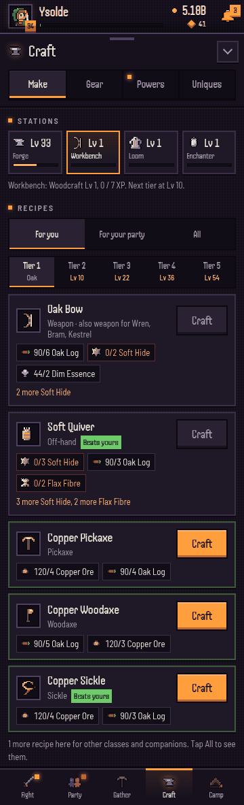 | 1-2 | stations, recipe filter, tier tabs, 2 recipes | 963 px (1.8) | Two stacked tab bars (For you / For your party / All, then Tier 1-5). Opened on the Workbench at Tier 1 for a zone 38 save. Tools are made here but shown in Gather. |
| Gear 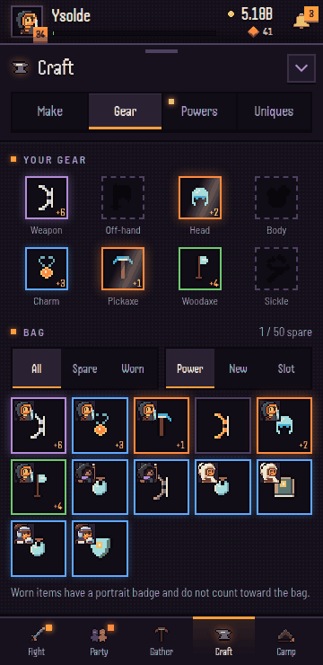 | 2 | your gear, bag | 510 px | Two filter bars side by side (All / Spare / Worn, Power / New / Slot). Gear strip repeats Party, Team. |
| Powers 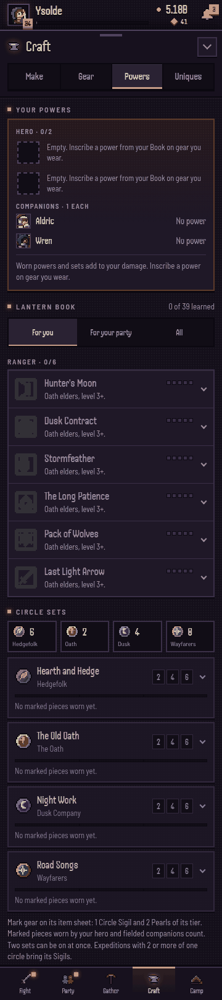 | 2 | your powers, Lantern Book | 1399 px (2.6) | 6 locked Book rows and 4 empty set rows for a player with no powers. The closing paragraph is 5 lines of rules. |
| Uniques 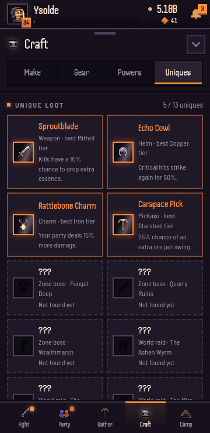 | 2 | 4 found, 4 "???" cards | 795 px (1.5) | A collection. The Codex has the same page (Uniques). |

### 1.6 Camp (Camp, Tavern, Almanac, Raid)

| View | Taps | Above the fold | Length | Notes |
|---|---|---|---|---|
| Camp 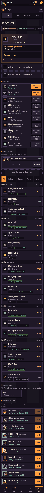 | 1-2 | Lantern Road, Hearth card, 2 builder cards | **3713 px (7.0)** | The longest screen in the game. Holds buildings, expeditions (1 out, "Send a team", 5 filter chips, 25 routes in 5 bands), blessings and a roster board of every hero. Building rows each have a two-line button with a cost and a time. |
| Tavern 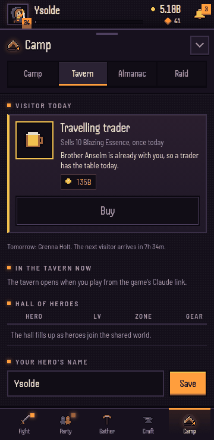 | 2 | visitor, online note, hall of heroes, rename | 509 px | Rename your Lanternbearer lives here. The offline notice repeats the Raid view's. |
| Almanac 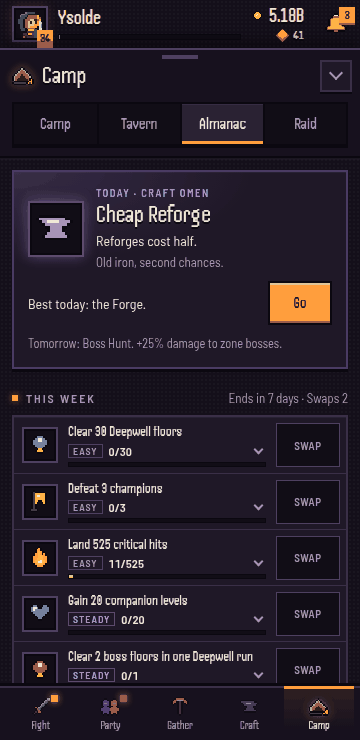 | 2 | Omen card, 4 weekly goals | 583 px (1.1) | Good. Its Omen is also the Fight banner. |
| Raid 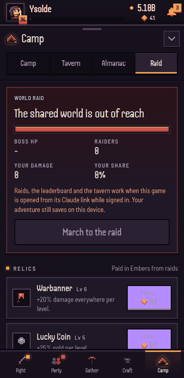 | 2 | raid card, relics | 719 px (1.4) | Mostly dead space offline. Relics (Embers) are single-player spending that only shows here. |

### 1.7 Achievements (hidden menu: Deeds, Tracks, Feats, Looks)

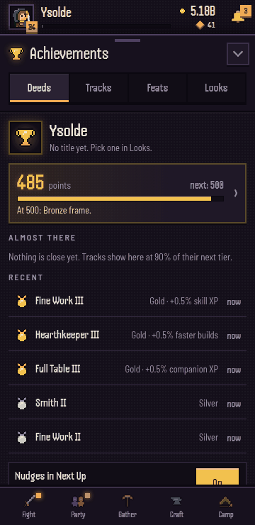 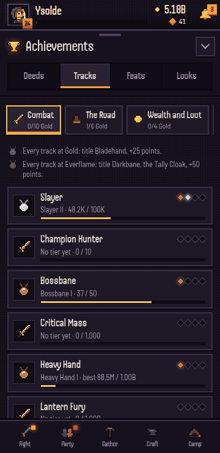

- **Taps: 3** (bell, Journal, "Open"), or a toast. It is a full menu with no tab, reached from a
  notices sheet.
- Deeds 618 px, Tracks 825 px (a scrolling chip row of 13 groups), Feats 1951 px (3.7), Looks 951 px.
- The menu header says "Achievements" but the tab bar shows no tab lit, so the player is lost on close.

### 1.8 Sheets

| Sheet | How to open | Height | Notes |
|---|---|---|---|
| Notices 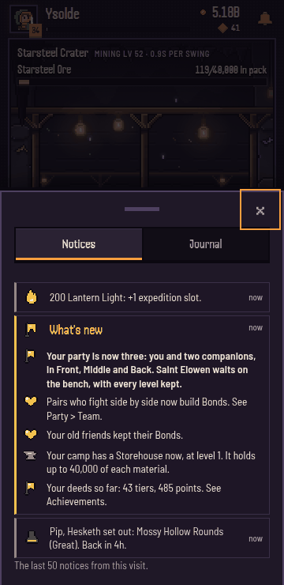 | bell | 453 px | Fine. |
| Journal 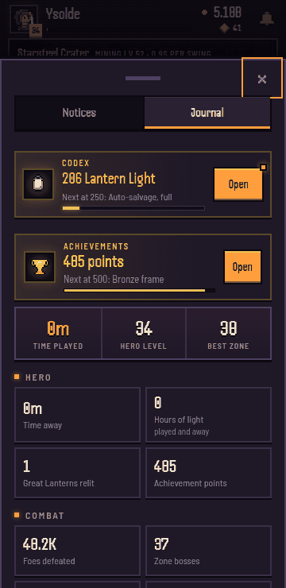 | bell, Journal | body 3271 px in a 620 px sheet (5.3 sheets) | Holds the Codex card, the Achievements card and the stats wall: the doors to two big systems sit inside a notices sheet. |
| Codex 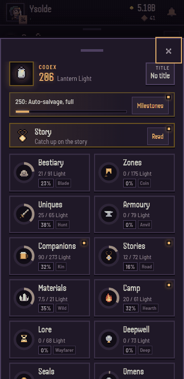 | bell, Journal, Open | 891 px | 3 taps. Pages repeat Bestiary, Zones and Uniques from other tabs. |
| Next Up 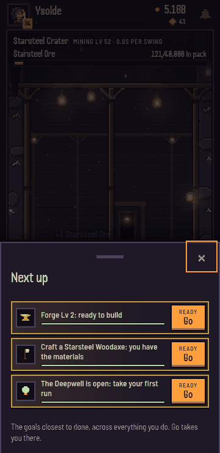 | the chip | 299 px | Good model: every row has one Go. |
| Where to get it 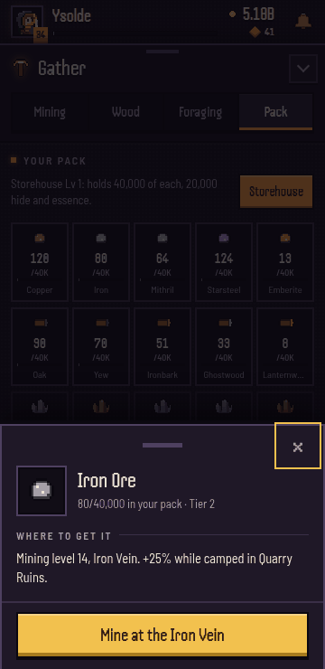 | a Pack cell | 150 px | Good: one line, one action ("Mine at the Iron Vein"). |
| Character 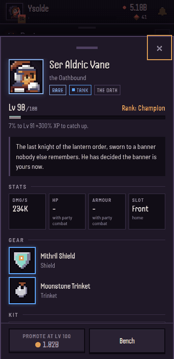 | a slot or roster card | 1861 px | HP and Armour show "-" and "with party combat" (party combat is always on now). |
| Lanternbearer 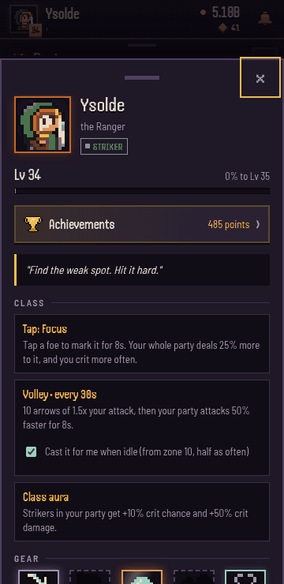 | the "Your hero" card | 1017 px | |
| Item 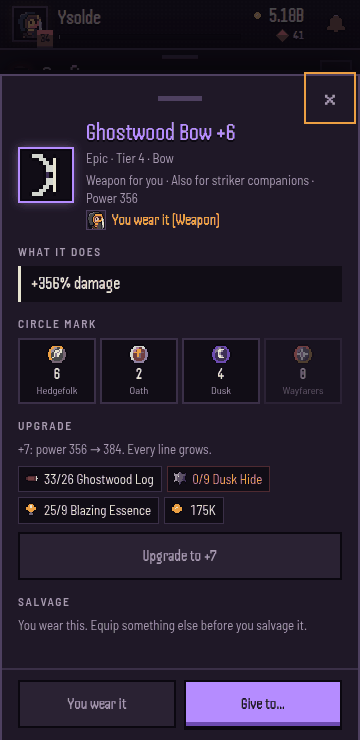 | a gear cell | 548 px | Good layout. "Give to..." opens a second sheet and the first one reopens after a timeout. |
| Combos and Kin 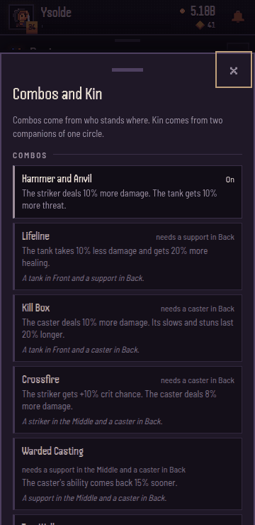 | See all | 1316 px | |
| Story, Lantern Road 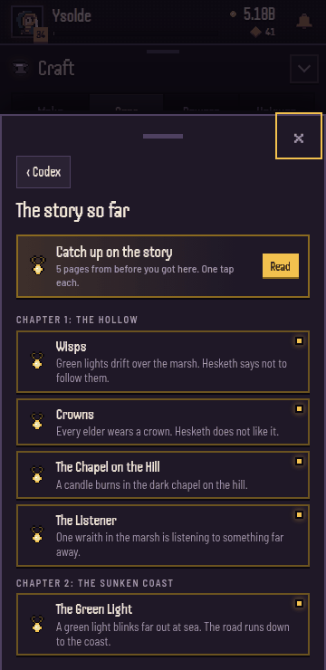 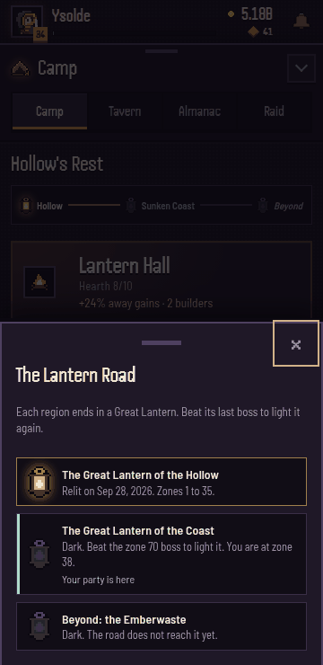 | Codex, Camp strip | 568 / 336 px | Fine. |

Every sheet opens with the orange focus ring on its close button (the focus moves there on open).

### 1.9 New game (cold Hearth)

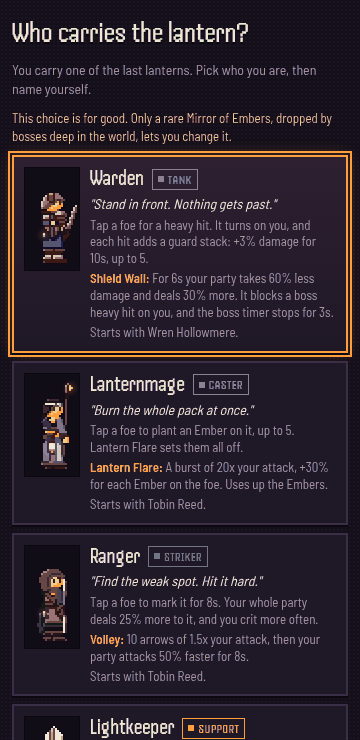 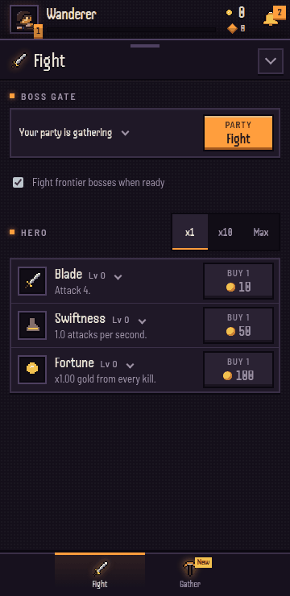 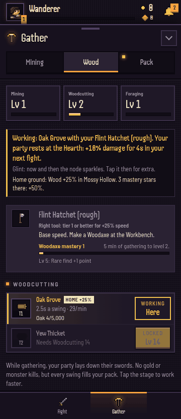

- Only Fight and Gather tabs; Gather has Mining, Wood and Pack. The Gather menu opens on **Mining**
  though the only thing a new player can gather is the Oak Grove (Wood).
- The Wood view shows three skill cards (Foraging included, which is still locked) and 5 lines of rules
  before the Oak Grove row.
- Fight says "Your party is gathering" and "PARTY Fight" on a save with no party.

### 1.10 Wide (1280 x 800)

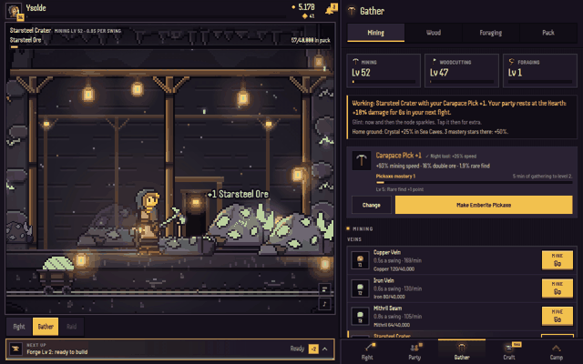 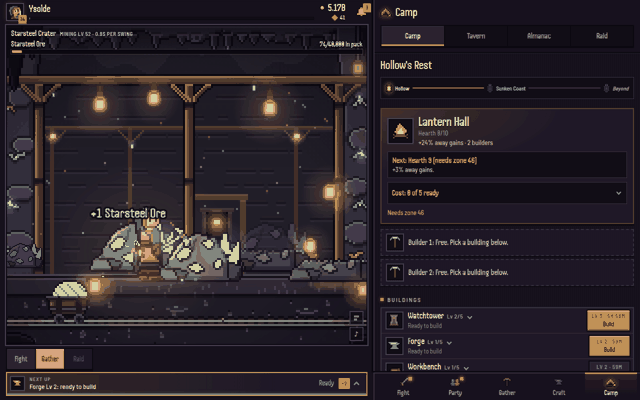

The menu column is 531 px wide and always open, so the problems are the same: Gather's first row at
~550 px, the Camp's 7-screen list. The wide layout itself works.

### 1.11 Patterns in use today

- **Tabs inside tabs:** 9 different inner switches (Deepwell shop, Stars x2, Roster x2, recipes x2,
  bag x2), plus the expedition filter chips and the track group chips. Some are segmented bars, some
  chips, some underlined tabs.
- **Action buttons:** at least 7 shapes: two-line caps "BUY 1 / price", "MINE / Go", "BOUNTY / 44%",
  "LV 3 · 5H 58M / Build", single word "Craft", "Send", "SWAP", "Open". Gold, orange, purple and grey
  fills mean different things on different tabs.
- **Section headers:** the orange-square caps header (most), a plain big title ("Hollow's Rest",
  "Ranger stars"), card titles, and "world-head" headings.
- **Type:** 23 display sizes (from `calc(9.5px * k)` to `calc(26px * k)`), 14 body sizes (9.5 to 14 px).
- **Spacing:** 12 different padding and gap values between 1 and 16 px.
- **Empty and locked:** "???" rows (Bestiary, Uniques), silhouettes (Roster), greyed rows (Powers, Book),
  "Needs X" buttons (Gather), hidden rows (Gather tiers beyond the next).

## 2. The top 10 problems

1. **Switching activity needs the game view.** No menu shows what you are doing, and no menu can switch
   it, except the boss gate's "PARTY Fight" on Fight, Upgrades. Fight to a node of another skill costs 3
   taps and a scroll, then a 4th to see it.
2. **Gather buries its nodes.** The first node row starts 423 px down a 528 px view (80%); three skill
   cards, a status box and a tool card come first, the same on every skill view.
3. **Gather rows all look alike.** 10 identical gold "MINE Go" buttons on Mining; no "best for you";
   the current node is a gold edge mid-list; held vs cap is a small grey line; lower tiers never fold.
4. **Stale copy after G1, H3 and party combat.** "your party lays down their swords", "Your party is
   gathering", "PARTY Fight" on a new game, "with party combat", "Pack" vs "Storehouse", the fight
   zone's home ground shown while gathering, "Rare find +1 point".
5. **The Camp view is 7 screens long** (3713 px): buildings, expeditions with 25 routes, blessings and a
   roster board in one scroll.
6. **Everything shows twice or three times.** Party members 3 times on Team (plus bench, Roster and the
   Camp board); the Lanternbearer's gear on Team and Craft; skill levels 3 times on Gather; Bestiary and
   Uniques in their tabs and in the Codex; the Omen on Fight and Almanac; the Trial twice in the Deepwell.
7. **Tabs inside tabs.** Nine inner switches, some two deep (Roster sort then role; recipe filter then
   tier; Deepwell shop), each styled its own way.
8. **Achievements and the Codex are hidden** behind the bell (a notices button): bell, Journal, Open =
   3 taps; the Journal itself is a 5-sheet-long stats wall.
9. **No shared patterns.** 7 button shapes, 4 header styles, 23 display font sizes, 12 spacing values;
   colour means different things per tab (gold = go on Gather, orange = build on Camp, purple = buy on Raid).
10. **Menu chrome and filler take the space.** 210 px of chrome per menu; "???" rows, silhouettes and
    empty families fill the rest; a new game opens Gather on Mining and shows locked Foraging.

## 3. Information architecture

### 3.1 Tabs

Five bottom tabs: **Fight · Gather · Party · Craft · World**. Fight and Gather are the basic play (what
you do now) and sit side by side under the thumb. Party, Craft and World are what you do between. The
**World** tab replaces the Camp tab and opens on a map (section 7): everything that is not fighting or
gathering is a place on it. Tab ids stay (`adv`, `gat`, `party`, `forge`, `world`); only the order and
the label ("Camp" becomes "World") change. Five still fit at 360 px with thumb reach; a sixth would not.
Each tab keeps 2-4 views, and every system has one home; other places link to it instead of repeating it.

| Tab | Views (first = default) | Changes |
|---|---|---|
| **Fight** | Zone · Bounties | "Upgrades" becomes **Zone**: the zone card (zone, foes to the boss, boss button, zone stepper, auto-boss), the Omen line (links to the Almanac post) and your upgrades. Bestiary and zone mastery move to the Codex (the zone card keeps a one-line mastery star count). **The Deepwell leaves** (to the World). **Raid does not come here**: it stays in the World at its raid site. |
| **Gather** | Mining · Wood · Foraging · Storehouse | Unchanged from UX2 (GX1, section 6.1). "Pack" becomes **Storehouse** (materials only). The Coast's Fishing becomes a fifth view: "Mine · Wood · Forage · Fish · Store". |
| **Party** | Team · Heroes · Stars | Unchanged from UX2: "Roster" is **Heroes**; Team drops the repeated hero cards; each hero card says where they are ("At the Library", "Out: Mossy Hollow, 4h"). The Camp's roster board goes. |
| **Craft** | Make · Armoury · Powers | Unchanged from UX2. The Armoury is built at Hollow's Rest; its screen (your gear, bag, loadouts, lock, salvage filter) lives here. Uniques move to the Codex. |
| **World** | **Map**, then the places you open from it | New. Opens on the map of the Lantern Road. Places: Hollow's Rest (the camp), the Tavern, the Deepwell, the Almanac post, the raid site, each region's Great Lantern, and one road row per band of 7 zones (travel and expeditions). No view switcher: the head row holds the region chips on the map and "‹ Map" in a place (7.4). |
| Journal (hidden menu) | Deeds · Tracks · Feats · Codex | Unchanged from UX2. Opened by tapping the portrait. The rename box moves to its Lanternbearer card (decided). |
| Bell (sheet) | Notices | Only notices. |

### 3.2 The places on the map

| Place | On the map | Opens as | Holds |
|---|---|---|---|
| **Hollow's Rest** (the camp) | top of the Hollow, below Lantern Hill | place view `rest` | **Build**: the Hearth, builders and every building (stations, Storehouse, Armoury, Bunkhouse, Watchtower, Map Room, Library, Shrine, Kitchen, K13's refining stations). **Work**: Hands on shifts (beds from the Bunkhouse) and K13's refining queues. **Blessing**: the Shrine. The Storehouse and Armoury rows say "Open ›" and go to their screens in Gather and Craft. |
| **The Tavern** | beside Hollow's Rest | place sheet | The visitor (hire heroes), the Job board (hire Hands; "Beds 3 of 4" from the Bunkhouse), Rumours (Tavern Lv 3), one online line with "Hall of heroes ›" (view `tav`, online). |
| **The Deepwell** | beside Hollow's Rest (the old well under the camp) | place view `deep` | The entrance: Normal run, the week's Trial, the Deep Lore shop (a sheet), last run. The Hollow's dungeon. |
| **The Almanac post** | at the camp gate, on the road | place sheet | The Omen and the weekly goals (today's Almanac view, as a sheet). |
| **The raid site** | in the region the current great foe roams (7.5) | place view `raid` online, small sheet offline | The world raid card, war horn, relics. Markup and ids unchanged. |
| **Great Lanterns** | one per region at its end (the Hollow's is on Lantern Hill) | sheet | Today's Lantern Road sheet for one region: the day it was relit, or what lights it. |
| **Road rows (bands)** | one row of 7 lamps per band | band sheet | The 7 zones as tiles (tap a lit one to fight there; mastery stars; later Oath Seals) and that band's expedition routes (Plan opens the send sheet). |
| Dungeons (later) | one slot per region | place view | The Deepwell is the Hollow's. A region spec may add one: a pin, a view id and an entrance view in the Deepwell's shape (7.7). |
| Pinnacles (later) | at their story place | decided by the pinnacle UI task | The map has the slot (a pin in `WORLD_MAP`). |

**Sheet or view.** A place with one job and a short list opens as a **sheet over the map** (the
Tavern, the Almanac, a Great Lantern, a band, the raid when offline): the map stays in sight and closing
goes back to it. A place you work in for minutes opens as a **place view** in the World menu (Hollow's
Rest, the Deepwell, the raid online).

**Decision: the Almanac stays on the map**, as a post at the camp gate, not in the Journal. The Journal
keeps records (what you did); the Almanac is this week's jobs, and the World tab is where "go and do
something between fights" lives. Its dot shows on the post and on the World tab. The Omen stays as one
line on Fight, Zone, linking to the post's sheet.

### 3.3 What moves

| Thing | Was (built) | UX2 planned | Now (UX2b) |
|---|---|---|---|
| Deepwell | Fight, Deepwell | Fight, Deepwell | World, the Deepwell pin (view `deep`, same id) |
| World raid, war horn, relics | Camp, Raid | Fight, Raid | World, the raid site (view `raid`, same id; `p-raid` stays inside `p-world`, so no markup moves) |
| Hearth, builders, buildings, blessing | Camp, Camp | Camp, Build | World, Hollow's Rest (view `rest`; old id `camp` is an alias) |
| Expeditions | a Camp section | Camp, Expeditions | The map: the expedition bar, the Routes sheet, road rows and their band sheets. No list view. |
| Almanac | Camp, Almanac | Camp, Almanac | World, the Almanac post (a sheet; old id `almanac` opens the map and the sheet) |
| Tavern: visitor, Job board | Camp, Tavern | Camp, Tavern | World, the Tavern sheet |
| Tavern: who is online, hall of heroes | Camp, Tavern | Camp, Tavern | view `tav` ("Hall of heroes ›" from the Tavern sheet; ids unchanged) |
| Lantern Road strip and sheet | Camp view header | Camp, Build | The map itself: region chips in the head, Great Lantern pins, lit lamps on the road |
| Zone travel beyond the stepper | none | none | Band sheets on the map (the stepper stays on Fight, Zone) |
| Hands (N3) | planned on Camp | planned on Camp | Hire at the Tavern sheet; beds and shifts at Hollow's Rest, Work |
| Roster board | Camp | gone | gone (Party, Heroes says where each hero is) |
| Rename your Lanternbearer | Tavern | Journal | Journal, Lanternbearer card |

### 3.4 Where each system lives

| System | Home | Also reachable from (links, not copies) |
|---|---|---|
| Zone, boss gate, auto-boss, zone stepper | Fight, Zone | game view control row, quick switcher, band sheets |
| Your upgrades (Blade, Swiftness, Fortune) | Fight, Zone | Next Up |
| Omen | World, Almanac post | one line on Fight, Zone |
| Bounties | Fight, Bounties | Next Up, toasts |
| Deepwell (runs, Trial, Marks shop) | World, the Deepwell (shop as a sheet) | quick switcher (while a run is live or paused), Codex page |
| World raid, war horn, relics | World, the raid site | quick switcher (Raid row, online only), the region chip's red dot |
| Formation, Bonds, combos and Kin | Party, Team | character sheet |
| Heroes, recruiting, leads, promotions | Party, Heroes | the Tavern's visitor, Next Up |
| Constellations | Party, Stars | Lanternbearer sheet |
| Gathering nodes, skills, tools worn, Glint | Gather, skill views | quick switcher, stage |
| Storehouse (materials, caps, trophies) | Gather, Storehouse | Hollow's Rest (upgrading it) |
| Recipes, stations, tools to make | Craft, Make | tool chip, Next Up |
| Gear, bag, loadouts, salvage (Armoury) | Craft, Armoury | character sheets, Hollow's Rest (upgrading it) |
| Legendary powers, Lantern Book, circle sets | Craft, Powers | item sheet |
| Buildings, Hearth, builders, blessings | World, Hollow's Rest | Next Up, toasts |
| Hands: beds, shifts; refining (K13) | World, Hollow's Rest, Work | Tavern (hiring), Next Up |
| Expeditions | World map: expedition bar, Routes sheet, band sheets | hero cards ("Out: ..."), toasts |
| Almanac (Omen, weekly goals) | World, the Almanac post | Fight, Zone (Omen line) |
| Tavern (visitor, Job board, Rumours) | World, the Tavern sheet | Party, Heroes (visitor lead) |
| Who is online, hall of heroes | World, view `tav` | the Tavern sheet's online line |
| Great Lanterns, the Lantern Road | World map | the Great Lantern card (moment), Codex Story |
| Achievements, titles, looks | Journal, Deeds / Tracks / Feats | portrait, toasts |
| Codex, Light, Bestiary, zone mastery, Uniques, story, Lore | Journal, Codex | portrait, toasts |
| Lifetime stats | Journal, Deeds, "Lifetime stats" sheet | |
| Rename the Lanternbearer | Journal hero card | |
| Notices, What's new | bell | |
| Settings (sound, HUD, targets, numbers, tips) | a Settings sheet from the Journal hero card | |

## 4. Global navigation

### 4.1 The activity pill

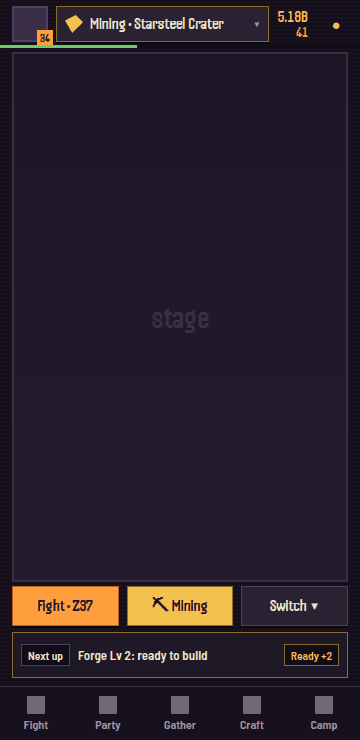

- The header's name block becomes the **activity pill**: one 36 px tall button between the portrait and
  the purse, visible on the game view and over every menu (the header never scrolls away).
- Text: "Fighting · Zone 37", "Mining · Copper Vein", "Woodcutting · Oak Grove", "Foraging · Sage Bed",
  "Raiding · The Glass Hydra", "Deepwell · Floor 12". An icon (sword, pick, axe, sickle, horn, lantern)
  before it, a chevron after it. It ellipses at 360 px ("Woodcutting · Ghostwoo...").
- State colour: gold edge while gathering, neutral while fighting, red edge when the current node's
  cell is full ("Mining · Copper Vein · full"), so the player sees it without opening Gather.
- The name moves to the Journal hero card and the Lanternbearer sheet. The XP bar becomes a 3 px line
  along the bottom edge of the header (full width). The level stays on the portrait.
- The portrait becomes a button: it opens the Journal.
- Wide screens: same pill in the header over the game column.

### 4.2 The quick switcher

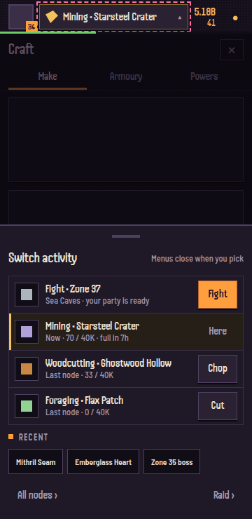

Tap the pill (or the "Switch" button on the control row) to open a small sheet:

1. **Fight · Zone N** (your current zone, with the zone name). One primary button: "Fight".
2. **Each open gathering skill**, with its last node: "Mining · Starsteel Crater, 70 / 40K". The row you
   are on says "Here". Buttons use the verb: Mine, Chop, Cut, Pick.
3. **Recent**: up to 3 chips of recent places not already listed (another node, "Zone 35 boss" when a
   boss attempt failed there, a Deepwell run that is paused).
4. Footer links: "All nodes ›" (opens Gather on the current skill), "Map ›" (the World map), "Raid ›"
   (online only; opens the raid site).

One tap switches the activity **and closes the sheet and any open menu** (portrait), so the player lands
on the stage and sees the change. On wide screens the menu stays open and updates. A locked skill is
not listed. The Deepwell appears only while a run is live or paused.

Save: the last node per skill and the recent list are new state, `registerState('nav', { v: 1, last:
{ mine: null, wood: null, forage: null }, recent: [] })`, filled from `S.node` on load so old saves
start with their current node. `S.node` keeps its meaning (the node you work now). No online change.

### 4.3 The control row

Keep the row: **[Fight · Z37] [⛏ Mining] [Switch ▾]**. The first button fights at your zone; the
second resumes the current skill's last node (it shows that skill's icon and name); Switch opens the
quick switcher. The zone stepper moves into the Fight, Zone card (it is only needed while fighting there)
and into the stage HUD's zone label as a tap target. Raid leaves the control row (it is in the
switcher and at the raid site on the World map), so offline players stop seeing a dead button
(approved by the coordinator, 2026-09-28).

### 4.4 Back and close

- One model, no history stack (the Artifact runs in an iframe; do not use the History API).
- A **menu** closes with: the close button, tapping its open tab, a swipe down on the head, Escape.
  Closing returns to the game view. Tapping another tab switches menus directly.
- A **sheet** closes with: ✕, a tap on the dim area, a swipe down, Escape. It returns to what was under
  it (a menu or the game). A sheet opened from a sheet (item, Give to, pick a hero) replaces the first and
  shows "‹ Back" at the top left instead of reopening it after a timeout.
- Picking an action that changes activity (quick switcher, "Mine at the Iron Vein", "Go fight") closes
  sheets and menus in portrait.
- Focus: a sheet puts focus on its first control only when opened from the keyboard; touch opens with
  no focus ring.

### 4.5 Swipe between views

- A horizontal swipe on a menu's content moves to the next or previous view (Mining ↔ Wood ↔ Foraging ↔
  Storehouse, and in every tab). The Gather order follows the tab order so it matches the GX1 ask.
- World: the map has no views to swipe to (it is `data-noswipe` and only scrolls); in a place view a
  right swipe goes back to the map (7.4).
- Trigger: 56 px, horizontal distance more than 1.5 x vertical, or a flick over 0.4 px/ms. It never
  starts on an element marked `data-noswipe` (the star map, drag-to-swap slots and bench, horizontally
  scrolling chip rows, sliders).
- The view switcher's lit edge slides; content cross-fades in 120 ms (none under
  `prefers-reduced-motion`). A swipe down still closes the menu (it wins when vertical).

### 4.6 Deep links

- Every place that points somewhere uses one target shape: `go: { tab, view, sel, fn }`, the one Next Up
  already uses (`setTab(tab, sel)`, then scroll and flash).
- **Toasts** may carry `go`. A toast with `go` shows a "›" at its right edge; a tap follows it, a swipe
  dismisses it. Candidates: bounty done (Bounties), build finished (Build), Storehouse full (the quick
  switcher), recruit and promotion (the hero's sheet), achievement tier and Feat (Journal), unique
  loot (the item sheet), Codex milestone (Codex), weekly goal (Almanac), expedition back (Expeditions).
- Next Up, the away card and What's new lines keep `go` and gain the activity targets:
  `go: { act: 'gather', node: { kind, t } }` and `go: { act: 'fight', zone }` switch activity instead
  of opening a menu.
- Hidden views open on demand (onboarding's safety net stays).
- **World targets** (UX2b): a place view is an ordinary view id (`go: { tab: 'world', view: 'rest' }`,
  `'deep'`, `'raid'`). A sheet on the map takes two new optional fields: `go: { tab: 'world', view:
  'map', place: 'tavern' }` (scroll to the pin, open its sheet) and `go: { tab: 'world', view: 'map',
  band: 6 }` (scroll to the road row, open its band sheet). Toasts: build finished → `rest`; visitor or
  Hand applicant → Tavern sheet; weekly goal → Almanac post sheet; expedition back → its band; war
  horn → `raid`; Great Lantern lit → the map at that lantern (after the card).

## 5. One set of patterns

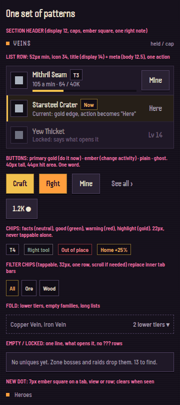

### 5.1 Type scale

Display font Handjet, always `calc(Npx * var(--display-k))`; body Barlow Semi Condensed.

| Token | Font | Use |
|---|---|---|
| `--t-hero` | display 22 | big numbers (points, Light, zone) |
| `--t-title` | display 18 | menu title, sheet title |
| `--t-card` | display 16 | card title |
| `--t-row` | display 14 | row title, button label |
| `--t-label` | display 12, caps, 0.12em | section header, slot label |
| `--t-body` | body 15 / 1.4 | paragraphs |
| `--t-meta` | body 12.5 / 1.3, muted | row meta, notes |
| `--t-chip` | body 11.5, 600 | chips, badges |

Six display sizes and three body sizes replace 23 and 14. New CSS uses the tokens; old rules move over
screen by screen as each is rebuilt.

### 5.2 Spacing

4 / 8 / 12 / 16 px only (`--s1`..`--s4`); `--gut` stays 12 px. Rows: 6 px vertical, 8 px horizontal
padding. Gap between sections 12 px, inside a card 8 px.

### 5.3 Menu header

One 44 px row: the view switcher and, at its right end, the close button (a down chevron, 44 x 44).
The title row goes (the lit tab names the tab, as it already does on short landscape screens). Saves
64 px of chrome in every menu: the content area at 360 x 740 grows from 528 to 592 px. The grab handle
stays as a 3 px line above the switcher (it is the swipe-down target). Hidden menus (Journal) show their
title in place of a lit tab: "Journal" on the left of the switcher row. The World tab uses the same
row for its region chips on the map and for "‹ Map · <place>" in a place view (7.4).

### 5.4 View switcher (sub-tabs)

Equal-width underlined labels, 1 word each (a number may follow: "Mining 52"). A 6 px ember square marks
news. **No inner tab bars.** Inside a view, a choice between lists is a row of **filter chips** (32 px,
one row, scrolls sideways when needed, `data-noswipe`) or a dropdown chip ("Tier 4 ▾", "For you ▾").

### 5.5 Section header

Ember square, caps label (`--t-label`), optional one right-aligned note (count or hint, `--t-meta`).
No big plain titles inside a view ("Hollow's Rest", "Ranger stars" become cards or the note).

### 5.6 List rows

- Min 52 px; icon 34 px (tier or state badge on it); title (`--t-row`) with at most one chip; one meta
  line (`--t-meta`); an optional 4 px progress bar under the meta; **one action** on the right.
- Rows sit in a list frame (`.dz-list`), 1 px dividers.
- The whole row is the tap target for its main action when the action is safe to repeat (go to a node,
  open a sheet); the right button is the visible label. Costly actions (buy, build, craft, salvage)
  take a tap on the button only.
- States: **current** (gold left edge, action becomes "Here" in ghost style), **best** (a "Best" chip),
  **dim** (can't afford or waiting: 55% opacity, the button says what is missing: "Needs hide"),
  **locked** (dim icon, meta says what opens it, button shows the level: "Lv 14").
- Details go behind a chevron (`disclose`) or into a sheet, never into a second meta line.

### 5.7 Buttons

| Style | Meaning | Example |
|---|---|---|
| Primary (gold fill) | do it now, affordable | Craft, Build, Mine, Claim |
| Activity (ember fill) | change what you are doing | Fight, Back to fight, Send a team |
| Plain (panel fill) | a normal action | Mine (a non-best node), Auto, Swap |
| Ghost (text) | navigate or open | See all ›, Change ›, Here |
| Price | plain with the price and coin icon, gold fill when affordable | 12.5Qa ● |

40 px tall, 44 px hit area, 1 word where possible (a price counts as a word). No two-line caps labels,
no brackets ("SWAP (FREE)" becomes "Swap" with "free" as meta). Purple stays for Embers prices only.

### 5.8 Cards

For the one thing a view is about (Now gathering, the zone card, the Hearth, the Omen): panel, 1 px
bright edge, 10 px padding, title `--t-card`, at most 3 lines, at most 2 buttons. A card never holds a list.

### 5.9 Chips

22 px, not tappable: fact (neutral), good (green), warning (red), highlight (gold: Home, Now, Best).
Filter chips (5.4) are the tappable 32 px kind.

### 5.10 Progress bars

4 px under row meta; 8 px on cards. Colour by meaning: gold = held vs cap and goals, green = XP, red =
foe HP or a full cell, ember = building. The label sits above the bar ("Starsteel 70 / 40K" left,
"Full in 7h 29m" right), never inside it.

### 5.11 Sheets

Keep the bottom sheet (`openSheet`). Small sheets for one decision (where to get it, a combo, a
confirm); tall sheets (90%) for a person or an item. Title row: name left, ✕ right, "‹ Back" when
stacked. One footer with at most 2 buttons, the main one on the right.

### 5.12 Toasts

Unchanged rules (priority, placement, folding). Add `go` (4.6). Copy: what happened, 1 line.

### 5.13 Empty and locked states

- One line that says what fills it and how: "No uniques yet. Zone bosses and raids drop them. 13 to find."
- No "???" rows, no rows of silhouettes, no zero-filled families: fold them ("Crystal, fibre, herbs,
  hide: none yet  Show ▾").
- A locked view is left out (as today); a locked row shows the level that opens it.

### 5.14 New dots

7 px ember square. On a tab (the tab has a view with news and is not open), a view label (news in that
view), a row (a new item, an unread story). It clears when the player opens the view or the row. Only
for things to act on or read; never for progress. "New" text badges stay only on newly opened tabs.

### 5.15 Copy

Player words: Lanternbearer, heroes, party, Storehouse, Armoury, node names, skill names. Verbs on
buttons (Mine, Chop, Cut, Pick, Fight, Build, Craft, Send). No mechanics words in the UI ("points" of
what, "cells", "flows"). Numbers short (`fmt`), "40K" not "40,000" on rows.

## 6. Per-screen wireframes

Mockups are HTML at 360 x 740 with the game's colours and fonts (`img/ux/m-*.png`). Grey squares stand
for pixel icons and portraits. The rest are ASCII.

### 6.1 Gather, skill view (GX1)

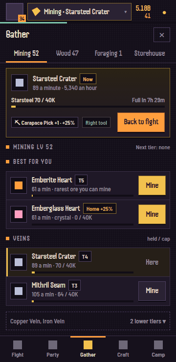

```
[portrait] [⛏ Mining · Starsteel Crater ▾] [5.18B / 41] [bell]
 Mining 52 | Wood 47 | Foraging 1 | Storehouse        [v]
┌ NOW ───────────────────────────────────────────────┐
│ [ic] Starsteel Crater  (Now)                         │
│      89 a minute · 5,340 an hour                     │
│ Starsteel 70 / 40K                 Full in 7h 29m    │
│ ▓░░░░░░░░░░░░░░░░░░░░░░░░░░░░░░░░░                   │
│ (⛏ Carapace Pick +1 · +25%) (Right tool) [Back to fight] │
└──────────────────────────────────────────────────────┘
■ MINING LV 52                     every tier open
▓▓▓▓▓▓▓░░░░░ (skill XP)
■ BEST FOR YOU
 [ic] Emberite Heart (T5)  61 a min · rarest ore  ▓░░ [Mine]
 [ic] Emberglass Heart (Home +25%) 0 / 40K        ░░░ [Mine]
■ VEINS                                      held / cap
 [ic] Starsteel Crater (T4) 89 a min · 70 / 40K  ▓ [Here]
 [ic] Mithril Seam (T3)     105 a min · 64 / 40K ▓ [Mine]
 ┆ Copper Vein, Iron Vein            2 lower tiers ▾ ┆
■ GEODES  (same rows, same fold)
```

- **Now gathering card** only on the skill you work now. On the other skill views it shrinks to a
  one-line strip: "You are mining Starsteel Crater. Tap a node to move here." The rows' buttons do it.
- While fighting, the card says "You are fighting in Zone 37." with [Gather here] resuming this
  skill's last node.
- **Stop** is "Back to fight" (ember): it fights at your zone and, in portrait, closes the menu.
- **Tool chip**: one row inside the card: the tool, its bonus, Right tool or "Wrong tool: -X%". Tap:
  the tool's item sheet (mastery bar, Make better ›). The old tool card goes.
- **Skill line**: one section header with the level and the next tier; the XP bar under it. The three
  skill cards go (levels are on the view labels).
- **Best for you**: up to 2 rows chosen by a pure rule in core (highest open tier; then Home ground; then
  what the next build or recipe waits on, `whereToGet`/Next Up needs; never the node you work).
- **Rows**: compact rows (5.6) with the held/cap bar, "a min" rate, one verb button. The whole row
  moves you there. Full cells: red bar and "Full" chip; the button still works (Spillover rules stay).
- **Lower tiers fold**: tiers more than one below your best open tier fold into one line per family.
  Locked tiers: only the next one shows, dim, "Lv 64".
- **Glint** moves to the stage only (it already shows there when it sparkles).
- **Home ground** shows as the Home chip on rows, only when it applies to gathering.
- The how-to paragraph goes; a first-time tip (onboarding) covers "tap the stage to work faster".
- New game (cold Hearth): Gather opens on **Wood**; the view shows the Now card with the Flint Hatchet
  chip, the Oak Grove row and the next locked tier. Mining and Foraging views appear when they open.

### 6.2 Gather, Storehouse

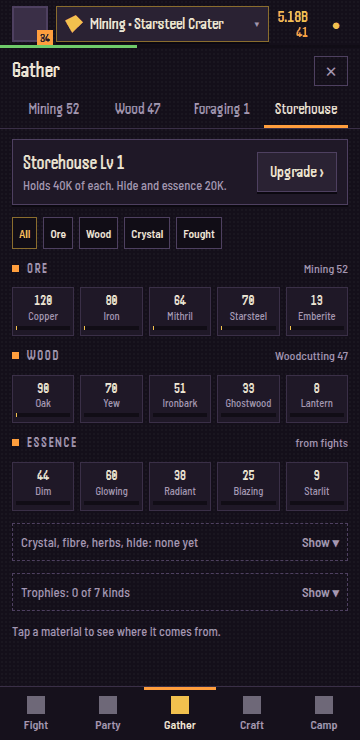

- Top card: Storehouse level, what it holds, "Upgrade ›" (opens Camp, Build on the Storehouse row).
- Filter chips: All · Ore · Wood · Crystal · Fibre · Herbs · Fought (hide, essence) · Trophies.
- Families as 5-cell rows with a held/cap bar in each cell; families with nothing fold into one line;
  trophies fold.
- Tap a cell: the "where to get it" sheet (kept as is; its button switches activity and closes menus).
- The full-cell warning ("Storehouse full" chip with Switch and Spillover) moves to the Now card and the
  pill (4.1).

### 6.3 The quick switcher and the game view

See 4.1-4.3 and `m-switch.png`, `m-game.png`.

### 6.4 Fight, Zone

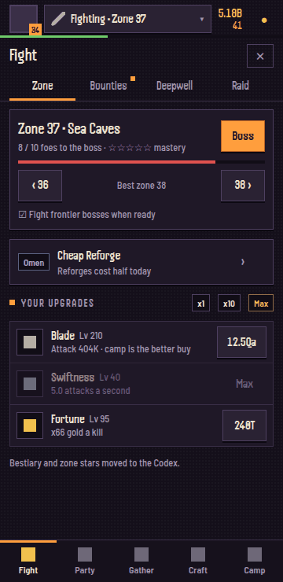

- Zone card: "Zone 37 · Sea Caves", foes to the boss with a bar, **Boss** (ember), the zone stepper
  (‹ 36, Best zone 38, 38 ›), auto-boss. While gathering, the card says "You are mining. [Fight here]".
  A ghost "Map ›" opens the World map at your road row (7.6).
- The Omen as one row (links to the Almanac).
- Your upgrades: x1/x10/Max as chips in the section header; rows with a price button. Advice ("the camp
  is the better buy") as meta with a ghost "Camp ›" when it applies.
- The old companion upgrade rows (before the roster) stay hidden as today.

### 6.5 Fight, Bounties

```
■ BOUNTIES                                   3 of 3
 [ic] Land 25 critical hits   11 / 25  ▓▓▓▓░░   [Claim] (gold when ready, else a % chip)
      41.1B gold · swap free                    [Swap]
```
One action per row: Claim when ready, else the row's button is Swap (ghost) and progress is the bar.

### 6.6 Deepwell and 6.7 Raid: moved to the World

UX2b moves both out of Fight: the Deepwell entrance is a place view on the World map (7.7) and the
raid is its raid site (7.5). The layouts UX2 drew here (the Trial once, the shop as a sheet, the raid
card with relics and the offline line) carry over unchanged.

### 6.8 Party, Team

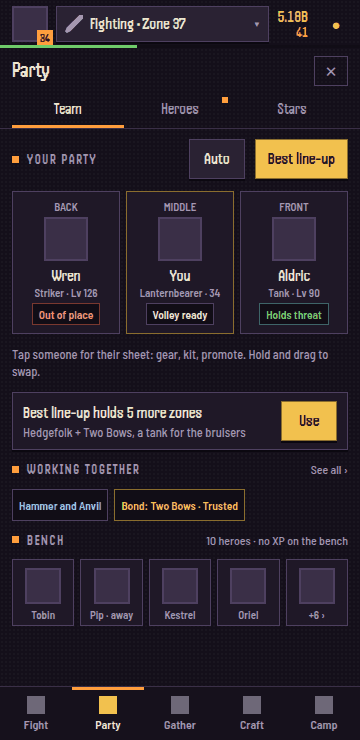

- Three slot cards (Back, Middle, Front) with one state chip each (Out of place, ability ready, holds
  threat). Tap: the character sheet. Hold and drag: swap (as today).
- Best line-up: one card with the gain and a **Use** button (the sentence and the button merge).
- "Working together": combos, Kin and Bonds as chips in one row, "See all ›" opens the combined sheet.
- Bench: one row of 4 portraits and "+N ›" (opens Heroes). The header note says "no XP on the bench".
- Gone from Team: "Your hero" card (the Lanternbearer's slot opens the Lanternbearer sheet, which holds
  gear, powers, looks and the ability) and "Fighting beside you" cards.

### 6.9 Party, Heroes (was Roster)

```
■ HEROES 12 / 18            (Power ▾) (All roles ▾)
 [grid of recruited heroes, 4 a row: portrait, Lv, where: In party / At the Library / Out 4h]
■ WHO COULD JOIN 6
 [sil] Morwen the Candlewitch   Quest: zone 33 boss with no support   ▓▓▓▓▓▓░ 75%
 [sil] Caedmon the Ashen Knight Renown 45 / 250                        ▓▓░ 59%
```
Sort and role become two dropdown chips in the header. Locked heroes show once, as rows with their lead.

### 6.10 Party, Stars

Keep the map. Map / List and Farm / Push become two dropdown chips in one header row with points left;
Rename and Reset move into a "⋯" menu chip.

### 6.11 Craft, Make

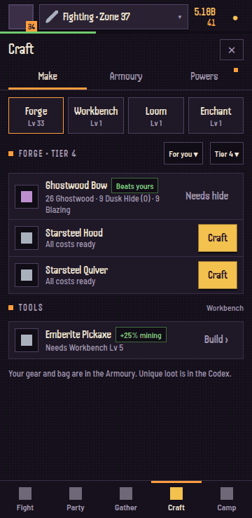

- Stations as 4 tiles (tap to pick, level under the name).
- One header row: station and tier, with "For you ▾" and "Tier 4 ▾" dropdown chips. It opens on your
  best station and highest open tier, not Tier 1.
- Recipe rows: name, one chip (Beats yours), costs as one meta line (missing ones in red), one button
  (Craft, or ghost "Needs hide" which opens where to get it).
- Tools: their own section on the Workbench list.

### 6.12 Craft, Armoury (was Gear)

```
┌ ARMOURY LV 1 ──────── bag 12 / 50 ── [Upgrade ›] ┐
■ WORN BY YOU        (Loadout: Farm ▾)
 [8 gear tiles: Weapon, Off-hand, Head, Body, Charm, Pickaxe, Woodaxe, Sickle]
■ BAG                (All ▾) (Power ▾)  [Salvage…]
 [grid of item tiles, lock icon on locked items]
```
The owner's Armoury features land here: bag size by building level, loadouts (a dropdown chip), lock
and favourite (on the item sheet and as a tile badge), the auto-salvage filter (a sheet from
"Salvage…"), sort and filter as two dropdown chips. The display rack is camp scenery. Build and upgrade
it at Camp, Build. Save fields for the Armoury belong to its own task.

### 6.13 Craft, Powers

```
■ YOUR POWERS   hero 0 / 2 · heroes 1 each
 [2 empty slots: "Inscribe a power from your Book on gear you wear."]
■ LANTERN BOOK 0 of 39        (For you ▾)
 empty state: "No powers yet. Oath elders at level 3+ drop them."   (6 locked rows fold)
■ CIRCLE SETS  6 · 2 · 4 · 0 sigils
 rows only for sets with a marked piece worn; the rest fold into one line
```

### 6.14 World, Hollow's Rest: Build (was Camp, Build)

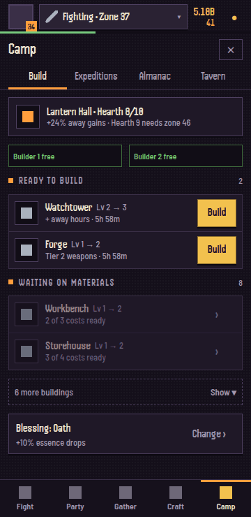

- Hearth card (one line of what the next level needs), builders as two chips (free / busy with a timer).
- Buildings grouped: **Ready to build** (primary Build buttons with the time as meta), **Waiting on
  materials** (dim rows, "2 of 3 costs ready", tap to see the costs), and the rest folded.
- The Lantern Road strip goes: the World map is the road (7).
- Blessing moves to its own chip in Hollow's Rest (7.8).
- The Storehouse and the Armoury rows link to their views ("Open ›" next to Build), in the group
  "Buildings with their own screen" (7.8).
- The roster board goes (Heroes shows where each hero is).

### 6.15 Expeditions, 6.16 Almanac and Tavern: moved to the World

Expeditions are sent from the map (7.6): the expedition bar, the Routes sheet and the band sheets
replace UX2's Expeditions view (`m-exped.png` is superseded by `w-band.png` and `w-send.png`). The
Almanac is the post's sheet (UX2's layout kept: one card, one list, one action a row; "SWAP" becomes
"Swap"). The Tavern is a place sheet (7.9); who is online and the hall of heroes stay in view `tav`.

### 6.17 Journal (hidden menu: Deeds, Tracks, Feats, Codex)

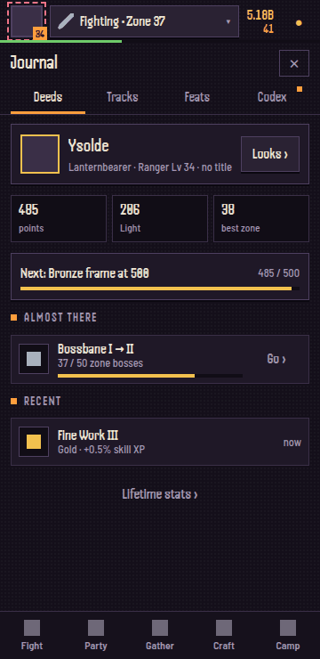

- Opened by the portrait. Deeds home: the Lanternbearer card (name, class, level, title, "Looks ›" and
  "Settings" in a ⋯ chip, rename), three stat tiles (points, Light, best zone), the next reward bar,
  Almost there (rows with Go), Recent, "Lifetime stats ›" (a sheet: today's stats wall).
- Tracks: group filter chips (one scrolling row) and track rows (as today).
- Feats: rows with progress; the long text goes into each Feat's sheet.
- Codex: today's Codex home as a view (Light, milestones, Story, page tiles); pages open as sheets. The
  Bestiary, Zones and Uniques pages are now the only place for those lists.

### 6.18 Sheets

| Sheet | Change |
|---|---|
| Character (hero) | Stats show real HP and Armour (party combat is always on); drop "with party combat". Footer: Promote (when ready) and Bench/Field. |
| Lanternbearer | Holds gear, powers, ability, Stars link and Looks link (moved from Team's "Your hero" card). |
| Item | Keep. "Give to…" is a stacked sheet with "‹ Back". Add Lock (Armoury). |
| Where to get it | Keep; the button closes menus when it switches activity. |
| Next Up | Keep; rows may switch activity (4.6). |
| Notices | Keep; the Journal tab goes. |
| Combos and Kin, Bond | Merge into "Working together" (tabs as filter chips: Combos, Kin, Bonds). |
| Story, expedition send, Inscribe | Keep; title row and footer per 5.11. The send sheet stacks on a band sheet (7.6). |
| Lantern Road | Becomes one region's Great Lantern sheet, opened from its pin (7.3). |

## 7. The World map

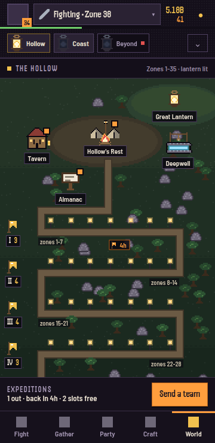 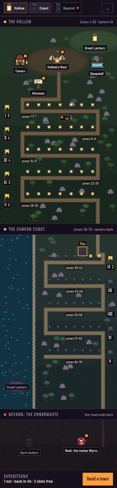

Mockups: `w-map` (the World tab at 360 x 740, opened at Hollow's Rest), `w-map-full` (the whole
scroll on the late save: zone 38, the Hollow lit, the Coast reached, the Ashen Wyrm raid live). The art
in them is the painter below with draft sprites; the art task (UX-W1) finishes the sprites.

### 7.1 Layout at 360 x 740

- **Head row** (44 px, the UX-B menu head): the **region chips**, one per region reached plus the next
  one (a lantern icon, lit or dark, and a short name: "Hollow", "Coast", "Beyond"), then the close
  chevron. A tap scrolls to that region's header. The chip of the region with the raid carries a red dot.
  No title: the lit World tab names the menu.
- **The map**: one vertical scroll, full bleed (360 px, no gutter). Regions stack in road order, top to
  bottom. Each is a 34 px section header ("THE HOLLOW · Zones 1-35 · lantern lit") and its **plate**.
  New regions append at the bottom.
- **The expedition bar** (56 px), fixed under the map and above the tab bar: "EXPEDITIONS · 1 out · back
  in 4h · 2 slots free" and one ember button, **Send a team** (7.6). It shows once expeditions open.
- Room for the map: 740 - 48 header - 44 head - 56 bar - 54 tabs = **538 px**. The whole map on the late
  save is 1,386 px (2.6 screens).
- **Opens where you left it** (the scroll is kept in `lanternfall.ui.v1` as `mapY`); the first time, at
  Hollow's Rest. A deep link scrolls to its target and flashes it.
- **No pan or zoom.** Decision: a fixed vertical strip. Native scroll is smooth, cheap and accessible,
  it never fights the swipe-down close or the view swipe, nothing is drawn scaled per frame, a plate is
  exactly one screen wide so nothing hides sideways, and a new region is just another plate below.

Region states:

| State | Plate | Pins | Header note |
|---|---|---|---|
| Reached (your max zone is in or past it) | full colour, lamps lit up to your max zone | all | "lantern lit" or "lantern dark" |
| Next (the first region not reached) | the same plate painted with the grey palette | dim; a tap says what opens it | "Reach zone 36" |
| Beyond (a region with no data yet, `ROAD_BEYOND`) | a short dim plate (76 art px): ash specks, the road running out, a dark lantern | the raid pin only, if its foe lives there | "The road ends here" |

### 7.2 A region plate

- Baked once to a small canvas at **art size 180 px wide** (Hollow 300 tall, Coast 266, Beyond 76),
  shown at 2x (1 art px = 2 CSS px) with `image-rendering: pixelated`. It holds only ground: a four-band
  colour ramp with a dithered seam, the region's shapes (Lantern Hill and the camp clearing; the sea and
  its shingle), scattered stamps (7.11), the road and the lamps.
- **The road** is a snake of 5 rows, **one row per band of 7 zones**, 4 art px wide with a 1 px dark
  edge. It enters at the top and leaves at the bottom at the x where the next plate's road begins.
- **Lamps**: one per zone above the road. Lit gold when the zone's boss is beaten (`zone < S.maxZone`),
  dark grey when not. This is the "visibly relit world" of plan-2 RD: the road lights up as you go. A
  new max zone repaints one lamp in place (a few `fillRect`s), never the plate.
- Everything you tap or read is **DOM over the plate** (sharp text, screen readers, 44 px targets):
  pins, labels, band flags, the zone-range labels, the You marker, teams out.
- Data, per region, in `WORLD_MAP[regionId]` (13d-art-world.js): `{ H, pal, road, rows: [5 y], xa,
  xb, shapes, stamps, places: { rest: [x, y], ... }, lantern: [x, y], raid: [x, y], dungeon? }`. The
  painter is generic; a new region only adds numbers and a palette (7.10).

### 7.3 Pins, flags and the You marker

- A **pin** is a 48 x 48 button centred on its spot: the landmark sprite (24 x 24 at 2x) or an icon
  (12 x 12 at 2x or 3x), with a label chip under it (body 11.5 px, 600, on a dark chip) and the 8 px
  ember **dot** when the place has something to act on (5.14: a build done, a visitor or applicant, a
  goal ready, a raid live, a run paused, a team back).
- Pins on one plate sit at least 48 px apart (a check). A **locked place** shows dim (55%) with its
  label; a tap opens a one-line sheet ("The Tavern opens at zone 8."). A place not in the game yet has
  no pin.
- **Band flags**: the `banner` icon at the start of each road row with the band numeral and its route
  count ("VI 2"); grey while the band's routes are locked. The **whole road row** (360 x 44 px) is the
  tap target for the band sheet; the flag is the cue. Zone ranges ("zones 36-42") label each row.
- **Teams out**: a small ember banner chip on the row of the route's band with the time left ("4h").
  When the team is back it says "Back" and gets the dot.
- **You**: your portrait (24 px) in a gold ring with a "You" tag. On your zone's lamp while fighting; at
  Hollow's Rest while gathering (nodes and Hands are near the camp); at the Deepwell during a run; at
  the raid site while raiding. It moves only when the activity or zone changes. Tap: the quick switcher.

### 7.4 Interaction

- **Tap a pin**: its sheet or place view (3.2). **Tap a road row**: its band sheet. **Tap You**: the
  quick switcher. **Tap a region chip**: scroll to it.
- **The activity pill and the quick switcher stay in the header** above the map and every place, as on
  every tab (4.1-4.2). Anything that changes activity (the switcher, a band tile, "Fight here", Enter
  the Deepwell, March to the raid) closes the World menu in portrait (4.4), so you land on the stage.
- **Place views** use the head "‹ Map · <place> · ⌄" (44 px) with optional filter chips under it
  (Hollow's Rest: Build · Work · Blessing). "‹ Map", a right swipe, or a tap on the lit World tab goes
  back to the map at the same scroll. ⌄ closes the menu. The tab remembers the place you were in, like
  any tab remembers its view.
- **Sheets over the map** follow 5.11: 90% at most, ✕, "‹ Back" when stacked (band → send).
- **Swipe**: the map is `data-noswipe` for the view swipe (4.5); it only scrolls. A swipe down on the
  head still closes the menu.
- **Wide (1280 x 800)**: the map stays 360 px wide, centred in the 531 px menu column (the sides show the
  panel colour); sheets open in the column. **Landscape phone (740 x 360)**: the expedition bar folds into
  the head as a chip ("1 out ›") so the map keeps about 250 px.
- **Reduced motion**: jumps do not smooth-scroll, the You marker jumps, no pin glow.

### 7.5 The raid site

- The world raid is one great foe for everyone (`world/boss.name`, which 80-online already holds). The
  map puts its pin in the **foe's home region**, from a small client table in the World UI (lore.md 4.7):
  the Hollow King and the Mire Colossus in the Hollow, the Glass Hydra on the Coast, the Ashen Wyrm and
  the Lantern Eater over the Emberwaste, the Pale Tyrant at the mountain pass (Beyond). A home not
  reached yet shows on the dim Beyond plate, lit and tappable: raids are open to everyone.
- The pin: the foe's sprite (the Ashen Wyrm is `SPR.wyrm`; the others use the war-horn icon) and
  "Raid: the Ashen Wyrm", with the dot while you can hit it. The region chip carries the same dot, so the
  raid is found from the top of the map, and the quick switcher keeps its Raid row.
- Tap: the raid view `raid` (unchanged markup: `p-raid`, `rName`, `marchBtn`, `hornBtn`, `relicRows`...).
  Offline or not signed in: a small sheet, "Raids need the game's Claude link and sign-in.", with the
  relics below (relics are single-player spending and stay).
- Each region has a raid spot in `WORLD_MAP`, so a later per-region raid needs only its own online data.
  That is out of scope and needs coordinator sign-off. **No online change here.**

### 7.6 Expeditions from the map

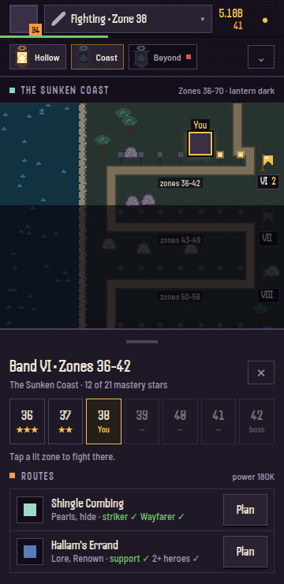 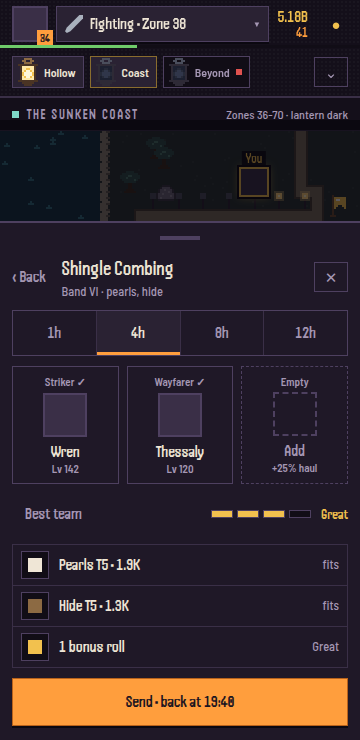

- **The expedition bar**: "1 out · back in 4h · 2 slots free" and **Send a team**. When a team is back:
  "Mossy Hollow Rounds is back" and a gold **Collect**. With no free slot: "3 out · next back in 1h" and
  a ghost **Log**.
- **Send a team** opens the **Routes sheet**: "Best for your team" (the top 3 routes over all open
  bands, one row each with Plan) and the line "Or tap a road on the map."
- **A band sheet** (tap a flag or a road row): "Band VI · Zones 36-42", the region and its mastery stars;
  **7 zone tiles** (number and stars; yours says "You"; locked ones dim; the boss zone says "boss"): a tap
  on a lit tile fights there and closes the menu; then **Routes** with need chips green when met and one
  **Plan** each; a team out on this band shows as a row with Call back.
- **The send sheet** is today's (length 1h/4h/8h/12h, three team slots with the need each fills, Best
  team, grade pips, the haul with "fits" or "won't fit" from H3's `stashFits`, **Send · back at 19:40**).
  It stacks on the band sheet with "‹ Back". After Send both sheets close and the row shows the team.
- The Map Room stays a building at Hollow's Rest (slots and lengths); its row says "Open ›" to the
  Routes sheet. Coast routes (bands VI-X) sit on the Coast's rows by the same rule, and so will every
  later region's.

### 7.7 The Deepwell entrance (`deep`)

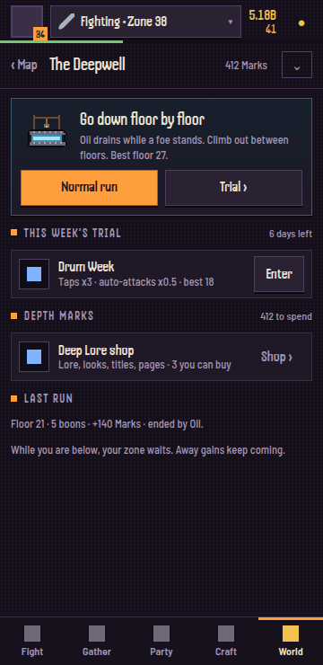

- Head: "‹ Map · The Deepwell · 412 Marks · ⌄".
- One card with the well sprite: "Go down floor by floor. Oil drains while a foe stands. Climb out
  between floors. Best floor 27." Buttons **Normal run** (ember) and **Trial ›**. A saved run replaces
  them with **Resume run · floor 14, Oil 48s**.
- **This week's Trial** once: one row with Enter. **Depth Marks**: one row, "Deep Lore shop" with
  Shop › (a sheet with filter chips: Lore, Looks, Titles, Pages). **Last run**: one line. The note
  "While you are below, your zone waits. Away gains keep coming." (deepwell.md 7).
- Run end's "Back to camp" becomes "Back to the map". The pill reads "Deepwell · Floor 12" during a run.
- Later dungeons use the same shape (card with the entrance sprite, the weekly line, the shop row, the
  last run) under their own view id.

### 7.8 Hollow's Rest (`rest`)

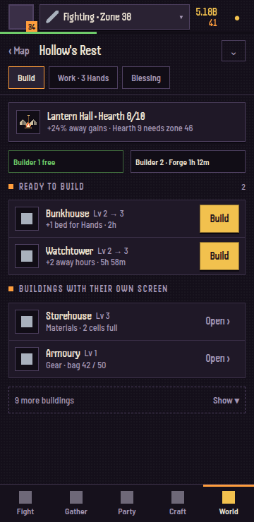

- Head: "‹ Map · Hollow's Rest · ⌄". Filter chips: **Build** · **Work** (with Hands) · **Blessing**
  (with the Shrine).
- **Build**: as 6.14 (the Hearth card, builders, Ready to build, Waiting on materials, the rest folded),
  plus one group **"Buildings with their own screen"**: Storehouse (Gather, Storehouse), Armoury (Craft,
  Armoury), Map Room (the Routes sheet), Library (Codex), each with "Open ›". The **Bunkhouse** is an
  ordinary building row ("+1 bed for Hands"). The Trophy Wall card (AC5) stays at the top of Build, and
  N2's camp panorama, if it is built, mounts above the chips. Neither is needed by this spec.
- **Work**: Hands on shifts (a row each: the Hand, the node, a bar, Send again), "Beds 3 of 4 · Bunkhouse
  Lv 2", then K13's refining stations (Smelter, Sawmill, ...) as rows with their queue. Hiring is at the
  Tavern ("Hire at the Tavern ›").
- **Blessing**: the Shrine's slots, each with Change ›.

### 7.9 The Tavern (a place sheet)

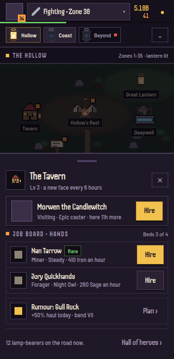

- Title row: the tavern sprite, **The Tavern**, "Lv 3 · a new face every 6 hours", ✕.
- **The visitor** card: portrait, name, rarity and role, time left, Hire.
- **Job board · Hands** (N3): up to 3 applicants as rows with Hire; the note "Beds 3 of 4".
- **Rumours** (Tavern Lv 3): one row, "Rumour: Gull Rock · +50% haul today", Plan › (the send sheet).
- One line: "12 lamp-bearers on the road now." and **Hall of heroes ›** (view `tav`: who is online and
  the hall, ids unchanged). Offline: "Other lamp-bearers show here when you play from the game's Claude
  link."
- No rename box (it is on the Journal's Lanternbearer card).

### 7.10 How new regions append

- A region spec (D4 for the Emberwaste) adds a `WORLD_MAP` block: height, a 4-colour ground ramp, road
  colours, its shapes (a lake, ash flats), 2-3 stamp ids, the 5 row heights, the lantern and raid spots,
  and optionally a dungeon (id, spot, one 24 x 24 sprite, a place view in the Deepwell's shape).
- The plate appends below the last region; the Beyond plate moves down to the next name in the road.
  Region chips grow by one; at 5 regions they shorten to icons with the name on the lit chip only
  (5 x 44 px + close fits 360).
- Expedition bands on the new rows come from the region's band data (as the Coast's VI-X).
- Checks (`tools/check.mjs`, section `world`): every `REGIONS` entry has a `WORLD_MAP` block; 5 rows per
  region; pins 48 px apart; every pin opens a view or sheet that exists; the plate is 180 art px wide.

### 7.11 Art plan

The owner asked for little new visual work. The map reuses the B1 icons and the packed-plate idea
(bake once, copy 1:1), with three landmark sprites.

| Piece | Size (art px) | New or reused | Used as |
|---|---|---|---|
| Hollow's Rest `wm_rest` | 24 x 24 | **new**: two tents, the lantern pole, the fire from `b_fire` | pin (2x); Hearth card icon (1x) |
| The Tavern `wm_tavern` | 24 x 24 | **new**: a house, red roof, lit windows, a mug sign in `mug`'s colours | pin (2x); sheet title (1x) |
| The Deepwell `wm_well` | 24 x 24 | **new**: a stone well mouth, a winch, a blue glow | pin (2x); entrance card (2x) |
| Almanac post `wm_sign` | 12 x 12 | **new** (ICON format) | pin (3x) |
| War horn `wm_horn` | 12 x 12 | **new** (ICON format) | raid pin for foes other than the Wyrm |
| The Ashen Wyrm | 16 x 16 | reuse `SPR.wyrm` | raid pin (2x) |
| Great Lanterns | 12 x 14 | reuse `LANTERN` (75-lantern-ui), lit in the region colour or dark | pins (2x), region chips (2x) |
| Band flags, teams out | 12 x 12 | reuse `banner`: gold open, grey locked, ember out | flags (2x), out chips (1x) |
| You | 24 CSS px | reuse `portraitURL` | the marker |
| Trees, rocks | 12 x 12 | reuse `SPR.tree`, `SPR.rock`, recoloured per region | plate stamps |
| Reeds, waves, graves, embers | 8 x 8 | **new** `wt_reed`, `wt_wave`, `wt_grave`, `wt_ember` | plate stamps |
| Ground, hill, sea, shingle, road, lamps | code | the painter (`fillRect` only) | plates |
| Hollow's Rest, Lantern Hall | 24 x 24 | later, optional (Hearth 8+) | not in W1 |
| A region's dungeon | 24 x 24 | later, one per region spec that has one | pin |

**New for W1: 9 small pixel maps** (3 landmarks, 2 icons, 4 stamps). Palettes:
the Hollow's ground `#243426 #1F2F23 #1B2A20 #18261D`, road `#6B5A44` edge `#3E3428`; the Coast's ground
`#26332F #223030 #1E2B2D #1B2629`, sea `#123241` with `#2F6F7F` waves, shingle `#8C8474`, road
`#7A6E58`; the dim palette (next region and Beyond) `#1E1A20 #1A1619` with ash `#5A2A26`. Lamps: lit
`#FFD27A` with a `#FFF3C4` core, dark `#4A4E5C`. The region colours come from `REGIONS[i].col`.

### 7.12 Performance budget

On top of perf.md and the UX budget in 8:

- **No per-frame work.** The map has no `requestAnimationFrame`; nothing draws while it is open. The
  only motion is CSS: the ember dot and a 2-step flicker on the Hollow's Rest fire and the raid pin
  (`steps(2)`, 1 s), off under `prefers-reduced-motion`; a hidden menu does not animate.
- **Plates**: painted with `fillRect` at art size into a canvas kept in memory (180 x 300 x 4 B = 216 KB
  each, 3 plates about 0.6 MB). Paint: at most 4 ms desktop / 16 ms phone per plate, one plate per
  `idleTask`, queued once the `camp` feature is open (so the first World open never paints). The 2x
  upscale is CSS (`image-rendering: pixelated`), done by the compositor.
- **Relight**: a new max zone repaints one lamp (a few `fillRect`s); a region lit or reached repaints
  that plate in idle time. Nothing else repaints.
- **DOM**: at most 40 nodes per region and 150 for the whole map; built once on the first open, then
  updated in place through the `put*` helpers.
- **First World open** (late save): longest task at most 60 ms phone (the UX budget is 150).
- **`update(force)`** while the World menu is open: one signature (max zone, lit lanterns, raid name and
  live flag, expedition slots and returns, dots, activity); writes only when it changes; at most 0.1 ms
  p95. Closed: nothing.
- `spriteURL` caches the icons; the landmark sprites bake in idle time with the plates.

## 8. Build plan

Each task: its own worktree and branch, `node tools/build.mjs`, `node tools/check.mjs`, and
`node tools/perf.mjs --quick` within budget before merge. Screenshots at 360 x 740, 412 x 915,
740 x 360 and 1280 x 800 for every screen it touches, no horizontal scroll, `prefers-reduced-motion`
honoured. Copy per 5.15.

Perf budget for every UX task (on top of docs/design/perf.md): `ui()` p95 grows by at most 0.3 ms;
opening any menu view: longest task <= 50 ms desktop, <= 150 ms phone; a sheet or the switcher: <= 16 ms
JS to first paint; nothing new runs per frame; DOM writes only through the `put*` helpers; rows are
built once and updated in place. The World map adds its own limits (7.12).

UX2b replaces UX2's **UX-C (Camp)** with three **World** tasks (UX-W1..W3) and takes the Deepwell and
the Raid move out of **UX-E (Fight)**. UX-A, UX-B, UX-D, UX-F and UX-G are unchanged except where noted.

| Phase | Task | Work | Owns | Shared-file edits (small) |
|---|---|---|---|---|
| UX-A | **GX1** global nav + Gather (running) | Unchanged: the pill and portrait button (4.1), the quick switcher (4.2), the control row (4.3; its Raid button goes, approved), swipe between views (4.5), toast `go` and activity targets (4.6), `S.nav`; Gather per 6.1-6.2 | new `55-nav.js`, `75-nav-ui.js`, `60-nav.css`; `72-ui-gather.js`, `75-tools-ui.js`, `75-store-ui.js` | `shell.html`, `70-ui.js`, `71-ui-fight.js` (gate copy), check.mjs `nav` |
| UX-B | Pattern kit + menu head + Journal | Unchanged. One addition: `kitHead` takes an optional back target and title ("‹ Map · Hollow's Rest") so World places can use the one head | new `74b-kit.js`, `60-kit.css`; `75-deeds-ui.js`, `75-codex-ui.js`, `75-stats-ui.js` | `70-ui.js` (menu head, bell), `shell.html` (menu head), `10-base.css` (tokens) |
| UX-W1 | **World shell and map** (absorbs plan-2 RD) | The tab relabelled "World" and the tab order Fight, Gather, Party, Craft, World; the `map` view (7.1-7.4): the plate painter and idle bake, region chips, headers, pins, flags, zone labels, the You marker, the expedition bar slot; **place views** (hidden from the switcher, the "‹ Map" head, right swipe back, remembered place); `registerPlace({ id, region, at, icon, label, open, dot, locked })` so W2 and W3 add their places without touching W1's files; the band sheet's zone tiles (travel, mastery stars) and a hook for later chips (`worldUI.tileChip(z)`, for O2's Oath Seals); the Great Lantern pins opening today's Lantern Road sheet (one region); `mapY` in UI prefs; view aliases `camp` → `rest`, `almanac` → map + post sheet; `go.place` and `go.band`; the 9 new pixel maps (7.11) | new `13d-art-world.js` (sprites, stamps, `WORLD_MAP` for the Hollow and the Coast), new `75-world-ui.js`, new `60-world.css`; `75-lantern-ui.js` (the Camp strip goes; the sheet is reused) | `70-ui.js` (tab label and order, hidden place views, swipe back, `go.place`/`go.band`), `shell.html` (`p-map` inside `p-world`, tab order), check.mjs section `world` |
| UX-W2 | **Hollow's Rest and the Tavern** | The `rest` place view (7.8: Build per 6.14 plus "Buildings with their own screen", chips Build · Work · Blessing; Work is a section slot `registerSection('rest-work')` that N3 and K13 fill); the roster board removed; the Tavern sheet (7.9: the visitor, a Job board slot for N3, Rumours, the online line); the Almanac as the post's sheet; pins for Hollow's Rest, the Tavern and the Almanac post via `registerPlace` | `75-camp-ui.js`, `75-almanac-ui.js`, `60-camp.css`, `60-almanac.css` | `75-unlocks-ui.js` (the visitor section moves from `tav` to the Tavern sheet), `74-ui-tavern.js` only if the rename form has not moved yet (UX-B moves it) |
| UX-W3 | **Deepwell, raid and expeditions on the map** | `deep` registered under `world` as a place view (7.7), the shop as a sheet, the Trial once; the raid pin, the foe-home table and the offline sheet (7.5; `74-ui-raid.js` and `80-online.js` untouched, `p-raid` stays in `p-world`); expeditions (7.6): the expedition bar, the Routes sheet, the routes part of the band sheet, the send sheet stacked with ‹ Back, teams out on the rows; the Camp's expedition section removed | `75-deepwell-ui.js`, `75-exped-ui.js`, `60-deepwell.css`, `60-exped.css` | `55-onboard.js` (view ids only: `deep` → `world`, `exped` → `map`, `camp` → `rest`) |
| UX-D | Party | Unchanged | as UX2 | none |
| UX-E | Fight | Zone view (6.4), Bounties rows (6.5), Bestiary and mastery to the Codex, the Omen row linking to the Almanac post. **No Deepwell and no Raid** (they are World places now), so no `shell.html` edit | `71-ui-fight.js`, `75-bounties-ui.js`, `75-mastery-ui.js` | `70-ui.js` (view registry) |
| UX-F | Craft | Unchanged; the Armoury's "Upgrade ›" goes to Hollow's Rest | as UX2 | `70-ui.js` (view registry) |
| UX-G | Polish | Unchanged, plus: the onboarding guide's `tab:world` copy ("The World: your camp, the Tavern and the road"), FEATURES names ("Camp" → "Hollow's Rest"), layout.md and ARCHITECTURE.md (module map: 13d, 75-world-ui) | `75-onboard-ui.js`, `55-onboard.js` (names, view ids), docs | small edits where found |

**Order.** A, then B, then **W1**, then W2, W3, D, E and F in parallel, then G. W1 must follow B (both
edit `70-ui.js` and `shell.html`). W2 and W3 share no files: each adds its places through
`registerPlace`. E no longer touches `shell.html`, because nothing moves under Fight.

**Plan-2 RD, the Lantern Road map, becomes part of UX-W1.** The map is the Lantern Road: regions,
Great Lanterns lit or dark, a lamp per zone lit as you pass it, band sheets with each zone's mastery
stars, and tap to travel. What RD listed and W1 leaves for later: each zone's best Oath Seal on the band
tiles, added by O2 (Oath UI) through `worldUI.tileChip(z)`. RD's planned files (`75-road-ui.js`,
`60-road.css`) are not made. The Great Lantern moment card stays in `75-lantern-ui.js`. Plan-2's
CD ("camp decorations in the camp scene") is not affected. D4 (the Region 3 spec) adds the Emberwaste's
`WORLD_MAP` block (7.10).

**Checks to add** (`tools/check.mjs`): every view id Next Up, `deedsOpen`, `codexOpen`, toasts and the
onboarding guide point at still exists; old view ids (`pack`, `gear`, `roster`, `camp`, `upgrades`,
`bestiary`, `uniques`, `almanac`, `ach-*`) resolve through aliases; `deep` resolves under `world`; `S.nav`
defaults on every fixture; the switcher lists only open skills; section `world`: a `WORLD_MAP` block for
every region, 5 rows each, pins 48 px apart, every pin's target exists, and the map builds with no
network or storage access.

## 9. What must not change

- **Save:** no field renamed or repurposed. `S.node`, `S.activity`, `S.zone`, `S.tab`, `S.party.*`,
  `S.mats`, `S.store`, `S.camp.*` keep their meaning. New state only through `registerState`
  (`nav` here; the Armoury's own fields in its task). The World map adds no save state (its scroll is a UI
  pref). Every fixture in `tests/fixtures/` loads without loss.
- **UI prefs:** `lanternfall.ui.v1` keeps `{ tab, views, log }`; new keys may be added (`mapY`). Old view
  ids in it must resolve (aliases), so a returning player lands on the renamed view (`views.world =
  'camp'` opens Hollow's Rest; `views.adv = 'deep'` falls back to Zone).
- **Online layer:** `80-online.js`, the `world/boss` and `raiders/<userId>` docs, room presence
  `{hero, lvl, zone, act, raiding}`, topic `rally`, the capabilities. The raid and tavern markup ids
  (`p-raid`, `p-tav`, `online`, `board`, `renameForm`, `nameInput`, `marchBtn`, `hornBtn`, `rName`,
  `rBar`, `rHp`, `rCount`, `rMine`, `rShare`, `relicRows`) stay. `p-raid` and `p-tav` stay inside
  `p-world`: UX2b moves nothing under Fight. The raid pin reads the boss name 80-online already holds;
  no new online reads or writes. Dropping the control row's Raid button and moving the rename form to
  the Journal are approved (coordinator, 2026-09-28).
- **APIs:** `setTab(tabOrViewId, sel)`, `closeMenu()`, `registerView`, `registerSection`, `registerTab`,
  `registerGoal` `go`, the `toast` event and `openSheet` keep their signatures (new optional fields only).
  Tab ids `adv`, `party`, `gat`, `forge`, `world`, `deeds` stay; the World tab reuses `world` (only its
  label and place in the bar change); the Journal reuses the `deeds` hidden tab.
- **Feature ids** in `FEATURES` (onboarding) stay; only the views they open may change.
- **Sandbox rules:** one HTML file, no `alert`/`confirm`, no History API, `localStorage` in try/catch,
  works at 360 px, respects `prefers-reduced-motion`, tap targets 44 px.

## 10. Open questions for the coordinator

UX2's four questions are answered (wave log, 2026-09-28): Raid leaves the control row (and now goes to
the World, not Fight); the rename form moves to the Journal; the pill replaces the name; bench XP is 0.

1. **The raid pin's place.** Recommended: in the great foe's home region (7.5), from lore.md 4.7, so
   "find the raid" reads as a place on the road. The simpler option is a fixed raid site at Hollow's
   Rest. Either is UI only.
2. **Tab order.** This spec puts Gather second (Fight, Gather, Party, Craft, World), since the owner
   groups fighting and gathering as the basic play. UX-A is running on the old order; W1 changes it.
   Confirm that UX-A should not reorder the bar itself.
3. **The Tavern as a sheet.** Recommended (you look, hire and leave). If N3's Job board grows past one
   screen, the Tavern becomes a place view like Hollow's Rest with no other change (same id, same pin).
