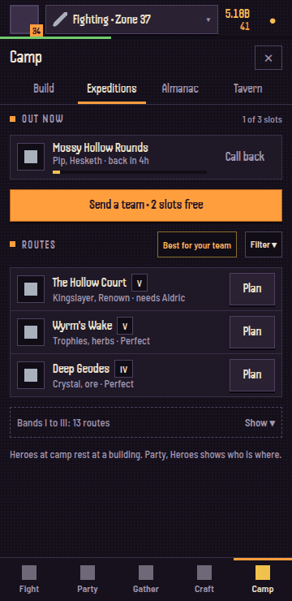

# UX overhaul: menus, navigation and one set of patterns (UX2)

Spec only. It covers every tab, view and sheet as built on `claude/elegant-johnson-m6k00u` at 8660749
(after the Storehouse, the Party screen, Achievements, Bonds, story and Lore merged).

Owner, 2026-09-28: "Navigating the gathering menus could still do with work... switching between each
thing needs to be more fluid. Also switching between fighting and gathering requires going to the main
screen, bit long." Then: "Perhaps a general look at overhauling the menus might be wise."

Naming (owner decision, same day). In player-facing text the player's own character is the
**Lanternbearer**, companions are **heroes**, and the party is the Lanternbearer plus two heroes.
Code ids and save fields keep their names (`companion`, `comp`, `rec`, `roster`, `hero` as a party key).

Owner items folded in: the **Armoury**, a new camp building for gear (bigger bag by level, loadouts,
lock and favourite, an auto-salvage filter, sort and filter, a display rack at camp), separate from the
Storehouse (materials only). **Benched heroes earn no XP** (F5 gave them 25%; the copy in this spec
follows the owner's rule, and the core change belongs to BAL3 or a small task).

Contents: 1 audit, 2 top problems, 3 information architecture, 4 global navigation, 5 patterns,
6 per-screen wireframes, 7 build plan, 8 what must not change.

---

## 1. Audit

How it was measured: `node tools/build.mjs`, then Chromium (Playwright, `/opt/pw-browsers/chromium`)
with dist served through `page.route` (`text/html; charset=utf-8`), Handjet and Barlow Semi Condensed
from npm `@fontsource` through `page.route`, saves seeded by `page.addInitScript` behind a
`sessionStorage` flag. Saves: `tests/fixtures/save-v3-four.json` (the "late" save: zone 38, class
chosen, camp, 12 heroes, one expedition out, gathering Starsteel Crater), and a new game (cold Hearth).
Sizes: 360 x 740 portrait (all images below) and 1280 x 800. Toasts hidden for the captures.

The menu's scroll area at 360 x 740 is **528 px**. Above it: header 48 px, menu title row and view
switcher 108 px; below it: the tab bar 54 px. So 210 of 740 px (28%) is chrome before any content.
"Screens" below = content height / 528.

Taps are counted from the game view. Each tab remembers its last view, so a view costs 1 tap if it was
the last one used, else 2. Every screen passed the no-horizontal-scroll check; there were no console errors.

Images: `img/ux/a-*.png` (late save, 360 wide; `-full` = the whole scroll length), `img/ux/new-*.png`
(new game), `img/ux/wide-*.png` (1280 x 800, halved), `img/ux/m-*.png` (the mockups in section 6).
Also captured, not shown inline: above-the-fold shots of the long views (`a-13-adv-deep`,
`a-14-party-team`, `a-15-party-roster`, `a-20-gat-pack`, `a-21-forge-make`, `a-23-forge-powers`,
`a-25-world-camp`), `a-18-gat-wood`, `a-19-gat-forage`, `a-31-deeds-ach-feats`, `a-32-deeds-ach-looks`,
`new-11-gat-mine`, `wide-01-game`, `wide-14-party-team`.

### 1.1 Game view

 

- The header shows the name, not what you are doing. What you are doing shows only on the stage
  strip ("Starsteel Crater, Mining Lv 52") and on the Fight / Gather / Raid buttons, and both are
  covered as soon as any menu opens.
- Raid is a greyed button on the control row for everyone who plays offline or from a file.
- Next Up is good: one line, Ready, +2.

### 1.2 Fight (Upgrades, Bounties, Bestiary, Deepwell)

| View | Taps | Above the fold | Length | Notes |
|---|---|---|---|---|
| Upgrades  | 1-2 | Omen banner, boss gate, hero upgrades | 477 px (0.9) | Omen banner repeats the Almanac card. Boss gate reads "Your party is gathering" while you gather, with a "PARTY Fight" button: the only way back to fighting inside any menu. The zone stepper is on the game view only. "Best spent on the Camp now." is good advice with no link to the Camp. |
| Bounties  | 2 | all 3 bounties | 408 px | "SWAP (FREE)" is the only caps button with brackets. The claim button is a grey box that says "BOUNTY 44%". |
| Bestiary  | 2 | zone mastery, 2 of 7 rows | 687 px (1.3) | 7 rows of "??? Not yet met." Zone mastery shows "+0% gold and damage" in warning orange. The same data is a Codex page (Bestiary, Zones). |
| Deepwell  | 2 | intro card, run choice | 1444 px (2.7) | The weekly Trial shows twice (run choice card and its own section). The Depth Marks shop has its own inner tab bar (Deep Lore, Looks, Titles, Pages): a third level of tabs. |

### 1.3 Party (Team, Roster, Stars)

| View | Taps | Above the fold | Length | Notes |
|---|---|---|---|---|
| Team  | 1-2 | the three slots, combos, one Bond | 1520 px (2.9) | Each party member appears three times: slot card, "Your hero" card, "Fighting beside you" card. The Lanternbearer's gear strip repeats Craft, Gear. "Best line-up" is a button and also a sentence under it. The bench repeats the Roster grid. |
| Roster  | 2 | sort bar, filter bar, 8 heroes | 1290 px (2.4) | Two stacked segmented bars (Sort, then role). Six locked heroes show as silhouettes in the grid AND again as "Leads" rows below. The Camp's roster board repeats who is at camp. |
| Stars  | 2 | header, the map | 736 px (1.4) | Two inner switches (Map / List, Farm / Push) plus Rename and Reset. Good use of space otherwise. |

### 1.4 Gather (Mining, Wood, Foraging, Pack)

  

| View | Taps | Above the fold | Length | Notes |
|---|---|---|---|---|
| Mining | 1-2 | three skill cards, status box, tool card, 1 node row | 1191 px (2.3) | **The first node row starts at 423 px of 528 (80% down).** 10 identical two-line gold "MINE Go" buttons. The current node is a gold edge in the middle of the list. Nothing says which node is best. Locked and empty tiers look the same as open ones. |
| Wood / Foraging | 2 | same header block | 845 / 808 px | Same header repeated. |
| Pack | 2 | Storehouse line, 3 rows of cells | 969 px (1.8) | 35 material cells plus 7 trophies; 4 whole families are all zero. Called "Pack" in the menu, "Storehouse" on the button, "in pack" on the stage. |

Stale or confusing copy on these views:
- "While gathering, your party lays down their swords. No gold or monster kills, but every swing fills
  your pack." Since G1 the party goes home and the Lanternbearer gathers alone; the status box above it says
  "Your party rests at the Hearth".
- "Home ground: Crystal +25% in Sea Caves. 3 mastery stars there: +50%." This is about the fight zone,
  shown while you gather.
- "Glint: now and then the node sparkles. Tap it then for extra." shows all the time.
- "Lv 5: Rare find +1 point" (points of what?).
- The skill level shows three times: skill card, section title ("MINING"), stage strip.
- On the Fight menu: "Your party is gathering" (the party is at the Hearth; you are gathering).

To switch from gathering to fighting inside a menu: close the menu, tap Fight (2 taps), or go to Fight,
Upgrades and tap the boss gate's "PARTY Fight". To go to a different skill's node: Gather tab, the skill's
view, scroll past 423 px of header, Go (3 taps and a scroll), then close the menu to watch it (4).

### 1.5 Craft (Make, Gear, Powers, Uniques)

| View | Taps | Above the fold | Length | Notes |
|---|---|---|---|---|
| Make  | 1-2 | stations, recipe filter, tier tabs, 2 recipes | 963 px (1.8) | Two stacked tab bars (For you / For your party / All, then Tier 1-5). Opened on the Workbench at Tier 1 for a zone 38 save. Tools are made here but shown in Gather. |
| Gear  | 2 | your gear, bag | 510 px | Two filter bars side by side (All / Spare / Worn, Power / New / Slot). Gear strip repeats Party, Team. |
| Powers  | 2 | your powers, Lantern Book | 1399 px (2.6) | 6 locked Book rows and 4 empty set rows for a player with no powers. The closing paragraph is 5 lines of rules. |
| Uniques  | 2 | 4 found, 4 "???" cards | 795 px (1.5) | A collection. The Codex has the same page (Uniques). |

### 1.6 Camp (Camp, Tavern, Almanac, Raid)

| View | Taps | Above the fold | Length | Notes |
|---|---|---|---|---|
| Camp  | 1-2 | Lantern Road, Hearth card, 2 builder cards | **3713 px (7.0)** | The longest screen in the game. Holds buildings, expeditions (1 out, "Send a team", 5 filter chips, 25 routes in 5 bands), blessings and a roster board of every hero. Building rows each have a two-line button with a cost and a time. |
| Tavern  | 2 | visitor, online note, hall of heroes, rename | 509 px | Rename your Lanternbearer lives here. The offline notice repeats the Raid view's. |
| Almanac  | 2 | Omen card, 4 weekly goals | 583 px (1.1) | Good. Its Omen is also the Fight banner. |
| Raid  | 2 | raid card, relics | 719 px (1.4) | Mostly dead space offline. Relics (Embers) are single-player spending that only shows here. |

### 1.7 Achievements (hidden menu: Deeds, Tracks, Feats, Looks)

 

- **Taps: 3** (bell, Journal, "Open"), or a toast. It is a full menu with no tab, reached from a
  notices sheet.
- Deeds 618 px, Tracks 825 px (a scrolling chip row of 13 groups), Feats 1951 px (3.7), Looks 951 px.
- The menu header says "Achievements" but the tab bar shows no tab lit, so the player is lost on close.

### 1.8 Sheets

| Sheet | How to open | Height | Notes |
|---|---|---|---|
| Notices  | bell | 453 px | Fine. |
| Journal  | bell, Journal | body 3271 px in a 620 px sheet (5.3 sheets) | Holds the Codex card, the Achievements card and the stats wall: the doors to two big systems sit inside a notices sheet. |
| Codex  | bell, Journal, Open | 891 px | 3 taps. Pages repeat Bestiary, Zones and Uniques from other tabs. |
| Next Up  | the chip | 299 px | Good model: every row has one Go. |
| Where to get it  | a Pack cell | 150 px | Good: one line, one action ("Mine at the Iron Vein"). |
| Character  | a slot or roster card | 1861 px | HP and Armour show "-" and "with party combat" (party combat is always on now). |
| Lanternbearer  | the "Your hero" card | 1017 px | |
| Item  | a gear cell | 548 px | Good layout. "Give to..." opens a second sheet and the first one reopens after a timeout. |
| Combos and Kin  | See all | 1316 px | |
| Story, Lantern Road   | Codex, Camp strip | 568 / 336 px | Fine. |

Every sheet opens with the orange focus ring on its close button (the focus moves there on open).

### 1.9 New game (cold Hearth)

  

- Only Fight and Gather tabs; Gather has Mining, Wood and Pack. The Gather menu opens on **Mining**
  though the only thing a new player can gather is the Oak Grove (Wood).
- The Wood view shows three skill cards (Foraging included, which is still locked) and 5 lines of rules
  before the Oak Grove row.
- Fight says "Your party is gathering" and "PARTY Fight" on a save with no party.

### 1.10 Wide (1280 x 800)

 

The menu column is 531 px wide and always open, so the problems are the same: Gather's first row at
~550 px, the Camp's 7-screen list. The wide layout itself works.

### 1.11 Patterns in use today

- **Tabs inside tabs:** 9 different inner switches (Deepwell shop, Stars x2, Roster x2, recipes x2,
  bag x2), plus the expedition filter chips and the track group chips. Some are segmented bars, some
  chips, some underlined tabs.
- **Action buttons:** at least 7 shapes: two-line caps "BUY 1 / price", "MINE / Go", "BOUNTY / 44%",
  "LV 3 · 5H 58M / Build", single word "Craft", "Send", "SWAP", "Open". Gold, orange, purple and grey
  fills mean different things on different tabs.
- **Section headers:** the orange-square caps header (most), a plain big title ("Hollow's Rest",
  "Ranger stars"), card titles, and "world-head" headings.
- **Type:** 23 display sizes (from `calc(9.5px * k)` to `calc(26px * k)`), 14 body sizes (9.5 to 14 px).
- **Spacing:** 12 different padding and gap values between 1 and 16 px.
- **Empty and locked:** "???" rows (Bestiary, Uniques), silhouettes (Roster), greyed rows (Powers, Book),
  "Needs X" buttons (Gather), hidden rows (Gather tiers beyond the next).

## 2. The top 10 problems

1. **Switching activity needs the game view.** No menu shows what you are doing, and no menu can switch
   it, except the boss gate's "PARTY Fight" on Fight, Upgrades. Fight to a node of another skill costs 3
   taps and a scroll, then a 4th to see it.
2. **Gather buries its nodes.** The first node row starts 423 px down a 528 px view (80%); three skill
   cards, a status box and a tool card come first, the same on every skill view.
3. **Gather rows all look alike.** 10 identical gold "MINE Go" buttons on Mining; no "best for you";
   the current node is a gold edge mid-list; held vs cap is a small grey line; lower tiers never fold.
4. **Stale copy after G1, H3 and party combat.** "your party lays down their swords", "Your party is
   gathering", "PARTY Fight" on a new game, "with party combat", "Pack" vs "Storehouse", the fight
   zone's home ground shown while gathering, "Rare find +1 point".
5. **The Camp view is 7 screens long** (3713 px): buildings, expeditions with 25 routes, blessings and a
   roster board in one scroll.
6. **Everything shows twice or three times.** Party members 3 times on Team (plus bench, Roster and the
   Camp board); the Lanternbearer's gear on Team and Craft; skill levels 3 times on Gather; Bestiary and
   Uniques in their tabs and in the Codex; the Omen on Fight and Almanac; the Trial twice in the Deepwell.
7. **Tabs inside tabs.** Nine inner switches, some two deep (Roster sort then role; recipe filter then
   tier; Deepwell shop), each styled its own way.
8. **Achievements and the Codex are hidden** behind the bell (a notices button): bell, Journal, Open =
   3 taps; the Journal itself is a 5-sheet-long stats wall.
9. **No shared patterns.** 7 button shapes, 4 header styles, 23 display font sizes, 12 spacing values;
   colour means different things per tab (gold = go on Gather, orange = build on Camp, purple = buy on Raid).
10. **Menu chrome and filler take the space.** 210 px of chrome per menu; "???" rows, silhouettes and
    empty families fill the rest; a new game opens Gather on Mining and shows locked Foraging.

## 3. Information architecture

### 3.1 Tabs

Keep **five bottom tabs** (five fit at 360 px with thumb reach; a sixth would not). Each tab keeps 2-4
views. Every system has one home; other places link to it instead of repeating it.

| Tab | Views (first = default) | Changes |
|---|---|---|
| **Fight** | Zone · Bounties · Deepwell · Raid | "Upgrades" becomes **Zone**: the zone card (zone, foes to the boss, boss button, zone stepper, auto-boss), the Omen line (links to the Almanac) and your upgrades. Bestiary and zone mastery move to the Codex (the zone card keeps a one-line mastery star count). **Raid moves here from Camp** (it is fighting; needs coordinator sign-off because it touches `p-raid`'s parent, see 8). |
| **Party** | Team · Heroes · Stars | "Roster" is renamed **Heroes**. Team drops the "Your hero" and "Fighting beside you" cards (the slot cards open the character sheet). The bench shows a single row plus "+N". Heroes merges the locked silhouettes and Leads into one "Who could join" list. The Camp's roster board goes; each hero card says where they are ("At the Library", "Out: Mossy Hollow, 4h"). |
| **Gather** | Mining · Wood · Foraging · Storehouse | GX1 (section 6.1). "Pack" becomes **Storehouse** (materials only). Each skill view shows only that skill. The Coast's Fishing becomes a fifth skill view: labels shorten to "Mine · Wood · Forage · Fish · Store" (5 x 72 px fits at 360). |
| **Craft** | Make · Armoury · Powers | "Gear" becomes the **Armoury** (the owner's new building: your gear, the bag, loadouts, lock and favourite, auto-salvage filter, sort and filter; its level sets the bag size). Uniques move to the Codex (the Armoury's unique items still show in the bag). Tool recipes stay in Make (Workbench); Gather's tool chip links there. |
| **Camp** | Build · Expeditions · Almanac · Tavern | "Camp" view becomes **Build** (Hearth, builders, buildings, blessing). **Expeditions** gets its own view. Raid leaves (to Fight). The Tavern keeps the visitor, who is online and the hall of heroes. Rename moves to the Journal's hero card. |
| Journal (hidden menu) | Deeds · Tracks · Feats · Codex | Replaces the hidden Achievements menu and the bell's Journal. Opened by **tapping the portrait** in the header (and from toasts and Next Up). Looks open as a sheet from the Deeds hero card; lifetime stats open as a sheet from Deeds ("Lifetime stats ›"). The Codex becomes a view (its home), pages open as sheets. |
| Bell (sheet) | Notices | Only notices. The Journal tab of the bell sheet goes. |

Fallback if the Raid move is not signed off: Raid stays in Camp and merges with the Tavern as one
view, **World** (both are online), so Camp stays at four views: Build · Expeditions · Almanac · World.

### 3.2 Where each system lives

| System | Home | Also reachable from (links, not copies) |
|---|---|---|
| Zone, boss gate, auto-boss, zone stepper | Fight, Zone | game view control row, quick switcher |
| Your upgrades (Blade, Swiftness, Fortune) | Fight, Zone | Next Up |
| Omen | Camp, Almanac | one line on Fight, Zone |
| Bounties | Fight, Bounties | Next Up, toasts |
| Deepwell (runs, Trial, Marks shop) | Fight, Deepwell (shop as a sheet) | Codex page |
| World raid, war horn, relics | Fight, Raid | quick switcher (Raid row, online only) |
| Formation, Bonds, combos and Kin | Party, Team | character sheet |
| Heroes, recruiting, leads, promotions | Party, Heroes | Tavern visitor, Next Up |
| Constellations | Party, Stars | Lanternbearer sheet |
| Gathering nodes, skills, tools worn, Glint | Gather, skill views | quick switcher, stage |
| Storehouse (materials, caps, trophies) | Gather, Storehouse | Camp, Build (upgrading it) |
| Recipes, stations, tools to make | Craft, Make | tool chip, Next Up |
| Gear, bag, loadouts, salvage (Armoury) | Craft, Armoury | character sheets, Camp, Build (upgrading it) |
| Legendary powers, Lantern Book, circle sets | Craft, Powers | item sheet |
| Buildings, Hearth, builders, blessings | Camp, Build | Next Up |
| Expeditions | Camp, Expeditions | hero cards ("Out: ...") |
| Almanac (Omen, weekly goals) | Camp, Almanac | |
| Tavern (visitor, online, hall of heroes) | Camp, Tavern | Heroes (visitor lead) |
| Achievements, titles, looks | Journal, Deeds / Tracks / Feats | portrait, toasts |
| Codex, Light, Bestiary, zone mastery, Uniques, story, Lore | Journal, Codex | portrait, toasts |
| Lifetime stats | Journal, Deeds, "Lifetime stats" sheet | |
| Rename the Lanternbearer | Journal hero card | |
| Notices, What's new | bell | |
| Settings (sound, HUD, targets, numbers, tips) | a Settings sheet from the Journal hero card | |

## 4. Global navigation

### 4.1 The activity pill


- The header's name block becomes the **activity pill**: one 36 px tall button between the portrait and
  the purse, visible on the game view and over every menu (the header never scrolls away).
- Text: "Fighting · Zone 37", "Mining · Copper Vein", "Woodcutting · Oak Grove", "Foraging · Sage Bed",
  "Raiding · The Glass Hydra", "Deepwell · Floor 12". An icon (sword, pick, axe, sickle, horn, lantern)
  before it, a chevron after it. It ellipses at 360 px ("Woodcutting · Ghostwoo...").
- State colour: gold edge while gathering, neutral while fighting, red edge when the current node's
  cell is full ("Mining · Copper Vein · full"), so the player sees it without opening Gather.
- The name moves to the Journal hero card and the Lanternbearer sheet. The XP bar becomes a 3 px line
  along the bottom edge of the header (full width). The level stays on the portrait.
- The portrait becomes a button: it opens the Journal.
- Wide screens: same pill in the header over the game column.

### 4.2 The quick switcher


Tap the pill (or the "Switch" button on the control row) to open a small sheet:

1. **Fight · Zone N** (your current zone, with the zone name). One primary button: "Fight".
2. **Each open gathering skill**, with its last node: "Mining · Starsteel Crater, 70 / 40K". The row you
   are on says "Here". Buttons use the verb: Mine, Chop, Cut, Pick.
3. **Recent**: up to 3 chips of recent places not already listed (another node, "Zone 35 boss" when a
   boss attempt failed there, a Deepwell run that is paused).
4. Footer links: "All nodes ›" (opens Gather on the current skill), "Raid ›" (online only).

One tap switches the activity **and closes the sheet and any open menu** (portrait), so the player lands
on the stage and sees the change. On wide screens the menu stays open and updates. A locked skill is
not listed. The Deepwell appears only while a run is live or paused.

Save: the last node per skill and the recent list are new state, `registerState('nav', { v: 1, last:
{ mine: null, wood: null, forage: null }, recent: [] })`, filled from `S.node` on load so old saves
start with their current node. `S.node` keeps its meaning (the node you work now). No online change.

### 4.3 The control row

Keep the row: **[Fight · Z37] [⛏ Mining] [Switch ▾]**. The first button fights at your zone; the
second resumes the current skill's last node (it shows that skill's icon and name); Switch opens the
quick switcher. The zone stepper moves into the Fight, Zone card (it is only needed while fighting there)
and into the stage HUD's zone label as a tap target. Raid leaves the control row (it is in the
switcher and in Fight, Raid), so offline players stop seeing a dead button. Needs sign-off with the
Raid move (8).

### 4.4 Back and close

- One model, no history stack (the Artifact runs in an iframe; do not use the History API).
- A **menu** closes with: the close button, tapping its open tab, a swipe down on the head, Escape.
  Closing returns to the game view. Tapping another tab switches menus directly.
- A **sheet** closes with: ✕, a tap on the dim area, a swipe down, Escape. It returns to what was under
  it (a menu or the game). A sheet opened from a sheet (item, Give to, pick a hero) replaces the first and
  shows "‹ Back" at the top left instead of reopening it after a timeout.
- Picking an action that changes activity (quick switcher, "Mine at the Iron Vein", "Go fight") closes
  sheets and menus in portrait.
- Focus: a sheet puts focus on its first control only when opened from the keyboard; touch opens with
  no focus ring.

### 4.5 Swipe between views

- A horizontal swipe on a menu's content moves to the next or previous view (Mining ↔ Wood ↔ Foraging ↔
  Storehouse, and in every tab). The Gather order follows the tab order so it matches the GX1 ask.
- Trigger: 56 px, horizontal distance more than 1.5 x vertical, or a flick over 0.4 px/ms. It never
  starts on an element marked `data-noswipe` (the star map, drag-to-swap slots and bench, horizontally
  scrolling chip rows, sliders).
- The view switcher's lit edge slides; content cross-fades in 120 ms (none under
  `prefers-reduced-motion`). A swipe down still closes the menu (it wins when vertical).

### 4.6 Deep links

- Every place that points somewhere uses one target shape: `go: { tab, view, sel, fn }`, the one Next Up
  already uses (`setTab(tab, sel)`, then scroll and flash).
- **Toasts** may carry `go`. A toast with `go` shows a "›" at its right edge; a tap follows it, a swipe
  dismisses it. Candidates: bounty done (Bounties), build finished (Build), Storehouse full (the quick
  switcher), recruit and promotion (the hero's sheet), achievement tier and Feat (Journal), unique
  loot (the item sheet), Codex milestone (Codex), weekly goal (Almanac), expedition back (Expeditions).
- Next Up, the away card and What's new lines keep `go` and gain the activity targets:
  `go: { act: 'gather', node: { kind, t } }` and `go: { act: 'fight', zone }` switch activity instead
  of opening a menu.
- Hidden views open on demand (onboarding's safety net stays).

## 5. One set of patterns


### 5.1 Type scale

Display font Handjet, always `calc(Npx * var(--display-k))`; body Barlow Semi Condensed.

| Token | Font | Use |
|---|---|---|
| `--t-hero` | display 22 | big numbers (points, Light, zone) |
| `--t-title` | display 18 | menu title, sheet title |
| `--t-card` | display 16 | card title |
| `--t-row` | display 14 | row title, button label |
| `--t-label` | display 12, caps, 0.12em | section header, slot label |
| `--t-body` | body 15 / 1.4 | paragraphs |
| `--t-meta` | body 12.5 / 1.3, muted | row meta, notes |
| `--t-chip` | body 11.5, 600 | chips, badges |

Six display sizes and three body sizes replace 23 and 14. New CSS uses the tokens; old rules move over
screen by screen as each is rebuilt.

### 5.2 Spacing

4 / 8 / 12 / 16 px only (`--s1`..`--s4`); `--gut` stays 12 px. Rows: 6 px vertical, 8 px horizontal
padding. Gap between sections 12 px, inside a card 8 px.

### 5.3 Menu header

One 44 px row: the view switcher and, at its right end, the close button (a down chevron, 44 x 44).
The title row goes (the lit tab names the tab, as it already does on short landscape screens). Saves
64 px of chrome in every menu: the content area at 360 x 740 grows from 528 to 592 px. The grab handle
stays as a 3 px line above the switcher (it is the swipe-down target). Hidden menus (Journal) show their
title in place of a lit tab: "Journal" on the left of the switcher row.

### 5.4 View switcher (sub-tabs)

Equal-width underlined labels, 1 word each (a number may follow: "Mining 52"). A 6 px ember square marks
news. **No inner tab bars.** Inside a view, a choice between lists is a row of **filter chips** (32 px,
one row, scrolls sideways when needed, `data-noswipe`) or a dropdown chip ("Tier 4 ▾", "For you ▾").

### 5.5 Section header

Ember square, caps label (`--t-label`), optional one right-aligned note (count or hint, `--t-meta`).
No big plain titles inside a view ("Hollow's Rest", "Ranger stars" become cards or the note).

### 5.6 List rows

- Min 52 px; icon 34 px (tier or state badge on it); title (`--t-row`) with at most one chip; one meta
  line (`--t-meta`); an optional 4 px progress bar under the meta; **one action** on the right.
- Rows sit in a list frame (`.dz-list`), 1 px dividers.
- The whole row is the tap target for its main action when the action is safe to repeat (go to a node,
  open a sheet); the right button is the visible label. Costly actions (buy, build, craft, salvage)
  take a tap on the button only.
- States: **current** (gold left edge, action becomes "Here" in ghost style), **best** (a "Best" chip),
  **dim** (can't afford or waiting: 55% opacity, the button says what is missing: "Needs hide"),
  **locked** (dim icon, meta says what opens it, button shows the level: "Lv 14").
- Details go behind a chevron (`disclose`) or into a sheet, never into a second meta line.

### 5.7 Buttons

| Style | Meaning | Example |
|---|---|---|
| Primary (gold fill) | do it now, affordable | Craft, Build, Mine, Claim |
| Activity (ember fill) | change what you are doing | Fight, Back to fight, Send a team |
| Plain (panel fill) | a normal action | Mine (a non-best node), Auto, Swap |
| Ghost (text) | navigate or open | See all ›, Change ›, Here |
| Price | plain with the price and coin icon, gold fill when affordable | 12.5Qa ● |

40 px tall, 44 px hit area, 1 word where possible (a price counts as a word). No two-line caps labels,
no brackets ("SWAP (FREE)" becomes "Swap" with "free" as meta). Purple stays for Embers prices only.

### 5.8 Cards

For the one thing a view is about (Now gathering, the zone card, the Hearth, the Omen): panel, 1 px
bright edge, 10 px padding, title `--t-card`, at most 3 lines, at most 2 buttons. A card never holds a list.

### 5.9 Chips

22 px, not tappable: fact (neutral), good (green), warning (red), highlight (gold: Home, Now, Best).
Filter chips (5.4) are the tappable 32 px kind.

### 5.10 Progress bars

4 px under row meta; 8 px on cards. Colour by meaning: gold = held vs cap and goals, green = XP, red =
foe HP or a full cell, ember = building. The label sits above the bar ("Starsteel 70 / 40K" left,
"Full in 7h 29m" right), never inside it.

### 5.11 Sheets

Keep the bottom sheet (`openSheet`). Small sheets for one decision (where to get it, a combo, a
confirm); tall sheets (90%) for a person or an item. Title row: name left, ✕ right, "‹ Back" when
stacked. One footer with at most 2 buttons, the main one on the right.

### 5.12 Toasts

Unchanged rules (priority, placement, folding). Add `go` (4.6). Copy: what happened, 1 line.

### 5.13 Empty and locked states

- One line that says what fills it and how: "No uniques yet. Zone bosses and raids drop them. 13 to find."
- No "???" rows, no rows of silhouettes, no zero-filled families: fold them ("Crystal, fibre, herbs,
  hide: none yet  Show ▾").
- A locked view is left out (as today); a locked row shows the level that opens it.

### 5.14 New dots

7 px ember square. On a tab (the tab has a view with news and is not open), a view label (news in that
view), a row (a new item, an unread story). It clears when the player opens the view or the row. Only
for things to act on or read; never for progress. "New" text badges stay only on newly opened tabs.

### 5.15 Copy

Player words: Lanternbearer, heroes, party, Storehouse, Armoury, node names, skill names. Verbs on
buttons (Mine, Chop, Cut, Pick, Fight, Build, Craft, Send). No mechanics words in the UI ("points" of
what, "cells", "flows"). Numbers short (`fmt`), "40K" not "40,000" on rows.

## 6. Per-screen wireframes

Mockups are HTML at 360 x 740 with the game's colours and fonts (`img/ux/m-*.png`). Grey squares stand
for pixel icons and portraits. The rest are ASCII.

### 6.1 Gather, skill view (GX1)


```
[portrait] [⛏ Mining · Starsteel Crater ▾] [5.18B / 41] [bell]
 Mining 52 | Wood 47 | Foraging 1 | Storehouse        [v]
┌ NOW ───────────────────────────────────────────────┐
│ [ic] Starsteel Crater  (Now)                         │
│      89 a minute · 5,340 an hour                     │
│ Starsteel 70 / 40K                 Full in 7h 29m    │
│ ▓░░░░░░░░░░░░░░░░░░░░░░░░░░░░░░░░░                   │
│ (⛏ Carapace Pick +1 · +25%) (Right tool) [Back to fight] │
└──────────────────────────────────────────────────────┘
■ MINING LV 52                     every tier open
▓▓▓▓▓▓▓░░░░░ (skill XP)
■ BEST FOR YOU
 [ic] Emberite Heart (T5)  61 a min · rarest ore  ▓░░ [Mine]
 [ic] Emberglass Heart (Home +25%) 0 / 40K        ░░░ [Mine]
■ VEINS                                      held / cap
 [ic] Starsteel Crater (T4) 89 a min · 70 / 40K  ▓ [Here]
 [ic] Mithril Seam (T3)     105 a min · 64 / 40K ▓ [Mine]
 ┆ Copper Vein, Iron Vein            2 lower tiers ▾ ┆
■ GEODES  (same rows, same fold)
```

- **Now gathering card** only on the skill you work now. On the other skill views it shrinks to a
  one-line strip: "You are mining Starsteel Crater. Tap a node to move here." The rows' buttons do it.
- While fighting, the card says "You are fighting in Zone 37." with [Gather here] resuming this
  skill's last node.
- **Stop** is "Back to fight" (ember): it fights at your zone and, in portrait, closes the menu.
- **Tool chip**: one row inside the card: the tool, its bonus, Right tool or "Wrong tool: -X%". Tap:
  the tool's item sheet (mastery bar, Make better ›). The old tool card goes.
- **Skill line**: one section header with the level and the next tier; the XP bar under it. The three
  skill cards go (levels are on the view labels).
- **Best for you**: up to 2 rows chosen by a pure rule in core (highest open tier; then Home ground; then
  what the next build or recipe waits on, `whereToGet`/Next Up needs; never the node you work).
- **Rows**: compact rows (5.6) with the held/cap bar, "a min" rate, one verb button. The whole row
  moves you there. Full cells: red bar and "Full" chip; the button still works (Spillover rules stay).
- **Lower tiers fold**: tiers more than one below your best open tier fold into one line per family.
  Locked tiers: only the next one shows, dim, "Lv 64".
- **Glint** moves to the stage only (it already shows there when it sparkles).
- **Home ground** shows as the Home chip on rows, only when it applies to gathering.
- The how-to paragraph goes; a first-time tip (onboarding) covers "tap the stage to work faster".
- New game (cold Hearth): Gather opens on **Wood**; the view shows the Now card with the Flint Hatchet
  chip, the Oak Grove row and the next locked tier. Mining and Foraging views appear when they open.

### 6.2 Gather, Storehouse


- Top card: Storehouse level, what it holds, "Upgrade ›" (opens Camp, Build on the Storehouse row).
- Filter chips: All · Ore · Wood · Crystal · Fibre · Herbs · Fought (hide, essence) · Trophies.
- Families as 5-cell rows with a held/cap bar in each cell; families with nothing fold into one line;
  trophies fold.
- Tap a cell: the "where to get it" sheet (kept as is; its button switches activity and closes menus).
- The full-cell warning ("Storehouse full" chip with Switch and Spillover) moves to the Now card and the
  pill (4.1).

### 6.3 The quick switcher and the game view

See 4.1-4.3 and `m-switch.png`, `m-game.png`.

### 6.4 Fight, Zone


- Zone card: "Zone 37 · Sea Caves", foes to the boss with a bar, **Boss** (ember), the zone stepper
  (‹ 36, Best zone 38, 38 ›), auto-boss. While gathering, the card says "You are mining. [Fight here]".
- The Omen as one row (links to the Almanac).
- Your upgrades: x1/x10/Max as chips in the section header; rows with a price button. Advice ("the camp
  is the better buy") as meta with a ghost "Camp ›" when it applies.
- The old companion upgrade rows (before the roster) stay hidden as today.

### 6.5 Fight, Bounties

```
■ BOUNTIES                                   3 of 3
 [ic] Land 25 critical hits   11 / 25  ▓▓▓▓░░   [Claim] (gold when ready, else a % chip)
      41.1B gold · swap free                    [Swap]
```
One action per row: Claim when ready, else the row's button is Swap (ghost) and progress is the bar.

### 6.6 Fight, Deepwell

```
┌ THE DEEPWELL ───────────────────── 0 Marks ┐
│ Go down floor by floor. Oil drains while a foe stands. │
│ [Normal run]              [Trial: Glass Week ›] │
└──────────────────────────────────────────────┘
■ THIS WEEK'S TRIAL: Glass Week      7 days left
 Damage x2 · most Oil 60s · best floor -  · seals 0
■ DEPTH MARKS                          [Shop ›] (sheet with filter chips: Lore, Looks, Titles, Pages)
■ LAST RUN   floor 12 · 3 boons · 140 Marks
```
The Trial shows once; the shop becomes a sheet (no inner tab bar).

### 6.7 Fight, Raid (moved from Camp)

```
┌ WORLD RAID ── The Glass Hydra ──── ▓▓▓▓▓░░ ┐
│ Raiders 12 · your damage 810M · share 4%     │
│ [March to the raid]           [War horn]     │
└──────────────────────────────────────────────┘
■ RELICS                         Paid in Embers
 rows: [ic] Warbanner Lv 6  +20% damage a level   [◆ 180]
```
Offline: one line "Raids need the game's Claude link and sign-in." replaces the card; relics stay.
Markup keeps its ids (`p-raid`, `rName`, `marchBtn`, `hornBtn`, `relicRows`) so 80-online is untouched.

### 6.8 Party, Team


- Three slot cards (Back, Middle, Front) with one state chip each (Out of place, ability ready, holds
  threat). Tap: the character sheet. Hold and drag: swap (as today).
- Best line-up: one card with the gain and a **Use** button (the sentence and the button merge).
- "Working together": combos, Kin and Bonds as chips in one row, "See all ›" opens the combined sheet.
- Bench: one row of 4 portraits and "+N ›" (opens Heroes). The header note says "no XP on the bench".
- Gone from Team: "Your hero" card (the Lanternbearer's slot opens the Lanternbearer sheet, which holds
  gear, powers, looks and the ability) and "Fighting beside you" cards.

### 6.9 Party, Heroes (was Roster)

```
■ HEROES 12 / 18            (Power ▾) (All roles ▾)
 [grid of recruited heroes, 4 a row: portrait, Lv, where: In party / At the Library / Out 4h]
■ WHO COULD JOIN 6
 [sil] Morwen the Candlewitch   Quest: zone 33 boss with no support   ▓▓▓▓▓▓░ 75%
 [sil] Caedmon the Ashen Knight Renown 45 / 250                        ▓▓░ 59%
```
Sort and role become two dropdown chips in the header. Locked heroes show once, as rows with their lead.

### 6.10 Party, Stars

Keep the map. Map / List and Farm / Push become two dropdown chips in one header row with points left;
Rename and Reset move into a "⋯" menu chip.

### 6.11 Craft, Make


- Stations as 4 tiles (tap to pick, level under the name).
- One header row: station and tier, with "For you ▾" and "Tier 4 ▾" dropdown chips. It opens on your
  best station and highest open tier, not Tier 1.
- Recipe rows: name, one chip (Beats yours), costs as one meta line (missing ones in red), one button
  (Craft, or ghost "Needs hide" which opens where to get it).
- Tools: their own section on the Workbench list.

### 6.12 Craft, Armoury (was Gear)

```
┌ ARMOURY LV 1 ──────── bag 12 / 50 ── [Upgrade ›] ┐
■ WORN BY YOU        (Loadout: Farm ▾)
 [8 gear tiles: Weapon, Off-hand, Head, Body, Charm, Pickaxe, Woodaxe, Sickle]
■ BAG                (All ▾) (Power ▾)  [Salvage…]
 [grid of item tiles, lock icon on locked items]
```
The owner's Armoury features land here: bag size by building level, loadouts (a dropdown chip), lock
and favourite (on the item sheet and as a tile badge), the auto-salvage filter (a sheet from
"Salvage…"), sort and filter as two dropdown chips. The display rack is camp scenery. Build and upgrade
it at Camp, Build. Save fields for the Armoury belong to its own task.

### 6.13 Craft, Powers

```
■ YOUR POWERS   hero 0 / 2 · heroes 1 each
 [2 empty slots: "Inscribe a power from your Book on gear you wear."]
■ LANTERN BOOK 0 of 39        (For you ▾)
 empty state: "No powers yet. Oath elders at level 3+ drop them."   (6 locked rows fold)
■ CIRCLE SETS  6 · 2 · 4 · 0 sigils
 rows only for sets with a marked piece worn; the rest fold into one line
```

### 6.14 Camp, Build


- Hearth card (one line of what the next level needs), builders as two chips (free / busy with a timer).
- Buildings grouped: **Ready to build** (primary Build buttons with the time as meta), **Waiting on
  materials** (dim rows, "2 of 3 costs ready", tap to see the costs), and the rest folded.
- The Lantern Road strip stays at the top as one line (tap: its sheet).
- Blessing as one row with "Change ›" (sheet).
- The Storehouse and the Armoury rows link to their views ("Open ›" next to Build).
- The roster board goes (Heroes shows where each hero is).

### 6.15 Camp, Expeditions



- "Out now" rows with a bar and Call back; one ember "Send a team" button.
- Routes: "Best for your team" and a filter dropdown (Materials, Trophies, Tokens, Lore); the top
  bands (the two highest you can run) show; lower bands fold per band. Plan opens the send sheet.

### 6.16 Camp, Almanac and Tavern

Almanac: keep (it is already the model: one card, one list, one action a row); "SWAP" becomes a plain
"Swap"; the weekly goal row's chevron keeps the details.
Tavern: visitor card, who is online, hall of heroes. Rename moves to the Journal. Offline, the online
parts collapse to one line.

### 6.17 Journal (hidden menu: Deeds, Tracks, Feats, Codex)


- Opened by the portrait. Deeds home: the Lanternbearer card (name, class, level, title, "Looks ›" and
  "Settings" in a ⋯ chip, rename), three stat tiles (points, Light, best zone), the next reward bar,
  Almost there (rows with Go), Recent, "Lifetime stats ›" (a sheet: today's stats wall).
- Tracks: group filter chips (one scrolling row) and track rows (as today).
- Feats: rows with progress; the long text goes into each Feat's sheet.
- Codex: today's Codex home as a view (Light, milestones, Story, page tiles); pages open as sheets. The
  Bestiary, Zones and Uniques pages are now the only place for those lists.

### 6.18 Sheets

| Sheet | Change |
|---|---|
| Character (hero) | Stats show real HP and Armour (party combat is always on); drop "with party combat". Footer: Promote (when ready) and Bench/Field. |
| Lanternbearer | Holds gear, powers, ability, Stars link and Looks link (moved from Team's "Your hero" card). |
| Item | Keep. "Give to…" is a stacked sheet with "‹ Back". Add Lock (Armoury). |
| Where to get it | Keep; the button closes menus when it switches activity. |
| Next Up | Keep; rows may switch activity (4.6). |
| Notices | Keep; the Journal tab goes. |
| Combos and Kin, Bond | Merge into "Working together" (tabs as filter chips: Combos, Kin, Bonds). |
| Story, Lantern Road, expedition send, Inscribe | Keep; title row and footer per 5.11. |

## 7. Build plan

Each task: its own worktree and branch, `node tools/build.mjs`, `node tools/check.mjs`, and
`node tools/perf.mjs --quick` within budget before merge. Screenshots at 360 x 740, 412 x 915,
740 x 360 and 1280 x 800 for every screen it touches, no horizontal scroll, `prefers-reduced-motion`
honoured. Copy per 5.15.

Perf budget for every UX task (on top of docs/design/perf.md): `ui()` p95 grows by at most 0.3 ms;
opening any menu view: longest task <= 50 ms desktop, <= 150 ms phone; a sheet or the switcher: <= 16 ms
JS to first paint; nothing new runs per frame; DOM writes only through the `put*` helpers; rows are
built once and updated in place.

| Phase | Task | Work | Owns | Shared-file edits (small) |
|---|---|---|---|---|
| UX-A | **GX1** global nav + Gather | Activity pill and portrait button (4.1), quick switcher (4.2), control row (4.3, without the Raid part until signed off), swipe between views (4.5), toast `go` and activity targets (4.6), `S.nav` state; Gather rebuilt per 6.1-6.2 (Now card, tool chip, compact rows, Best for you, folds, Storehouse view, cold start opens Wood), copy fixes on Gather and the boss gate | new `55-nav.js` (state, `bestNodes(skill)`, recent list), new `75-nav-ui.js`, new `60-nav.css`; `72-ui-gather.js` (rewrite), `75-tools-ui.js` (chip), `75-store-ui.js` (Storehouse view) | `shell.html` (header pill slot, Gather markup), `70-ui.js` (swipe, toast `go`, view label "Storehouse" with the `pack` id kept), `71-ui-fight.js` (gate copy), check.mjs section `nav` |
| UX-B | Pattern kit + menu head + Journal | Tokens (5.1-5.2) in `10-base.css`; `kit` helpers (`kitRow`, `kitChip`, `kitHead`, `kitFold`, `kitEmpty`) in a new file; the one-row menu head (5.3); the Journal hidden menu (Deeds, Tracks, Feats, Codex), portrait opens it, bell = Notices only, Looks/Stats/Settings sheets | new `74b-kit.js`, new `60-kit.css`; `75-deeds-ui.js`, `75-codex-ui.js`, `75-stats-ui.js` | `70-ui.js` (menu head, bell), `shell.html` (menu head), `10-base.css` (tokens) |
| UX-C | Camp | Build view (6.14), Expeditions view (6.15), roster board removed, Tavern trimmed (rename moves) | `75-camp-ui.js`, `75-exped-ui.js`, `75-lantern-ui.js`, `60-camp.css`, `60-exped.css` | `70-ui.js` (view list) |
| UX-D | Party | Team de-dupe (6.8), Heroes view (6.9), Stars header (6.10), Lanternbearer sheet takes the hero card, character sheet stats fix, "Working together" sheet; hero/Lanternbearer copy sweep | `75-party.js`, `75-party-sheet.js`, `75-bonds-ui.js`, `75-stars-ui.js`, `60-party.css`, `60-formation.css` | none |
| UX-E | Fight | Zone view (6.4), Bounties rows (6.5), Deepwell (6.6), Bestiary and mastery to the Codex; Raid move (6.7) **only with sign-off** | `71-ui-fight.js`, `75-bounties-ui.js`, `75-deepwell-ui.js`, `75-mastery-ui.js`, `75-almanac-ui.js` (Omen row) | `shell.html` (move `p-raid` markup, ids unchanged), `70-ui.js` (view registry) |
| UX-F | Craft | Make (6.11), Armoury view shell (6.12; the building and its save fields come from the Armoury task), Powers (6.13), Uniques to the Codex | `75-craft-ui.js`, `75-legend-ui.js`, `73-ui-forge.js`, `60-craft.css`, `60-legend.css` | `70-ui.js` (view registry) |
| UX-G | Polish | Onboarding targets re-pointed (guide steps, `FEATURES` views), new-game states, empty/locked states everywhere (5.13), remaining old font sizes on tokens, wide layout pass, layout.md and ARCHITECTURE.md updated | `75-onboard-ui.js`, `55-onboard.js` (view ids only), docs | small edits where found |

Order of pain: A (the owner's ask), then B (every later task builds on the kit and it unhides the
Journal), C (the 7-screen Camp), D (Team repeats everyone three times), E, F, G. A and B both touch
`70-ui.js` and `shell.html`: run them one after the other, not together. C, D, E and F own separate
files and can run in parallel after B (E and F touch `70-ui.js` only to register views).

Checks to add (`tools/check.mjs`): every view id Next Up, `deedsOpen`, `codexOpen`, toasts and the
onboarding guide point at still exists; old view ids (`pack`, `gear`, `roster`, `camp`, `upgrades`,
`bestiary`, `uniques`, `ach-*`) still resolve through aliases; `S.nav` defaults on every fixture;
the switcher lists only open skills.

## 8. What must not change

- **Save:** no field renamed or repurposed. `S.node`, `S.activity`, `S.zone`, `S.tab`, `S.party.*`,
  `S.mats`, `S.store`, `S.camp.*` keep their meaning. New state only through `registerState`
  (`nav` here; the Armoury's own fields in its task). Every fixture in `tests/fixtures/` loads without loss.
- **UI prefs:** `lanternfall.ui.v1` keeps `{ tab, views, log }`; new keys may be added. Old view ids in
  it must resolve (aliases), so a returning player lands on the renamed view.
- **Online layer:** `80-online.js`, the `world/boss` and `raiders/<userId>` docs, room presence
  `{hero, lvl, zone, act, raiding}`, topic `rally`, the capabilities. The raid and tavern markup ids
  (`p-raid`, `p-tav`, `online`, `board`, `renameForm`, `nameInput`, `marchBtn`, `hornBtn`, `rName`,
  `rBar`, `rHp`, `rCount`, `rMine`, `rShare`, `relicRows`) stay; moving `p-raid` under Fight, dropping the
  control row's Raid button and moving the rename form to the Journal each need coordinator sign-off.
- **APIs:** `setTab(tabOrViewId, sel)`, `closeMenu()`, `registerView`, `registerSection`, `registerTab`,
  `registerGoal` `go`, the `toast` event and `openSheet` keep their signatures (new optional fields only).
  Tab ids `adv`, `party`, `gat`, `forge`, `world`, `deeds` stay; the Journal reuses the `deeds` hidden tab.
- **Feature ids** in `FEATURES` (onboarding) stay; only the views they open may change.
- **Sandbox rules:** one HTML file, no `alert`/`confirm`, no History API, `localStorage` in try/catch,
  works at 360 px, respects `prefers-reduced-motion`, tap targets 44 px.

## 9. Open questions for the coordinator

1. Sign-off to move Raid under Fight and drop Raid from the control row (UI only; no data change). If
   not, use the World view fallback (3.1).
2. Sign-off to move the rename form from the Tavern to the Journal hero card (same element and ids).
3. The name leaves the header for the pill (4.1). If the owner wants the name kept, the pill takes the
   second line of the name block at 11 px instead (header stays 48 px).
4. Bench XP: F5 gives benched heroes 25% kill XP; the owner says none. Which rule ships, and when
   (the Team bench note follows it).
